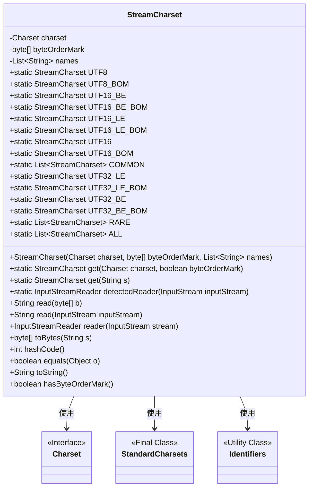
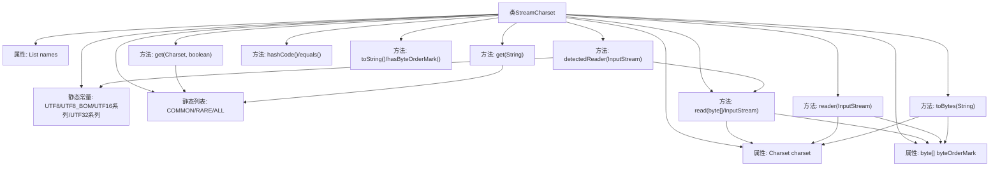

# 基础信息

|      |      |
|------|------|
| 名称 | StreamCharset |
| 编码语言 | .java |
| 代码路径 | xpipe/core/src/main/java/io/xpipe/core/util/StreamCharset.java |
| 包名 | io.xpipe.core.util |
| 依赖项 | ['lombok.Value', 'java.io.ByteArrayInputStream', 'java.io.InputStream', 'java.io.InputStreamReader', 'java.nio.charset.Charset', 'java.nio.charset.StandardCharsets', 'java.util.Arrays', 'java.util.List', 'java.util.Locale', 'java.util.Objects', 'java.util.stream.Stream'] |
| 概述说明 | StreamCharset类定义了多种字符集常量，支持BOM检测与处理，提供字符集转换和读取功能。 |

# 说明

StreamCharset类封装了多种字符集处理功能，包括UTF-8、UTF-16、UTF-32及其带BOM的版本，以及ASCII、ISO-8859-1等常见字符集。提供静态实例和工具方法，支持字符集检测、读写操作、字节转换及BOM处理。包含equals、hashCode和toString方法，确保对象比较和字符串表示的准确性。通过COMMON和RARE列表分类管理字符集，支持通过名称或Charset对象查找。

# 类列表 Class Summary

| 名称   | 类型  | 说明 |
|-------|------|-------------|
| StreamCharset | class | StreamCharset类定义了多种字符集常量，支持UTF-8/16/32及其BOM版本，提供字符集检测、读写转换和BOM处理功能。 |

## 类 StreamCharset

|      |      |
|------|------|
| 访问范围 | @Value;public |
| 类型 | class |
| 名称 | StreamCharset |
| 说明 | StreamCharset类定义了多种字符集常量，支持UTF-8/16/32及其BOM版本，提供字符集检测、读写转换和BOM处理功能。 |

### UML类图

这段代码定义了一个`StreamCharset`类，用于处理不同字符编码的流操作。该类封装了字符集(Charset)、字节顺序标记(BOM)和别名列表，提供了静态常量定义常见编码(如UTF-8/16/32及其BOM变体)，以及通过输入流自动检测编码、读取字节数据转换为字符串等方法。类中包含对字符集和BOM的校验逻辑，并实现了equals/hashCode/toString等标准方法。

### 内部方法调用关系图

这段代码定义了一个StreamCharset类，用于处理不同字符编码的流操作。核心功能包括：1) 预定义常见字符编码常量(UTF8/16/32系列)；2) 通过BOM(字节顺序标记)自动检测编码；3) 提供编码转换和读写方法。类结构包含静态配置列表(COMMON/RARE/ALL)和实例方法，支持从字节流检测编码、带BOM的读写操作，以及编码名称的映射查询。特别注意处理了不同字节序(大端/小端)和BOM标记的特殊情况。

### 字段列表 Field List

| 名称  | 类型  | 说明 |
|-------|-------|------|
| ALL =            Stream.concat(COMMON.stream(), RARE.stream()).toList() | List<StreamCharset> | 合并两个字符集流为最终列表。 |
| UTF16_BE =            new StreamCharset(StandardCharsets.UTF_16BE, null, Identifiers.get("utf", "16", "be")) | StreamCharset | 定义UTF16_BE常量，使用UTF_16BE编码和指定标识符。 |
| UTF16_LE =            new StreamCharset(StandardCharsets.UTF_16LE, null, Identifiers.get("utf", "16", "le")) | StreamCharset | 定义UTF-16LE字符集常量，使用标准编码和标识符。 |
| RARE = Stream.concat(                    RARE_NAMED.stream(),                    Charset.availableCharsets().values().stream()                            .filter(charset -> !charset.equals(StandardCharsets.UTF_16)                                    && !charset.equals(Charset.forName("utf-32"))                                    && !charset.displayName().startsWith("x-")                                    && !charset.displayName().startsWith("X-")                                    && !charset.displayName().endsWith("-BOM")                                    && COMMON.stream()                                            .noneMatch(c -> c.getCharset().equals(charset))                                    && RARE_NAMED.stream()                                            .noneMatch(c -> c.getCharset().equals(charset)))                            .map(charset -> new StreamCharset(                                    charset,                                    null,                                    Identifiers.get(charset.name().split("-")))))            .toList() | List<StreamCharset> | 合并RARE_NAMED和过滤后的字符集列表，排除UTF-16、UTF-32等常见字符集。 |
| UTF8 =            new StreamCharset(StandardCharsets.UTF_8, null, Identifiers.get("utf", "8")) | StreamCharset | 定义UTF8字符集常量，使用StandardCharsets.UTF_8和标识符"utf8"。 |
| UTF16 = UTF16_LE | StreamCharset | UTF16是UTF16_LE的静态常量。 |
| RARE_NAMED =            List.of(UTF16_LE, UTF16_LE_BOM, UTF16_BE, UTF16_BE_BOM, UTF32_LE, UTF32_LE_BOM, UTF32_BE, UTF32_BE_BOM) | List<StreamCharset> | 定义罕见字符编码列表，包含UTF16和UTF32的多种变体。 |
| UTF16_LE_BOM = new StreamCharset(            StandardCharsets.UTF_16LE,            new byte[] {(byte) 0xFF, (byte) 0xFE},            Identifiers.get("utf", "16", "le", "bom")) | StreamCharset | 定义UTF16_LE_BOM字符集，含BOM头0xFFFE，标识为utf16le。 |
| names | List<String> | 字符串列表变量。 |
| UTF16_BE_BOM = new StreamCharset(            StandardCharsets.UTF_16BE,            new byte[] {(byte) 0xFE, (byte) 0xFF},            Identifiers.get("utf", "16", "be", "bom")) | StreamCharset | 定义UTF16_BE_BOM字符集，含BOM头0xFEFF，标识为utf16be。 |
| UTF16_BOM = UTF16_LE_BOM | StreamCharset | UTF16_BOM定义为UTF16_LE_BOM。 |
| UTF8_BOM = new StreamCharset(            StandardCharsets.UTF_8,            new byte[] {(byte) 0xEF, (byte) 0xBB, (byte) 0xBF},            Identifiers.get("utf", "8", "bom")) | StreamCharset | 定义UTF8_BOM字符集，含BOM头。 |
| byteOrderMark | byte[] | 字节数组存储字节顺序标记 |
| UTF32_BE =            new StreamCharset(Charset.forName("utf-32be"), null, Identifiers.get("utf", "32", "be")) | StreamCharset | 定义UTF-32BE字符集常量 |
| charset | Charset | 定义字符集变量charset。 |
| COMMON = List.of(            UTF8,            UTF8_BOM,            UTF16,            UTF16_BOM,            new StreamCharset(                    StandardCharsets.US_ASCII,                    null,                    Identifiers.join(Identifiers.get("ascii"), Identifiers.get("us", "ascii"))),            new StreamCharset(                    StandardCharsets.ISO_8859_1,                    null,                    Identifiers.join(                            Identifiers.get("iso", "8859"),                            Identifiers.get("iso", "8859", "1"),                            Identifiers.get("8859"),                            Identifiers.get("8859", "1"))),            new StreamCharset(                    Charset.forName("Windows-1251"),                    null,                    Identifiers.join(Identifiers.get("windows", "1251"), Identifiers.get("1251"))),            new StreamCharset(                    Charset.forName("Windows-1252"),                    null,                    Identifiers.join(Identifiers.get("windows", "1252"), Identifiers.get("1252")))) | List<StreamCharset> | 定义常用字符集列表，包括UTF8、UTF16、ASCII、ISO-8859-1、Windows-1251和1252。 |
| UTF32_LE =            new StreamCharset(Charset.forName("utf-32le"), null, Identifiers.get("utf", "32", "le")) | StreamCharset | 定义UTF-32LE字符集常量。 |
| UTF32_BE_BOM = new StreamCharset(            Charset.forName("utf-32be"),            new byte[] {                (byte) 0xFF, (byte) 0xFE, 0x00, 0x00,            },            Identifiers.get("utf", "32", "be", "bom")) | StreamCharset | UTF32_BE_BOM流字符集，含BOM头FF FE 00 00。 |
| UTF32_LE_BOM = new StreamCharset(            Charset.forName("utf-32le"),            new byte[] {0x00, 0x00, (byte) 0xFE, (byte) 0xFF},            Identifiers.get("utf", "32", "le", "bom")) | StreamCharset | 定义UTF-32LE带BOM的字符集常量 |

### 方法列表 Method List

| 名称  | 类型  | 说明 |
|-------|-------|------|
| detectedReader | InputStreamReader | 检测输入流编码并返回对应Reader，默认UTF-8。 |
| toString | String | 方法返回名字列表中的第一个名字。 |
| reader | InputStreamReader | 读取输入流并处理字节序标记，不匹配时抛出异常，返回字符流读取器。 |
| read | String | 读取输入流并检查BOM标记，不匹配则报错，最后返回字符串。 |
| read | String | Java方法：从字节数组读取数据并返回字符串。 |
| hashCode | int | 重写hashCode方法，基于charset和byteOrderMark生成哈希值。 |
| get | StreamCharset | 静态方法根据字符串查找字符集，未找到则抛异常。 |
| toBytes | byte[] | 将字符串转为字节数组，可选添加BOM头。 |
| get | StreamCharset | 静态方法根据字符集和字节序标记获取匹配的StreamCharset实例。 |
| equals | boolean | 重写equals方法，比较字符集和字节序标记是否相同。 |
| hasByteOrderMark | boolean | 检查字节顺序标记是否存在。 |

