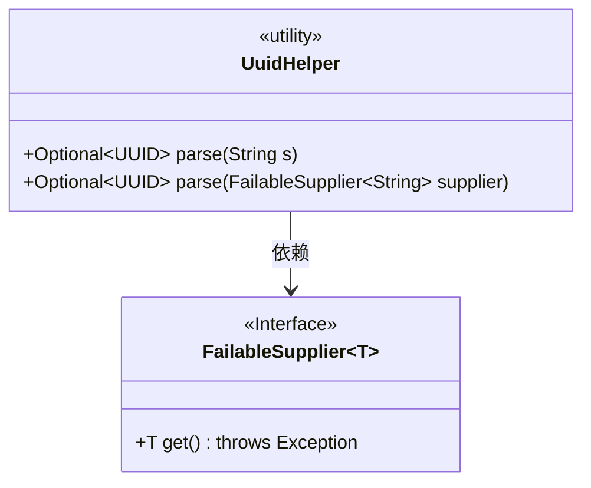
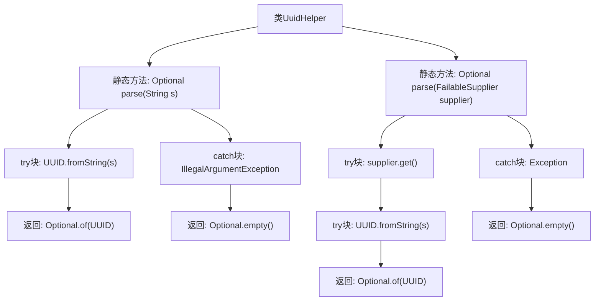

# 基础信息

|      |      |
|------|------|
| 名称 | UuidHelper |
| 编码语言 | .java |
| 代码路径 | xpipe/core/src/main/java/io/xpipe/core/util/UuidHelper.java |
| 包名 | io.xpipe.core.util |
| 依赖项 | ['java.util.Optional', 'java.util.UUID'] |
| 概述说明 | UUID字符串解析工具类，支持直接解析或通过供应商获取字符串解析，失败返回空。 |

# 说明

UuidHelper类提供了两个静态方法用于解析UUID字符串。第一个方法parse接收字符串参数，尝试将其转换为UUID对象，成功返回包含UUID的Optional，失败返回空Optional。第二个方法parse接收FailableSupplier参数，尝试获取字符串并转换为UUID，处理方式与第一个方法相同。两个方法都捕获异常并返回空Optional，确保解析过程的健壮性。

# 类列表 Class Summary

| 名称   | 类型  | 说明 |
|-------|------|-------------|
| UuidHelper | class | UUID解析工具类，支持字符串和供应商两种方式，失败返回空。 |

## 类 UuidHelper

|      |      |
|------|------|
| 访问范围 | public |
| 类型 | class |
| 名称 | UuidHelper |
| 说明 | UUID解析工具类，支持字符串和供应商两种方式，失败返回空。 |

### UML类图

这段代码展示了一个工具类UuidHelper，提供了两种将字符串转换为UUID的方法：直接解析字符串或通过FailableSupplier接口获取字符串后再解析。两种方法都返回Optional<UUID>，在解析失败时返回空Optional。FailableSupplier是一个泛型接口，定义了一个可能抛出异常的get方法。类图清晰地展示了UuidHelper与FailableSupplier之间的依赖关系，以及它们的方法签名和返回类型。

### 内部方法调用关系图

这段代码展示了UuidHelper类的两个静态方法，用于将字符串或供应商提供的字符串解析为UUID对象。第一个方法直接处理字符串输入，捕获非法参数异常；第二个方法通过FailableSupplier获取字符串后再解析，捕获所有异常。两个方法均返回Optional<UUID>，成功时包含UUID值，失败时返回空Optional。流程图清晰地呈现了两种解析路径的异常处理逻辑和返回结果分支。

### 字段列表 Field List

| 名称  | 类型  | 说明 |
|-------|-------|------|

### 方法列表 Method List

| 名称  | 类型  | 说明 |
|-------|-------|------|
| parse | Optional<UUID> | 解析字符串为UUID，失败返回空。 |
| parse | Optional<UUID> | 解析字符串为UUID，失败返回空。 |

