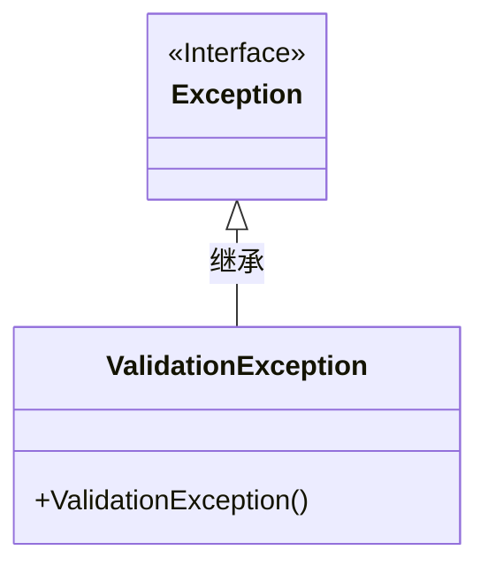
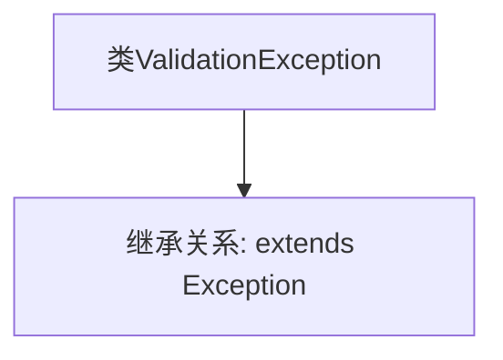

# 基础信息

|      |      |
|------|------|
| 名称 | ValidationException |
| 编码语言 | .java |
| 代码路径 | xpipe/core/src/main/java/io/xpipe/core/util/ValidationException.java |
| 包名 | io.xpipe.core.util |
| 依赖项 | ['lombok.experimental.StandardException'] |
| 概述说明 | 标准异常类ValidationException继承Exception |

# 说明

这是一个名为ValidationException的公共类，继承自Exception类，用于表示验证相关的异常情况。该类使用了@StandardException注解，表明它是一个标准的异常类型。该异常可用于在程序验证过程中抛出，以处理不符合预期或无效的数据输入等情况。由于继承自Exception，它属于受检异常，调用者必须处理或声明抛出。

# 类列表 Class Summary

| 名称   | 类型  | 说明 |
|-------|------|-------------|
| ValidationException | class | 验证异常继承自标准异常类。 |

## 类 ValidationException

|      |      |
|------|------|
| 访问范围 | @StandardException;public |
| 类型 | class |
| 名称 | ValidationException |
| 说明 | 验证异常继承自标准异常类。 |

### UML类图

这段类图展示了ValidationException继承自Exception接口的简单结构。ValidationException是一个自定义异常类，通过继承Java标准库中的Exception接口来实现异常处理功能。图中明确显示了继承关系，ValidationException作为子类拥有父接口Exception的所有特性，同时可以扩展自己的异常处理逻辑。这种设计模式是Java异常处理体系的典型实现方式。

### 内部方法调用关系图

这段流程图展示了ValidationException类的简单结构。该代码定义了一个名为ValidationException的自定义异常类，它通过extends关键字继承了Java标准库中的Exception基类。这种继承关系表明ValidationException属于受检异常(checked exception)类型，使用时必须被捕获或声明抛出。图中清晰呈现了类与父类之间的继承链，这种设计模式常用于创建特定领域的异常类型，以便在验证失败时提供更精确的错误处理机制。

### 字段列表 Field List

| 名称  | 类型  | 说明 |
|-------|-------|------|

### 方法列表 Method List

| 名称  | 类型  | 说明 |
|-------|-------|------|

