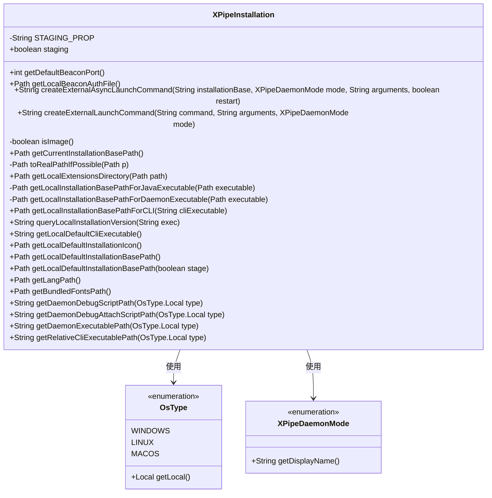

# 基础信息

|      |      |
|------|------|
| 名称 | XPipeInstallation |
| 编码语言 | .java |
| 代码路径 | xpipe/core/src/main/java/io/xpipe/core/util/XPipeInstallation.java |
| 包名 | io.xpipe.core.util |
| 依赖项 | ['io.xpipe.core.process.OsType', 'io.xpipe.core.store.FileNames', 'lombok.Getter', 'lombok.SneakyThrows', 'java.io.IOException', 'java.nio.charset.StandardCharsets', 'java.nio.file.Files', 'java.nio.file.Path', 'java.util.Optional'] |
| 概述说明 | XPipe安装类，含路径获取、命令生成及系统适配功能。 |

# 说明

XPipeInstallation类提供了XPipe软件安装路径和配置的实用方法。它支持不同操作系统（Windows、Linux、MacOS）的路径处理，包含获取默认端口、认证文件路径、启动命令生成等功能。类中方法可获取当前安装基础路径、扩展目录、语言文件路径、字体路径等。支持开发环境和生产环境区分处理，通过staging标志区分测试版和正式版安装路径。还包含调试脚本路径、守护进程可执行路径等实用工具方法。

# 类列表 Class Summary

| 名称   | 类型  | 说明 |
|-------|------|-------------|
| XPipeInstallation | class | XPipe安装类，包含路径获取、启动命令生成等功能，支持多操作系统。 |

## 类 XPipeInstallation

|      |      |
|------|------|
| 访问范围 | public |
| 类型 | class |
| 名称 | XPipeInstallation |
| 说明 | XPipe安装类，包含路径获取、启动命令生成等功能，支持多操作系统。 |

### UML类图

这段代码描述了一个XPipeInstallation类，主要用于管理XPipe应用程序的安装路径、执行命令和资源配置。该类包含多个静态方法，用于获取不同操作系统下的安装路径、生成启动命令、查询版本信息等。代码通过OsType枚举处理不同操作系统的差异，并通过XPipeDaemonMode枚举管理不同的守护进程模式。主要功能包括：获取默认端口号、生成异步启动命令、解析安装路径、获取资源文件路径等，具有完善的跨平台支持能力。

### 内部方法调用关系图

```mermaid
graph TD
    A["类XPipeInstallation"]
    B["静态属性: STAGING_PROP"]
    C["静态属性: staging"]
    D["方法: getDefaultBeaconPort()"]
    E["方法: getLocalBeaconAuthFile()"]
    F["方法: createExternalAsyncLaunchCommand()"]
    G["方法: createExternalLaunchCommand()"]
    H["方法: isImage()"]
    I["方法: getCurrentInstallationBasePath()"]
    J["方法: toRealPathIfPossible()"]
    K["方法: getLocalExtensionsDirectory()"]
    L["方法: getLocalInstallationBasePathForJavaExecutable()"]
    M["方法: getLocalInstallationBasePathForDaemonExecutable()"]
    N["方法: getLocalInstallationBasePathForCLI()"]
    O["方法: queryLocalInstallationVersion()"]
    P["方法: getLocalDefaultCliExecutable()"]
    Q["方法: getLocalDefaultInstallationIcon()"]
    R["方法: getLocalDefaultInstallationBasePath()"]
    S["方法: getLangPath()"]
    T["方法: getBundledFontsPath()"]
    U["方法: getDaemonDebugScriptPath()"]
    V["方法: getDaemonDebugAttachScriptPath()"]
    W["方法: getDaemonExecutablePath()"]
    X["方法: getRelativeCliExecutablePath()"]

    A --> B
    A --> C
    A --> D
    A --> E
    A --> F
    A --> G
    A --> H
    A --> I
    I --> J
    A --> K
    A --> L
    A --> M
    A --> N
    A --> O
    A --> P
    A --> Q
    A --> R
    A --> S
    A --> T
    A --> U
    A --> V
    A --> W
    A --> X
```

这段代码定义了一个名为XPipeInstallation的类，主要用于处理XPipe应用程序的安装路径、执行文件路径、调试脚本路径等与安装相关的操作。该类包含多个静态方法，根据不同的操作系统类型（Windows、Linux、MacOS）返回相应的路径或命令字符串。代码还处理了开发环境和生产环境的差异，提供了获取默认安装路径、查询版本信息等功能。整体设计注重跨平台兼容性，通过OsType类判断当前操作系统类型来适配不同路径结构。

### 字段列表 Field List

| 名称  | 类型  | 说明 |
|-------|-------|------|
| staging = Optional.ofNullable(System.getProperty(STAGING_PROP))            .map(Boolean::parseBoolean)            .orElse(false) | boolean | 私有静态布尔变量staging，通过系统属性STAGING_PROP解析，默认false。 |
| STAGING_PROP = "io.xpipe.app.staging" | String | 私有静态常量STAGING_PROP值为"io.xpipe.app.staging"。 |

### 方法列表 Method List

| 名称  | 类型  | 说明 |
|-------|-------|------|
| getLocalDefaultInstallationIcon | Path | 获取本地默认安装图标路径，根据操作系统和开发环境返回不同路径。 |
| getLocalDefaultInstallationBasePath | Path | 获取本地默认安装基础路径，调用带参方法。 |
| getLocalExtensionsDirectory | Path | 根据操作系统类型返回本地扩展目录路径，MacOS需额外解析子目录。 |
| getCurrentInstallationBasePath | Path | 获取当前安装路径，处理命令路径、链接解析及开发环境判断。 |
| getBundledFontsPath | Path | 获取字体路径方法：非镜像返回dist/fonts；镜像则根据系统类型返回不同路径。 |
| getLocalDefaultCliExecutable | String | 获取本地默认CLI可执行文件路径，根据是否为镜像选择基础路径并解析相对路径。 |
| toRealPathIfPossible | Path | 私有方法将路径转为真实路径，失败则返回原路径。 |
| getLocalInstallationBasePathForDaemonExecutable | Path | 获取不同系统下可执行文件的本地安装根路径。 |
| getDefaultBeaconPort | int | 静态方法返回默认信标端口，测试环境加1。 |
| queryLocalInstallationVersion | String | 查询本地安装版本的方法，执行命令并返回版本信息。 |
| isImage | boolean | 检查代码源是否为JRT协议。 |
| getLocalInstallationBasePathForCLI | Path | 获取CLI本地安装路径，根据操作系统和可执行文件位置返回对应路径。 |
| createExternalLaunchCommand | String | 生成外部启动命令，包含参数和模式选项。 |
| getLangPath | Path | 获取语言路径方法：非镜像返回"lang"，镜像按系统类型返回不同路径，Windows和Linux为"lang"，其他系统为"Contents/Resources/lang"。 |
| createExternalAsyncLaunchCommand | String | 生成异步启动命令，支持Linux/MacOS/其他系统，含参数和模式选项。 |
| getLocalInstallationBasePathForJavaExecutable | Path | 根据操作系统获取Java可执行文件的安装根路径。 |
| getLocalDefaultInstallationBasePath | Path | 获取XPipe默认安装路径，根据系统类型和阶段选择不同路径。 |
| getLocalBeaconAuthFile | Path | 获取本地认证文件路径，根据环境返回不同文件名。 |
| getDaemonDebugScriptPath | String | 根据操作系统类型返回对应调试脚本路径。 |
| getDaemonDebugAttachScriptPath | String | 根据系统类型返回调试脚本路径。 |
| getDaemonExecutablePath | String | 根据操作系统类型返回不同路径的可执行文件。 |
| getRelativeCliExecutablePath | String | 根据操作系统类型返回xpipe可执行文件路径。 |

