# 基础信息

|      |      |
|------|------|
| 名称 | util |
| 编码语言 | .java |
| 代码路径 | xpipe/core/src/main/java/io/xpipe/core/util |
| 包名 | xpipe.core.src.main.java.io.xpipe.core.util |
| 概述说明 | AesSecretValue类实现AES加密解密，使用GCM算法128位标签。SecretReference封装秘密ID引用。ValidationException处理验证异常。Deobfuscator反混淆堆栈信息。Identifiers处理字符串组合。XPipeInstallation管理软件安装路径。InPlaceSecretValue生成AES密钥。JacksonMapper配置JSON处理。DataStateProvider管理数据状态。CoreJacksonModule注册序列化器。StreamCharset处理字符集。EncryptedSecretValue抽象类处理加密数据。UuidHelper解析UUID。 |

# 说明

```markdown
## 概述

该代码模块是XPipe核心工具集，主要提供加密安全、数据序列化、异常处理、路径管理等基础功能。模块包含以下核心组件：

1. **加密安全体系**：
   - 基于AES/GCM算法的加密框架（`AesSecretValue`、`InPlaceSecretValue`）
   - 密钥管理（PBKDF2WithHmacSHA256密钥派生）
   - 敏感数据处理（`SecretValue`抽象体系）

2. **数据序列化**：
   - Jackson扩展（`JacksonMapper`统一配置）
   - 自定义类型序列化（`CoreJacksonModule`）
   - 字符集处理（`StreamCharset`）

3. **基础设施**：
   - 安装路径管理（`XPipeInstallation`跨平台支持）
   - 状态管理（`DataStateProvider`单例模式）
   - 标识符处理（`Identifiers`多格式生成）

4. **异常处理**：
   - 堆栈反混淆（`Deobfuscator`）
   - 验证异常（`ValidationException`）
   - 函数式异常包装（`Failable`系列接口）

## 主要业务场景

1. **敏感数据保护**：
   - 使用AES-128/GCM加密用户凭证（如`InPlaceSecretValue`实现）
   - 安全存储加密数据（IV+密文拼接存储）
   - 通过`SecretReference`建立安全引用关系

2. **配置管理**：
   - 跨平台安装路径解析（开发/生产环境区分）
   - 守护进程模式控制（`XPipeDaemonMode`）
   - 状态持久化（`DataStateProvider`缓存机制）

3. **数据序列化**：
   - 安全JSON处理（敏感字段脱敏）
   - 自定义类型序列化（路径/字符集等）
   - 异常堆栈信息处理（混淆/反混淆）

4. **工具函数**：
   - UUID解析（`UuidHelper`健壮性处理）
   - 换行符标准化（`NewLine`）
   - 多格式标识符生成（`Identifiers`连接逻辑）

5. **异常处理流程**：
   - 验证失败抛出`ValidationException`
   - 通过`Deobfuscator`解析混淆堆栈
   - 函数式接口的异常传播（`FailableFunction`等）

模块采用分层设计，加密组件（底层）-> 序列化组件（中间层）-> 业务工具（上层），支持XPipe核心功能的可靠运行。
```


### 包内部结构视图

```mermaid
graph TD
    util --> AesSecretValue.java
    util --> FailableBiFunction.java
    util --> FailableFunction.java
    util --> SecretReference.java
    util --> FailableBiConsumer.java
    util --> ModuleLayerLoader.java
    util --> SecretValue.java
    util --> JacksonExtension.java
    util --> ValidationException.java
    util --> FailableRunnable.java
    util --> Deobfuscator.java
    util --> Identifiers.java
    util --> XPipeInstallation.java
    util --> InPlaceSecretValue.java
    util --> JacksonMapper.java
    util --> XPipeDaemonMode.java
    util --> DataStateProvider.java
    util --> CoreJacksonModule.java
    util --> StreamCharset.java
    util --> FailableSupplier.java
    util --> NewLine.java
    util --> FailableConsumer.java
    util --> EncryptedSecretValue.java
    util --> UuidHelper.java
```



该流程图展示了xpipe核心模块中util包下的所有Java文件结构。根节点为util目录，直接包含22个不同的工具类文件，这些文件涵盖了加密、函数式接口、数据验证、JSON处理等多种实用功能组件，形成了一个完整的工具类集合。所有文件都直接隶属于util目录下，没有更深层次的子目录结构。

# 文件列表 File List

| 名称   | 类型  | 说明 |
|-------|------|-------------|
| [FailableConsumer.java](FailableConsumer.md) | file | 输入内容为空，无法生成概要。请提供具体信息。 |
| [StreamCharset.java](StreamCharset.md) | file | StreamCharset类定义了多种字符集常量，支持BOM检测与处理，提供字符集转换和读取功能。 |
| [ValidationException.java](ValidationException.md) | file | 标准异常类ValidationException继承Exception |
| [SecretReference.java](SecretReference.md) | file | SecretReference类含UUID和int字段，提供静态创建方法。 |
| [JacksonExtension.java](JacksonExtension.md) | file | 输入内容为空，无法生成概要。请提供具体信息。 |
| [SecretValue.java](SecretValue.md) | file | 输入内容为空，无法生成概要描述。请提供具体信息。 |
| [ModuleLayerLoader.java](ModuleLayerLoader.md) | file | 输入内容为空，无法生成概要描述。请提供具体信息。 |
| [FailableBiConsumer.java](FailableBiConsumer.md) | file | 输入内容为空，无法生成概要描述。 |
| [FailableFunction.java](FailableFunction.md) | file | 输入内容为空，无法生成概要描述。请提供具体信息以便总结。 |
| [FailableBiFunction.java](FailableBiFunction.md) | file | 输入内容为空，无法生成概要描述。请提供具体信息。 |
| [AesSecretValue.java](AesSecretValue.md) | file | AesSecretValue类实现AES/GCM加密解密，含密钥生成与随机数生成功能。 |
| [NewLine.java](NewLine.md) | file | 输入内容为空，无法生成概要描述。请提供具体信息。 |
| [FailableSupplier.java](FailableSupplier.md) | file | 输入内容为空，无法生成概要描述。请提供具体信息。 |
| [CoreJacksonModule.java](CoreJacksonModule.md) | file | CoreJacksonModule注册多种序列化器和子类型，处理文件路径、字符集、脚本等类型转换。 |
| [DataStateProvider.java](DataStateProvider.md) | file | 抽象类提供数据状态管理，含单例获取、状态存取、缓存操作及存储检查方法。 |
| [XPipeDaemonMode.java](XPipeDaemonMode.md) | file | 输入内容为空，无法生成概要。请提供具体信息。 |
| [JacksonMapper.java](JacksonMapper.md) | file | JacksonMapper类提供静态ObjectMapper实例，支持JSON序列化配置、模块扩展和敏感数据脱敏处理。 |
| [InPlaceSecretValue.java](InPlaceSecretValue.md) | file | InPlaceSecretValue类继承AesSecretValue，使用AES加密和PBKDF2算法生成密钥，支持多种输入类型。 |
| [XPipeInstallation.java](XPipeInstallation.md) | file | XPipe安装类，含路径获取、命令生成及系统适配功能。 |
| [Identifiers.java](Identifiers.md) | file | 合并字符串列表并生成多种格式组合。 |
| [Deobfuscator.java](Deobfuscator.md) | file | 反混淆异常堆栈，解析并重设堆栈信息，支持递归处理嵌套异常。 |
| [FailableRunnable.java](FailableRunnable.md) | file | 输入内容为空，无法生成概要。请提供具体信息以便总结。 |
| [UuidHelper.java](UuidHelper.md) | file | UUID字符串解析工具类，支持直接解析或通过供应商获取字符串解析，失败返回空。 |
| [EncryptedSecretValue.java](EncryptedSecretValue.md) | file | 抽象类EncryptedSecretValue实现SecretValue，含加密解密方法，支持字符串、字节数组和字符数组操作。 |


