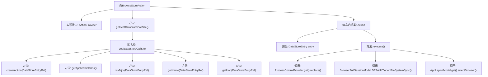

# 基础信息

|      |      |
|------|------|
| 名称 | BrowseStoreAction |
| 编码语言 | .java |
| 代码路径 | xpipe/ext/base/src/main/java/io/xpipe/ext/base/action/BrowseStoreAction.java |
| 包名 | io.xpipe.ext.base.action |
| 依赖项 | ['io.xpipe.app.browser.BrowserFullSessionModel', 'io.xpipe.app.core.AppI18n', 'io.xpipe.app.core.AppLayoutModel', 'io.xpipe.app.ext.ActionProvider', 'io.xpipe.app.ext.ProcessControlProvider', 'io.xpipe.app.ext.ShellStore', 'io.xpipe.app.storage.DataStoreEntry', 'io.xpipe.app.storage.DataStoreEntryRef', 'io.xpipe.app.util.LabelGraphic', 'io.xpipe.core.store.FileSystemStore', 'javafx.beans.property.SimpleBooleanProperty', 'javafx.beans.value.ObservableValue', 'lombok.Value'] |
| 概述说明 | 实现浏览商店操作的ActionProvider类，包含数据存储调用和文件系统打开功能。 |

# 说明

这段代码定义了一个名为BrowseStoreAction的类，实现了ActionProvider接口。它提供了获取LeafDataStoreCallSite的方法，返回一个针对ShellStore类型的调用站点。该调用站点定义了创建Action、获取适用类、判断重要性、获取名称和图标等方法。Action内部类实现了执行逻辑，包括替换DataStoreEntryRef、打开文件系统同步浏览以及选择浏览器布局等操作。整个结构用于实现浏览存储的功能。

# 类列表 Class Summary

| 名称   | 类型  | 说明 |
|-------|------|-------------|
| BrowseStoreAction | class | 浏览商店操作类，实现ActionProvider接口，提供文件系统访问功能。 |


## 类 BrowseStoreAction

|      |      |
|------|------|
| 访问范围 | public |
| 类型 | class |
| 名称 | BrowseStoreAction |
| 说明 | 浏览商店操作类，实现ActionProvider接口，提供文件系统访问功能。 |


### UML类图

```mermaid
classDiagram
    class BrowseStoreAction {
        +LeafDataStoreCallSite~?~ getLeafDataStoreCallSite()
    }
    <<interface>> ActionProvider {
        <<Interface>>
        +LeafDataStoreCallSite~?~ getLeafDataStoreCallSite()
    }
    BrowseStoreAction ..|> ActionProvider : 实现

    class "LeafDataStoreCallSite~ShellStore~" {
        <<Interface>>
        +Action createAction(DataStoreEntryRef~ShellStore~ store)
        +Class~ShellStore~ getApplicableClass()
        +boolean isMajor(DataStoreEntryRef~ShellStore~ o)
        +ObservableValue~String~ getName(DataStoreEntryRef~ShellStore~ store)
        +LabelGraphic getIcon(DataStoreEntryRef~ShellStore~ store)
    }
    BrowseStoreAction --> "LeafDataStoreCallSite~ShellStore~" : 创建匿名实现类

    class Action {
        -DataStoreEntry entry
        +void execute() throws Exception
    }
    BrowseStoreAction --> Action : 包含静态内部类

    class DataStoreEntryRef~T~ {
        <<Generic>>
    }
    class DataStoreEntry {
    }
    class ProcessControlProvider {
        +DataStoreEntryRef~FileSystemStore~ replace(DataStoreEntryRef~?~ entry)
    }
    class BrowserFullSessionModel {
        +void openFileSystemSync(DataStoreEntryRef~FileSystemStore~ ref, Object p1, SimpleBooleanProperty p2, boolean p3)
    }
    class AppLayoutModel {
        +void selectBrowser()
    }

    Action --> DataStoreEntry : 包含
    Action --> ProcessControlProvider : 调用
    Action --> BrowserFullSessionModel : 调用
    Action --> AppLayoutModel : 调用
```

这段代码描述了一个浏览存储动作的实现结构。BrowseStoreAction实现了ActionProvider接口，通过内部匿名类实现了LeafDataStoreCallSite接口，并定义了具体的Action内部类来处理执行逻辑。整体架构采用了策略模式，通过接口隔离了不同组件的职责，其中Action类负责具体的执行操作，涉及多个外部服务调用和数据存储操作。类图中清晰地展示了各个组件之间的依赖关系和接口实现层次。


### 内部方法调用关系图



该流程图展示了BrowseStoreAction类的结构及其与内部组件的关系。主类实现ActionProvider接口，核心方法getLeafDataStoreCallSite()返回一个匿名LeafDataStoreCallSite实例，该实例包含5个重写方法。静态内部类Action持有DataStoreEntry属性，其execute()方法依次调用ProcessControlProvider的replace()、BrowserFullSessionModel的文件系统打开操作和AppLayoutModel的界面切换。整个结构体现了从动作创建到执行的完整流程，涉及多层级的方法调用和跨组件协作。

### 字段列表 Field List

| 名称  | 类型  | 说明 |
|-------|-------|------|

### 方法列表 Method List

| 名称  | 类型  | 说明 |
|-------|-------|------|
| getLeafDataStoreCallSite | LeafDataStoreCallSite<?> | 重写方法返回LeafDataStoreCallSite实例，定义动作、类、名称和图标。 |


