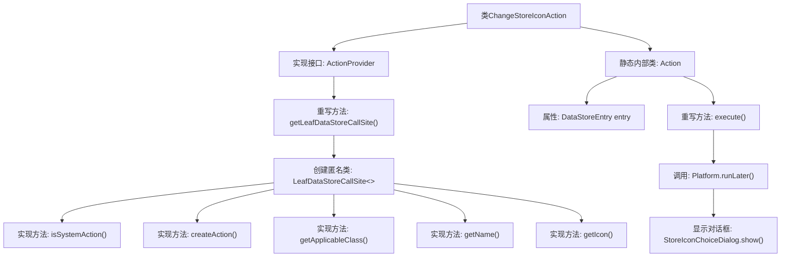

# 基础信息

|      |      |
|------|------|
| 名称 | ChangeStoreIconAction |
| 编码语言 | .java |
| 代码路径 | xpipe/ext/base/src/main/java/io/xpipe/ext/base/action/ChangeStoreIconAction.java |
| 包名 | io.xpipe.ext.base.action |
| 依赖项 | ['io.xpipe.app.comp.store.StoreIconChoiceDialog', 'io.xpipe.app.core.AppI18n', 'io.xpipe.app.ext.ActionProvider', 'io.xpipe.app.storage.DataStoreEntry', 'io.xpipe.app.storage.DataStoreEntryRef', 'io.xpipe.app.util.LabelGraphic', 'io.xpipe.core.store.DataStore', 'javafx.application.Platform', 'javafx.beans.value.ObservableValue', 'lombok.Value'] |
| 概述说明 | Java类实现更改存储图标操作，含系统动作、名称、图标及执行逻辑。 |

# 说明

该代码定义了一个名为ChangeStoreIconAction的类，实现了ActionProvider接口，用于更改数据存储图标。主要功能包括：通过LeafDataStoreCallSite提供系统级操作，创建针对DataStore类的动作，显示名称为"base.changeIcon"，图标使用"mdi2t-tooltip-image-outline"。内部Action类包含执行逻辑，通过StoreIconChoiceDialog显示图标选择对话框。整个实现采用响应式设计，支持国际化名称显示。

# 类列表 Class Summary

| 名称   | 类型  | 说明 |
|-------|------|-------------|
| ChangeStoreIconAction | class | 实现更改存储图标功能的ActionProvider类，包含系统动作定义与执行逻辑。 |


## 类 ChangeStoreIconAction

|      |      |
|------|------|
| 访问范围 | public |
| 类型 | class |
| 名称 | ChangeStoreIconAction |
| 说明 | 实现更改存储图标功能的ActionProvider类，包含系统动作定义与执行逻辑。 |


### UML类图

```mermaid
classDiagram
    class ChangeStoreIconAction {
        +LeafDataStoreCallSite~?~ getLeafDataStoreCallSite()
    }
    <<interface>> ChangeStoreIconAction {
        <<Interface>>
    }

    class LeafDataStoreCallSite~T~ {
        <<Interface>>
        +boolean isSystemAction()
        +ActionProvider.Action createAction(DataStoreEntryRef~DataStore~ store)
        +Class~DataStore~ getApplicableClass()
        +ObservableValue~String~ getName(DataStoreEntryRef~DataStore~ store)
        +LabelGraphic getIcon(DataStoreEntryRef~DataStore~ store)
    }
    ChangeStoreIconAction --> LeafDataStoreCallSite : 创建实例

    class Action {
        -DataStoreEntry entry
        +void execute()
    }
    LeafDataStoreCallSite --> Action : 创建实例

    class DataStoreEntryRef~T~ {
        <<Interface>>
    }
    LeafDataStoreCallSite --> DataStoreEntryRef : 依赖

    class DataStore {
    }
    LeafDataStoreCallSite --> DataStore : 类型关联

    class StoreIconChoiceDialog {
        +static void show(DataStoreEntry entry)
    }
    Action --> StoreIconChoiceDialog : 调用
```

这段代码展示了一个修改存储图标功能的实现架构。ChangeStoreIconAction作为入口类，通过内部匿名类实现了LeafDataStoreCallSite接口，该接口定义了与数据存储相关的各种操作规范。核心功能由Action类实现，通过Platform.runLater在JavaFX线程中调用StoreIconChoiceDialog来执行图标修改操作。整个设计采用了工厂模式和命令模式，通过接口隔离实现细节，支持对DataStore类型对象的图标修改操作。


### 内部方法调用关系图



这段代码描述了一个实现ActionProvider接口的ChangeStoreIconAction类，主要用于处理数据存储图标变更操作。通过getLeafDataStoreCallSite方法返回一个匿名LeafDataStoreCallSite实现类，该实现类定义了系统动作的创建、名称、图标等属性。内部Action类封装了实际执行逻辑，通过Platform.runLater在JavaFX线程中显示图标选择对话框。整个结构体现了插件式动作的设计模式，支持对DataStore类型对象的图标修改功能。

### 字段列表 Field List

| 名称  | 类型  | 说明 |
|-------|-------|------|

### 方法列表 Method List

| 名称  | 类型  | 说明 |
|-------|-------|------|
| getLeafDataStoreCallSite | LeafDataStoreCallSite<?> | 重写方法返回自定义LeafDataStoreCallSite，定义系统动作、创建操作、适用类、名称及图标。 |


