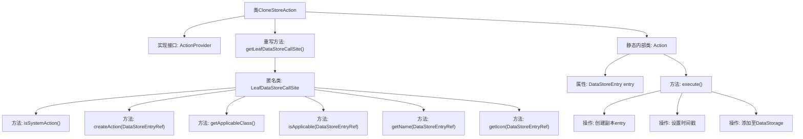

# 基础信息

|      |      |
|------|------|
| 名称 | CloneStoreAction |
| 编码语言 | .java |
| 代码路径 | xpipe/ext/base/src/main/java/io/xpipe/ext/base/action/CloneStoreAction.java |
| 包名 | io.xpipe.ext.base.action |
| 依赖项 | ['io.xpipe.app.core.AppI18n', 'io.xpipe.app.ext.ActionProvider', 'io.xpipe.app.storage.DataStorage', 'io.xpipe.app.storage.DataStoreEntry', 'io.xpipe.app.storage.DataStoreEntryRef', 'io.xpipe.app.util.LabelGraphic', 'io.xpipe.core.store.DataStore', 'javafx.beans.value.ObservableValue', 'lombok.Value', 'java.time.Duration'] |
| 概述说明 | 克隆存储操作类，实现系统动作，检查可克隆性并创建副本。 |

# 说明

该代码定义了一个名为CloneStoreAction的类，实现了ActionProvider接口，用于克隆数据存储条目。主要功能包括：判断是否为系统操作、创建克隆操作、检查适用性、获取操作名称和图标。内部Action类执行克隆逻辑，创建新条目并设置时间戳后添加到存储中。整个过程涉及数据存储条目的复制、时间管理和存储更新。

# 类列表 Class Summary

| 名称   | 类型  | 说明 |
|-------|------|-------------|
| CloneStoreAction | class | 克隆存储操作类，实现系统动作，检查可克隆性并执行复制操作。 |


## 类 CloneStoreAction

|      |      |
|------|------|
| 访问范围 | public |
| 类型 | class |
| 名称 | CloneStoreAction |
| 说明 | 克隆存储操作类，实现系统动作，检查可克隆性并执行复制操作。 |


### UML类图

```mermaid
classDiagram
    class CloneStoreAction {
        +LeafDataStoreCallSite~?~ getLeafDataStoreCallSite()
    }
    <<Interface>> ActionProvider {
        <<Interface>>
        +LeafDataStoreCallSite~?~ getLeafDataStoreCallSite()
    }
    class LeafDataStoreCallSite~T~ {
        <<Interface>>
        +boolean isSystemAction()
        +ActionProvider.Action createAction(DataStoreEntryRef~DataStore~ store)
        +Class~DataStore~ getApplicableClass()
        +boolean isApplicable(DataStoreEntryRef~DataStore~ o)
        +ObservableValue~String~ getName(DataStoreEntryRef~DataStore~ store)
        +LabelGraphic getIcon(DataStoreEntryRef~DataStore~ store)
    }
    class Action {
        -DataStoreEntry entry
        +void execute()
    }
    <<Interface>> ActionProvider.Action {
        <<Interface>>
        +void execute()
    }

    CloneStoreAction ..|> ActionProvider : 实现
    LeafDataStoreCallSite~?~ <|-- CloneStoreAction : 匿名内部类实现
    Action ..|> ActionProvider.Action : 实现
    CloneStoreAction --> Action : 包含
    LeafDataStoreCallSite~T~ --> DataStoreEntryRef~DataStore~ : 依赖
    Action --> DataStoreEntry : 依赖
```

这段代码展示了一个克隆存储操作的实现结构。CloneStoreAction类实现了ActionProvider接口，并通过匿名内部类实现了LeafDataStoreCallSite接口。内部包含一个静态的Action类，用于执行实际的克隆操作。整个结构实现了从界面操作到实际数据克隆的完整流程，涉及数据存储条目引用、操作提供者等多个组件的交互。


### 内部方法调用关系图



这段代码实现了一个数据存储克隆功能，核心流程包含：1) 通过LeafDataStoreCallSite定义系统级克隆操作的元信息（名称/图标/适用性校验）；2) 静态内部类Action执行具体克隆逻辑，包括创建带副本后缀的新存储项、设置时间戳、并注册到全局存储管理器。所有操作均通过DataStoreEntryRef引用机制保证线程安全，且通过canClone()校验实现防御性编程。

### 字段列表 Field List

| 名称  | 类型  | 说明 |
|-------|-------|------|

### 方法列表 Method List

| 名称  | 类型  | 说明 |
|-------|-------|------|
| getLeafDataStoreCallSite | LeafDataStoreCallSite<?> | 重写方法返回可克隆DataStore的调用站点，包含系统动作、创建操作、适用性检查及名称图标定义。 |


