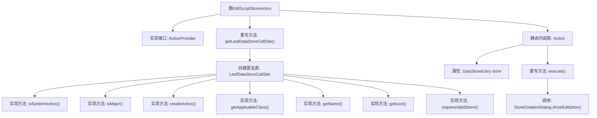

# 基础信息

|      |      |
|------|------|
| 名称 | EditScriptStoreAction |
| 编码语言 | .java |
| 代码路径 | xpipe/ext/base/src/main/java/io/xpipe/ext/base/action/EditScriptStoreAction.java |
| 包名 | io.xpipe.ext.base.action |
| 依赖项 | ['io.xpipe.app.comp.store.StoreCreationDialog', 'io.xpipe.app.core.AppI18n', 'io.xpipe.app.ext.ActionProvider', 'io.xpipe.app.storage.DataStoreEntry', 'io.xpipe.app.storage.DataStoreEntryRef', 'io.xpipe.app.util.LabelGraphic', 'io.xpipe.ext.base.script.SimpleScriptStore', 'javafx.beans.value.ObservableValue', 'lombok.Value'] |
| 概述说明 | 编辑脚本存储操作类，实现系统动作，支持编辑SimpleScriptStore。 |

# 说明

该代码定义了一个名为EditScriptStoreAction的类，实现了ActionProvider接口，用于编辑脚本存储。主要功能包括：返回一个LeafDataStoreCallSite对象，其中包含多个方法实现，如判断是否为系统操作、是否为主要操作、创建操作、获取适用类、获取名称和图标等。内部静态类Action实现了执行操作的具体逻辑，通过StoreCreationDialog显示编辑对话框。整体设计用于提供编辑脚本存储的功能，支持国际化名称和图标显示。

# 类列表 Class Summary

| 名称   | 类型  | 说明 |
|-------|------|-------------|
| EditScriptStoreAction | class | 编辑脚本存储操作类，提供系统级编辑功能，支持简单脚本存储。 |


## 类 EditScriptStoreAction

|      |      |
|------|------|
| 访问范围 | public |
| 类型 | class |
| 名称 | EditScriptStoreAction |
| 说明 | 编辑脚本存储操作类，提供系统级编辑功能，支持简单脚本存储。 |


### UML类图

```mermaid
classDiagram
    class EditScriptStoreAction {
        +LeafDataStoreCallSite<?> getLeafDataStoreCallSite()
    }
    <<interface>> EditScriptStoreAction {
        <<Interface>>
    }

    class LeafDataStoreCallSite~T~ {
        <<Interface>>
        +boolean isSystemAction()
        +boolean isMajor(DataStoreEntryRef~T~ o)
        +ActionProvider.Action createAction(DataStoreEntryRef~T~ store)
        +Class~T~ getApplicableClass()
        +ObservableValue~String~ getName(DataStoreEntryRef~T~ store)
        +LabelGraphic getIcon(DataStoreEntryRef~T~ store)
        +boolean requiresValidStore()
    }

    class Action {
        -DataStoreEntry store
        +void execute()
    }

    class DataStoreEntryRef~T~ {
    }

    class SimpleScriptStore {
    }

    class ObservableValue~String~ {
        <<Interface>>
    }

    class LabelGraphic {
    }

    class StoreCreationDialog {
        +static void showEdit(DataStoreEntry store)
    }

    EditScriptStoreAction --> LeafDataStoreCallSite : 创建
    LeafDataStoreCallSite --> Action : 创建
    Action --> StoreCreationDialog : 调用
    LeafDataStoreCallSite --> DataStoreEntryRef : 使用
    LeafDataStoreCallSite --> SimpleScriptStore : 泛型关联
    LeafDataStoreCallSite --> ObservableValue : 返回
    LeafDataStoreCallSite --> LabelGraphic : 返回
```

该代码展示了一个编辑脚本存储动作的实现结构。EditScriptStoreAction作为入口类，通过getLeafDataStoreCallSite()方法返回一个匿名实现的LeafDataStoreCallSite接口，该接口定义了与数据存储交互的各种方法。内部静态类Action实现了具体的执行逻辑，通过StoreCreationDialog展示编辑界面。整体设计采用了接口隔离和依赖注入原则，各组件职责明确，通过泛型和接口实现松耦合。


### 内部方法调用关系图



这段代码展示了一个实现ActionProvider接口的EditScriptStoreAction类，主要用于创建和管理脚本编辑操作。核心是通过getLeafDataStoreCallSite()方法返回一个匿名LeafDataStoreCallSite实例，该实例定义了系统行为、动作创建、名称/图标获取等逻辑。静态内部类Action封装了具体执行逻辑，通过StoreCreationDialog.showEdit()方法实现编辑功能。整体结构体现了策略模式的应用，将动作定义与执行分离，便于扩展和维护。

### 字段列表 Field List

| 名称  | 类型  | 说明 |
|-------|-------|------|

### 方法列表 Method List

| 名称  | 类型  | 说明 |
|-------|-------|------|
| getLeafDataStoreCallSite | LeafDataStoreCallSite<?> | 重写方法返回LeafDataStoreCallSite实例，定义系统操作、动作创建及属性。 |


