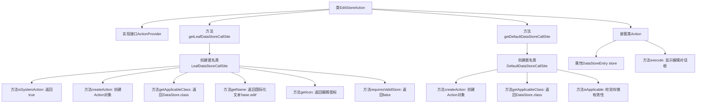

# 基础信息

|      |      |
|------|------|
| 名称 | EditStoreAction |
| 编码语言 | .java |
| 代码路径 | xpipe/ext/base/src/main/java/io/xpipe/ext/base/action/EditStoreAction.java |
| 包名 | io.xpipe.ext.base.action |
| 依赖项 | ['io.xpipe.app.comp.store.StoreCreationDialog', 'io.xpipe.app.core.AppI18n', 'io.xpipe.app.ext.ActionProvider', 'io.xpipe.app.storage.DataStoreEntry', 'io.xpipe.app.storage.DataStoreEntryRef', 'io.xpipe.app.util.LabelGraphic', 'io.xpipe.core.store.DataStore', 'javafx.beans.value.ObservableValue', 'lombok.Value'] |
| 概述说明 | 编辑数据存储的ActionProvider实现类。 |

# 说明

该内容描述了一个名为EditStoreAction的类，实现了ActionProvider接口，用于编辑数据存储。类包含两个主要方法：getLeafDataStoreCallSite和getDefaultDataStoreCallSite，分别处理叶子节点和默认数据存储的操作。方法定义了系统行为、创建动作、适用类、名称、图标等属性。内部Action类执行具体编辑操作，通过StoreCreationDialog显示编辑界面。关键功能包括验证存储状态、判断适用性及提供编辑入口。

# 类列表 Class Summary

| 名称   | 类型  | 说明 |
|-------|------|-------------|
| EditStoreAction | class | 编辑数据存储的ActionProvider实现类，包含默认和叶子节点调用逻辑。 |


## 类 EditStoreAction

|      |      |
|------|------|
| 访问范围 | public |
| 类型 | class |
| 名称 | EditStoreAction |
| 说明 | 编辑数据存储的ActionProvider实现类，包含默认和叶子节点调用逻辑。 |


### UML类图

```mermaid
classDiagram
    class EditStoreAction {
        +LeafDataStoreCallSite~?~ getLeafDataStoreCallSite()
        +DefaultDataStoreCallSite~?~ getDefaultDataStoreCallSite()
    }
    <<Interface>> ActionProvider {
        <<Interface>>
        +LeafDataStoreCallSite~?~ getLeafDataStoreCallSite()
        +DefaultDataStoreCallSite~?~ getDefaultDataStoreCallSite()
    }
    class LeafDataStoreCallSite~T~ {
        <<Interface>>
        +boolean isSystemAction()
        +Action createAction(DataStoreEntryRef~DataStore~ store)
        +Class~DataStore~ getApplicableClass()
        +ObservableValue~String~ getName(DataStoreEntryRef~DataStore~ store)
        +LabelGraphic getIcon(DataStoreEntryRef~DataStore~ store)
        +boolean requiresValidStore()
    }
    class DefaultDataStoreCallSite~T~ {
        <<Interface>>
        +Action createAction(DataStoreEntryRef~DataStore~ store)
        +Class~DataStore~ getApplicableClass()
        +boolean isApplicable(DataStoreEntryRef~DataStore~ o)
    }
    class Action {
        -DataStoreEntry store
        +void execute()
    }
    class DataStoreEntryRef~T~ {
        +DataStore get()
    }
    class DataStore {
        +DataStoreEntry.Validity getValidity()
        +Provider getProvider()
    }
    class DataStoreEntry {
        +Validity validity
        +Provider provider
    }
    class Provider {
        +boolean editByDefault()
    }

    EditStoreAction ..|> ActionProvider : 实现
    EditStoreAction --> LeafDataStoreCallSite~?~ : 创建实例
    EditStoreAction --> DefaultDataStoreCallSite~?~ : 创建实例
    LeafDataStoreCallSite~?~ --> Action : 创建
    DefaultDataStoreCallSite~?~ --> Action : 创建
    Action --> DataStoreEntry : 依赖
    DataStoreEntryRef~DataStore~ --> DataStore : 获取
    DataStore --> DataStoreEntry : 包含
    DataStore --> Provider : 关联
```

该类图展示了EditStoreAction实现ActionProvider接口的结构，包含两个核心方法分别返回LeafDataStoreCallSite和DefaultDataStoreCallSite接口实现。这些调用站点负责创建Action对象，其中涉及DataStoreEntryRef、DataStore、DataStoreEntry和Provider等多个关联类，形成一个完整的编辑存储操作处理链。系统通过接口隔离实现了不同场景下的编辑操作逻辑，同时支持默认编辑和叶子节点编辑两种模式。


### 内部方法调用关系图



流程图描述：该流程图展示了EditStoreAction类的完整结构，该类实现了ActionProvider接口，包含两个主要方法getLeafDataStoreCallSite和getDefaultDataStoreCallSite，分别返回不同的匿名调用站点类。其中LeafDataStoreCallSite处理基础编辑操作相关配置，DefaultDataStoreCallSite包含更复杂的适用性判断逻辑。嵌套类Action封装了实际执行编辑操作的逻辑，通过StoreCreationDialog显示编辑界面。各方法间通过清晰的调用关系展现编辑功能的完整流程。

### 字段列表 Field List

| 名称  | 类型  | 说明 |
|-------|-------|------|

### 方法列表 Method List

| 名称  | 类型  | 说明 |
|-------|-------|------|
| getDefaultDataStoreCallSite | DefaultDataStoreCallSite<?> | 重写方法返回默认数据存储调用点，包含创建动作、适用类判断及有效性检查逻辑。 |
| getLeafDataStoreCallSite | LeafDataStoreCallSite<?> | 重写方法返回自定义LeafDataStoreCallSite，定义系统操作、创建动作、适用类、名称、图标及存储验证要求。 |


