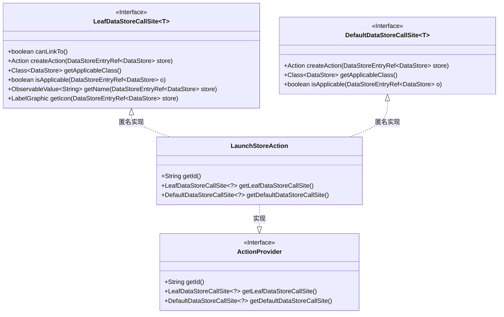
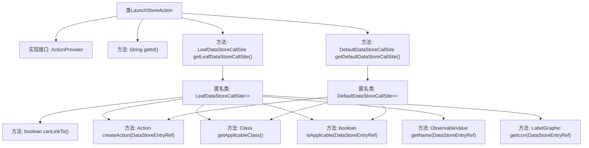

# 基础信息

|      |      |
|------|------|
| 名称 | LaunchStoreAction |
| 编码语言 | .java |
| 代码路径 | xpipe/ext/base/src/main/java/io/xpipe/ext/base/action/LaunchStoreAction.java |
| 包名 | io.xpipe.ext.base.action |
| 依赖项 | ['io.xpipe.app.core.AppI18n', 'io.xpipe.app.ext.ActionProvider', 'io.xpipe.app.storage.DataStoreEntryRef', 'io.xpipe.app.util.LabelGraphic', 'io.xpipe.core.store.DataStore', 'javafx.beans.value.ObservableValue'] |
| 概述说明 | 实现启动商店操作的ActionProvider类，包含数据存储调用站点和方法。 |

# 说明

这是一个名为LaunchStoreAction的Java类，实现了ActionProvider接口。它提供了两个主要方法：getLeafDataStoreCallSite和getDefaultDataStoreCallSite，用于创建与DataStore相关的操作。该类检查DataStore是否可用且支持启动操作，并提供了名称和图标显示功能。当条件满足时，会通过DataStore的provider创建启动操作。

# 类列表 Class Summary

| 名称   | 类型  | 说明 |
|-------|------|-------------|
| LaunchStoreAction | class | 实现启动商店操作的ActionProvider类，包含数据存储调用站点逻辑。 |

## 类 LaunchStoreAction

|      |      |
|------|------|
| 访问范围 | public |
| 类型 | class |
| 名称 | LaunchStoreAction |
| 说明 | 实现启动商店操作的ActionProvider类，包含数据存储调用站点逻辑。 |

### UML类图

这段代码展示了一个实现`ActionProvider`接口的`LaunchStoreAction`类，主要用于创建与数据存储相关的启动操作。该类通过匿名内部类实现了`LeafDataStoreCallSite`和`DefaultDataStoreCallSite`两个泛型接口，提供了检查数据存储可用性、创建启动动作、获取名称和图标等功能。整体设计体现了策略模式，通过接口隔离了动作提供者与具体实现，支持灵活扩展不同的数据存储操作场景。

### 内部方法调用关系图

这段代码定义了一个名为LaunchStoreAction的类，实现了ActionProvider接口。主要功能是提供两种数据存储调用站点（Leaf和Default），用于创建启动动作。流程图展示了类的结构，包括接口实现、方法定义以及两个匿名内部类的层级关系。核心逻辑集中在判断数据存储是否可用并创建对应的启动动作，同时处理名称和图标等UI元素。

### 字段列表 Field List

| 名称  | 类型  | 说明 |
|-------|-------|------|

### 方法列表 Method List

| 名称  | 类型  | 说明 |
|-------|-------|------|
| getId | String | 重写getId方法，返回字符串"launch"。 |
| getLeafDataStoreCallSite | LeafDataStoreCallSite<?> | 重写LeafDataStoreCallSite方法，支持链接、创建动作、检查适用性及获取名称图标。 |
| getDefaultDataStoreCallSite | DefaultDataStoreCallSite<?> | 重写方法返回默认数据存储调用点，包含创建动作、适用类判断及可用性检查逻辑。 |

