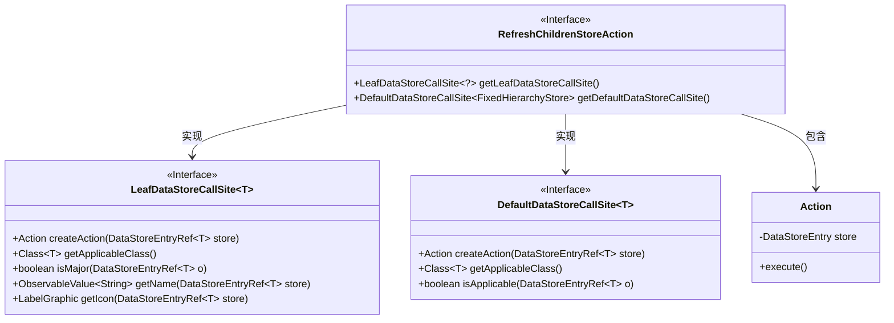
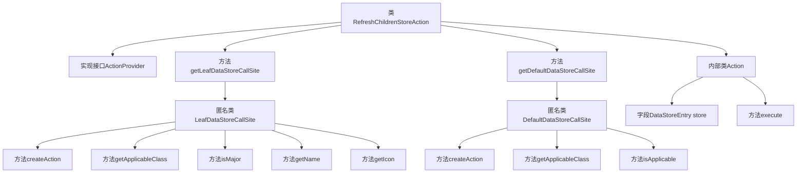

# 基础信息

|      |      |
|------|------|
| 名称 | RefreshChildrenStoreAction |
| 编码语言 | .java |
| 代码路径 | xpipe/ext/base/src/main/java/io/xpipe/ext/base/action/RefreshChildrenStoreAction.java |
| 包名 | io.xpipe.ext.base.action |
| 依赖项 | ['io.xpipe.app.core.AppI18n', 'io.xpipe.app.ext.ActionProvider', 'io.xpipe.app.storage.DataStorage', 'io.xpipe.app.storage.DataStoreEntry', 'io.xpipe.app.storage.DataStoreEntryRef', 'io.xpipe.app.util.FixedHierarchyStore', 'io.xpipe.app.util.LabelGraphic', 'javafx.beans.value.ObservableValue', 'lombok.Value'] |
| 概述说明 | 刷新子存储操作类，实现ActionProvider接口，提供Leaf和Default两种调用方式，执行子存储刷新功能。 |

# 说明

该代码定义了一个名为RefreshChildrenStoreAction的类，实现了ActionProvider接口，用于刷新数据存储的子项。它包含两个主要方法：getLeafDataStoreCallSite返回一个针对FixedHierarchyStore的叶子节点调用站点，提供创建动作、获取适用类、判断重要性、名称和图标的功能；getDefaultDataStoreCallSite返回默认调用站点，同样针对FixedHierarchyStore，但仅在子项数量为零时适用。内部Action类封装了执行刷新子项操作的具体逻辑。整体实现了数据存储子项的刷新功能，支持界面交互元素如名称和图标。

# 类列表 Class Summary

| 名称   | 类型  | 说明 |
|-------|------|-------------|
| RefreshChildrenStoreAction | class | 刷新子存储操作类，提供创建动作、图标及名称功能，适用于FixedHierarchyStore。 |

## 类 RefreshChildrenStoreAction

|      |      |
|------|------|
| 访问范围 | public |
| 类型 | class |
| 名称 | RefreshChildrenStoreAction |
| 说明 | 刷新子存储操作类，提供创建动作、图标及名称功能，适用于FixedHierarchyStore。 |

### UML类图

这段代码展示了一个刷新子存储操作的实现架构。RefreshChildrenStoreAction类实现了ActionProvider接口，提供了两种调用方式：LeafDataStoreCallSite（用于叶子节点操作）和DefaultDataStoreCallSite（默认操作）。内部静态类Action封装了实际执行逻辑，通过DataStorage刷新子存储。类图清晰地展示了接口实现关系和泛型参数的使用，体现了模块化设计思想。

### 内部方法调用关系图

这段代码流程图展示了RefreshChildrenStoreAction类的完整结构，该类实现了ActionProvider接口。核心包含两个主要方法：getLeafDataStoreCallSite返回一个匿名LeafDataStoreCallSite实现类，处理叶子节点相关操作；getDefaultDataStoreCallSite返回DefaultDataStoreCallSite匿名类，处理默认存储操作。内部Action类封装了执行刷新子节点操作的具体逻辑。每个匿名类都实现了多个关键方法，包括创建动作、获取适用类、验证条件等，形成完整的动作处理链。

### 字段列表 Field List

| 名称  | 类型  | 说明 |
|-------|-------|------|

### 方法列表 Method List

| 名称  | 类型  | 说明 |
|-------|-------|------|
| getLeafDataStoreCallSite | LeafDataStoreCallSite<?> | 重写方法返回处理FixedHierarchyStore的LeafDataStoreCallSite实例，包含创建动作、类匹配、名称和图标定义。 |
| getDefaultDataStoreCallSite | DefaultDataStoreCallSite<FixedHierarchyStore> | 重写方法返回默认数据存储调用点，检查适用性并创建操作。 |

