# 基础信息

|      |      |
|------|------|
| 名称 | RunScriptActionMenu |
| 编码语言 | .java |
| 代码路径 | xpipe/ext/base/src/main/java/io/xpipe/ext/base/action/RunScriptActionMenu.java |
| 包名 | io.xpipe.ext.base.action |
| 依赖项 | ['io.xpipe.app.comp.store.StoreCategoryConfigComp', 'io.xpipe.app.comp.store.StoreViewState', 'io.xpipe.app.core.AppI18n', 'io.xpipe.app.ext.ActionProvider', 'io.xpipe.app.ext.ProcessControlProvider', 'io.xpipe.app.ext.ShellStore', 'io.xpipe.app.prefs.AppPrefs', 'io.xpipe.app.storage.DataStorage', 'io.xpipe.app.storage.DataStoreEntry', 'io.xpipe.app.storage.DataStoreEntryRef', 'io.xpipe.app.terminal.TerminalLauncher', 'io.xpipe.app.util.CommandDialog', 'io.xpipe.app.util.LabelGraphic', 'io.xpipe.core.process.CommandControl', 'io.xpipe.core.process.ShellTtyState', 'io.xpipe.core.process.SystemState', 'io.xpipe.ext.base.script.ScriptHierarchy', 'javafx.beans.property.SimpleStringProperty', 'javafx.beans.value.ObservableValue', 'lombok.Value', 'java.util.LinkedHashMap', 'java.util.List'] |
| 概述说明 | 代码实现脚本运行菜单功能，支持终端、连接中心和后台执行。 |

# 说明

该代码定义了一个RunScriptActionMenu类，实现ActionProvider接口，用于管理脚本执行操作。主要包含四种执行方式：TerminalRunActionProvider（终端执行）、HubRunActionProvider（连接中心执行）、BackgroundRunActionProvider（后台执行）和ScriptActionProvider（脚本执行）。每个Provider都实现了Leaf和Batch两种调用方式，处理单个或多个ShellStore实例。代码还包含异常处理逻辑，如NoScriptsActionProvider（无可用脚本）、ScriptsDisabledActionProvider（脚本禁用）和NoStateActionProvider（无脚本状态）。整体结构通过ScriptHierarchy管理脚本层次关系，支持动态生成菜单项，并检查ShellStore的兼容性和状态。

# 类列表 Class Summary

| 名称   | 类型  | 说明 |
|-------|------|-------------|
| RunScriptActionMenu | class | 提供ShellStore脚本执行功能，支持终端、连接中心和后台运行三种方式，包含禁用和状态检查逻辑。 |

## 类 RunScriptActionMenu

|      |      |
|------|------|
| 访问范围 | public |
| 类型 | class |
| 名称 | RunScriptActionMenu |
| 说明 | 提供ShellStore脚本执行功能，支持终端、连接中心和后台运行三种方式，包含禁用和状态检查逻辑。 |

### UML类图

```mermaid
classDiagram
    class RunScriptActionMenu {
        <<Interface>>
        +BranchDataStoreCallSite~?~ getBranchDataStoreCallSite()
        +BatchDataStoreCallSite~?~ getBatchDataStoreCallSite()
    }

    class TerminalRunActionProvider {
        -ScriptHierarchy hierarchy
        +LeafDataStoreCallSite~?~ getLeafDataStoreCallSite()
        +BatchDataStoreCallSite~ShellStore~ getBatchDataStoreCallSite()
    }

    class HubRunActionProvider {
        -ScriptHierarchy hierarchy
        +LeafDataStoreCallSite~?~ getLeafDataStoreCallSite()
        +BatchDataStoreCallSite~ShellStore~ getBatchDataStoreCallSite()
    }

    class BackgroundRunActionProvider {
        -ScriptHierarchy hierarchy
        +LeafDataStoreCallSite~?~ getLeafDataStoreCallSite()
        +BatchDataStoreCallSite~?~ getBatchDataStoreCallSite()
    }

    class ScriptActionProvider {
        -ScriptHierarchy hierarchy
        +BranchDataStoreCallSite~?~ getBranchDataStoreCallSite()
        +BatchDataStoreCallSite~?~ getBatchDataStoreCallSite()
    }

    class NoScriptsActionProvider {
        +LeafDataStoreCallSite~?~ getLeafDataStoreCallSite()
        +BatchDataStoreCallSite~?~ getBatchDataStoreCallSite()
    }

    class ScriptsDisabledActionProvider {
        +LeafDataStoreCallSite~?~ getLeafDataStoreCallSite()
        +BatchDataStoreCallSite~?~ getBatchDataStoreCallSite()
    }

    class NoStateActionProvider {
        +LeafDataStoreCallSite~?~ getLeafDataStoreCallSite()
        +BatchDataStoreCallSite~?~ getBatchDataStoreCallSite()
    }

    RunScriptActionMenu <|-- TerminalRunActionProvider
    RunScriptActionMenu <|-- HubRunActionProvider
    RunScriptActionMenu <|-- BackgroundRunActionProvider
    RunScriptActionMenu <|-- ScriptActionProvider
    RunScriptActionMenu <|-- NoScriptsActionProvider
    RunScriptActionMenu <|-- ScriptsDisabledActionProvider
    RunScriptActionMenu <|-- NoStateActionProvider

    TerminalRunActionProvider --> ScriptHierarchy : 使用
    HubRunActionProvider --> ScriptHierarchy : 使用
    BackgroundRunActionProvider --> ScriptHierarchy : 使用
    ScriptActionProvider --> ScriptHierarchy : 使用
```

该代码实现了一个复杂的脚本执行系统，包含7个主要组件：RunScriptActionMenu作为基础接口，以及6个具体实现类（TerminalRunActionProvider、HubRunActionProvider等）。这些类通过ScriptHierarchy协作，提供了多种脚本执行方式（终端执行、Hub执行、后台执行等），并处理不同状态（无脚本、脚本禁用等）。类图展示了清晰的继承关系和依赖关系，核心类都实现了ActionProvider接口并通过ScriptHierarchy获取脚本信息。系统设计考虑了多种边界情况，如脚本兼容性检查、状态验证等。

### 内部方法调用关系图

```mermaid
graph TD
    A["类RunScriptActionMenu"]
    B["内部类TerminalRunActionProvider"]
    C["内部类Action"]
    D["方法execute: 执行终端脚本"]
    E["方法getLeafDataStoreCallSite: 创建单例调用点"]
    F["方法getBatchDataStoreCallSite: 创建批量调用点"]
    G["内部类HubRunActionProvider"]
    H["方法getLeafDataStoreCallSite: 创建连接中心调用点"]
    I["方法getBatchDataStoreCallSite: 创建批量连接中心调用点"]
    J["内部类BackgroundRunActionProvider"]
    K["方法execute: 后台执行脚本"]
    L["方法getLeafDataStoreCallSite: 创建后台调用点"]
    M["方法getBatchDataStoreCallSite: 创建批量后台调用点"]
    N["内部类ScriptActionProvider"]
    O["方法getLeafSite: 获取叶子节点调用点"]
    P["方法getBranchDataStoreCallSite: 获取分支调用点"]
    Q["方法getBatchDataStoreCallSite: 获取批量调用点"]
    R["内部类NoScriptsActionProvider"]
    S["内部类ScriptsDisabledActionProvider"]
    T["内部类NoStateActionProvider"]
    U["方法getBranchDataStoreCallSite: 主分支调用点"]
    V["方法getBatchDataStoreCallSite: 主批量调用点"]

    A --> B
    B --> C
    C --> D
    B --> E
    B --> F
    A --> G
    G --> H
    G --> I
    A --> J
    J --> K
    J --> L
    J --> M
    A --> N
    N --> O
    N --> P
    N --> Q
    A --> R
    A --> S
    A --> T
    A --> U
    A --> V
```

这段代码实现了一个复杂的脚本执行菜单系统，包含终端执行、连接中心执行、后台执行等多种执行方式。核心是RunScriptActionMenu类及其嵌套的多个ActionProvider实现类，每个Provider都通过getLeafDataStoreCallSite和getBatchDataStoreCallSite方法创建对应的调用点。系统会根据脚本状态、兼容性等条件动态构建执行菜单树，支持单例和批量两种操作模式，并处理了脚本禁用、无脚本可用等多种边缘情况。整体采用责任链模式，通过层次化的ActionProvider结构实现灵活的执行策略配置。

### 字段列表 Field List

| 名称  | 类型  | 说明 |
|-------|-------|------|

### 方法列表 Method List

| 名称  | 类型  | 说明 |
|-------|-------|------|
| getBatchDataStoreCallSite | BatchDataStoreCallSite<?> | 重写getBatchDataStoreCallSite方法，返回处理ShellStore的批操作调用点，包含名称、图标及子操作逻辑。 |
| getBranchDataStoreCallSite | BranchDataStoreCallSite<?> | 重写BranchDataStoreCallSite方法，返回ShellStore相关配置，包括名称、图标、子项等逻辑。 |

