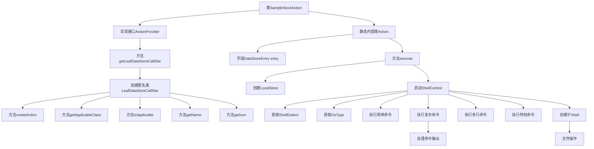
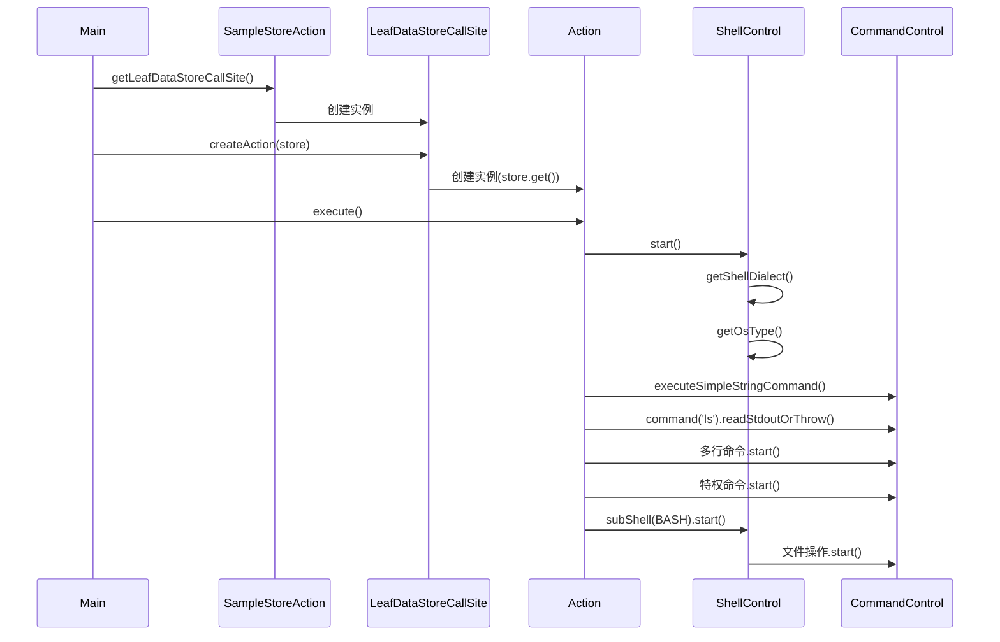

# 基础信息

|      |      |
|------|------|
| 名称 | SampleStoreAction |
| 编码语言 | .java |
| 代码路径 | xpipe/ext/base/src/main/java/io/xpipe/ext/base/action/SampleStoreAction.java |
| 包名 | io.xpipe.ext.base.action |
| 依赖项 | ['io.xpipe.app.core.AppI18n', 'io.xpipe.app.ext.ActionProvider', 'io.xpipe.app.ext.LocalStore', 'io.xpipe.app.ext.ShellStore', 'io.xpipe.app.storage.DataStoreEntry', 'io.xpipe.app.storage.DataStoreEntryRef', 'io.xpipe.app.util.LabelGraphic', 'io.xpipe.core.process.CommandControl', 'io.xpipe.core.process.ElevationFunction', 'io.xpipe.core.process.ShellControl', 'io.xpipe.core.process.ShellDialects', 'io.xpipe.core.store.FilePath', 'javafx.beans.value.ObservableValue', 'lombok.Value', 'java.io.BufferedReader', 'java.io.StringReader'] |
| 概述说明 | SampleStoreAction实现ActionProvider，提供ShellStore操作按钮，支持命令执行和脚本处理。 |

# 说明

该代码定义了一个名为SampleStoreAction的类，实现了ActionProvider接口，用于为存储的Shell连接提供操作功能。主要功能包括创建操作按钮、确定适用连接类型、设置操作名称和图标。内部Action类执行具体操作，如启动Shell控制、执行命令、处理输出、提升权限、切换子Shell等。支持多种Shell方言，提供复杂命令处理、文件操作和权限管理功能，适用于不同操作系统环境。所有操作通过try-with-resources确保资源释放，错误处理通过异常机制实现。

# 类列表 Class Summary

| 名称   | 类型  | 说明 |
|-------|------|-------------|
| SampleStoreAction | class | SampleStoreAction实现ActionProvider，提供ShellStore操作按钮，支持执行多种Shell命令和脚本。 |


## 类 SampleStoreAction

|      |      |
|------|------|
| 访问范围 | public |
| 类型 | class |
| 名称 | SampleStoreAction |
| 说明 | SampleStoreAction实现ActionProvider，提供ShellStore操作按钮，支持执行多种Shell命令和脚本。 |


### UML类图

```mermaid
classDiagram
    class SampleStoreAction {
        +LeafDataStoreCallSite~?~ getLeafDataStoreCallSite()
    }
    
    class Action {
        -DataStoreEntry entry
        +void execute() throws Exception
    }
    
    <<Interface>> ActionProvider {
        <<Interface>>
        +LeafDataStoreCallSite~?~ getLeafDataStoreCallSite()
    }
    
    <<Interface>> LeafDataStoreCallSite~T~ {
        <<Interface>>
        +Action createAction(DataStoreEntryRef~T~ store)
        +Class~T~ getApplicableClass()
        +boolean isApplicable(DataStoreEntryRef~T~ o)
        +ObservableValue~String~ getName(DataStoreEntryRef~T~ store)
        +LabelGraphic getIcon(DataStoreEntryRef~T~ store)
    }
    
    <<Interface>> ActionProvider.Action {
        <<Interface>>
        +void execute() throws Exception
    }
    
    SampleStoreAction --> ActionProvider : 实现
    SampleStoreAction ..|> LeafDataStoreCallSite~ShellStore~ : 创建匿名实现
    Action --> ActionProvider.Action : 实现
    LeafDataStoreCallSite~T~ --> DataStoreEntryRef~T~ : 依赖
    Action --> DataStoreEntry : 依赖
    Action --> ShellControl : 依赖
    Action --> CommandControl : 依赖
```

这段代码展示了一个Shell连接存储操作的实现框架。SampleStoreAction类实现了ActionProvider接口，通过内部匿名类实现LeafDataStoreCallSite接口来定义具体操作行为。核心Action类封装了执行逻辑，包含与ShellControl和CommandControl的交互，支持多种shell命令执行方式、权限提升和工作目录设置等功能。整个设计采用接口隔离原则，通过泛型和回调机制实现灵活的操作扩展。


### 内部方法调用关系图





这段代码实现了一个Shell连接存储操作框架，主要包含SampleStoreAction类和其内部Action类。流程图展示了类结构和主要方法调用关系，时序图则详细描述了从获取调用站点到执行各种Shell命令的完整过程。该框架支持创建不同类型的Shell操作，包括简单命令执行、多行脚本处理、特权命令操作以及子Shell创建等功能，同时提供了丰富的命令控制和输出处理机制。

### 字段列表 Field List

| 名称  | 类型  | 说明 |
|-------|-------|------|

### 方法列表 Method List

| 名称  | 类型  | 说明 |
|-------|-------|------|
| getLeafDataStoreCallSite | LeafDataStoreCallSite<?> | 重写方法返回按钮操作，适用于ShellStore类，显示名称和图标可定制。 |


