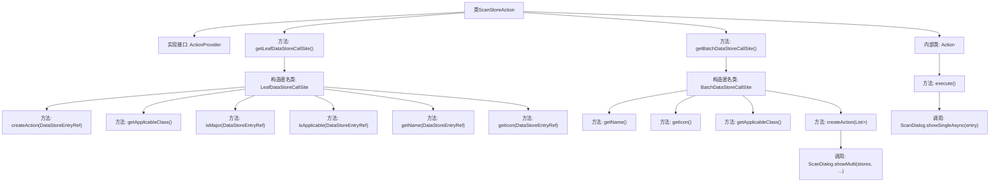

# 基础信息

|      |      |
|------|------|
| 名称 | ScanStoreAction |
| 编码语言 | .java |
| 代码路径 | xpipe/ext/base/src/main/java/io/xpipe/ext/base/action/ScanStoreAction.java |
| 包名 | io.xpipe.ext.base.action |
| 依赖项 | ['io.xpipe.app.core.AppI18n', 'io.xpipe.app.ext.ActionProvider', 'io.xpipe.app.ext.ShellStore', 'io.xpipe.app.storage.DataStoreEntry', 'io.xpipe.app.storage.DataStoreEntryRef', 'io.xpipe.app.util.LabelGraphic', 'io.xpipe.app.util.ScanDialog', 'io.xpipe.app.util.ScanDialogAction', 'io.xpipe.core.process.ShellTtyState', 'io.xpipe.core.process.SystemState', 'javafx.beans.value.ObservableValue', 'lombok.Value', 'java.util.List'] |
| 概述说明 | 扫描连接操作类，支持单/批量处理ShellStore，检查状态并显示对话框。 |

# 说明

ScanStoreAction是一个实现ActionProvider接口的类，提供对ShellStore数据存储的扫描操作。它包含两个主要部分：LeafDataStoreCallSite处理单个存储项操作，BatchDataStoreCallSite处理批量操作。单个操作检查ShellStore状态条件，支持无交互模式且无TTY状态的连接扫描，显示"scanConnections"名称和特定图标。批量操作显示"addConnections"名称和相同图标，支持多连接扫描对话框。内部Action类执行单个存储项的异步扫描对话框显示。

# 类列表 Class Summary

| 名称   | 类型  | 说明 |
|-------|------|-------------|
| ScanStoreAction | class | 扫描连接操作类，实现单条和批量处理ShellStore数据。 |


## 类 ScanStoreAction

|      |      |
|------|------|
| 访问范围 | public |
| 类型 | class |
| 名称 | ScanStoreAction |
| 说明 | 扫描连接操作类，实现单条和批量处理ShellStore数据。 |


### UML类图

```mermaid
classDiagram
    class ActionProvider {
        <<Interface>>
        +LeafDataStoreCallSite~?~ getLeafDataStoreCallSite()
        +BatchDataStoreCallSite~?~ getBatchDataStoreCallSite()
    }

    class ScanStoreAction {
        +LeafDataStoreCallSite~?~ getLeafDataStoreCallSite()
        +BatchDataStoreCallSite~?~ getBatchDataStoreCallSite()
    }

    class LeafDataStoreCallSite~T~ {
        <<Interface>>
        +Action createAction(DataStoreEntryRef~T~ store)
        +Class~T~ getApplicableClass()
        +boolean isMajor(DataStoreEntryRef~T~ o)
        +boolean isApplicable(DataStoreEntryRef~T~ o)
        +ObservableValue~String~ getName(DataStoreEntryRef~T~ store)
        +LabelGraphic getIcon(DataStoreEntryRef~T~ store)
    }

    class BatchDataStoreCallSite~T~ {
        <<Interface>>
        +ObservableValue~String~ getName()
        +LabelGraphic getIcon()
        +Class~?~ getApplicableClass()
        +Action createAction(List~DataStoreEntryRef~T~~ stores)
    }

    class Action {
        <<Interface>>
        +void execute()
    }

    class ScanStoreAction..Action {
        -DataStoreEntry entry
        +void execute()
    }

    ScanStoreAction --> ActionProvider : 实现
    ScanStoreAction --> LeafDataStoreCallSite~ShellStore~ : 创建匿名实例
    ScanStoreAction --> BatchDataStoreCallSite~ShellStore~ : 创建匿名实例
    LeafDataStoreCallSite~T~ --> Action : 生成
    BatchDataStoreCallSite~T~ --> Action : 生成
```

该代码展示了ScanStoreAction类实现ActionProvider接口，提供对ShellStore数据存储的扫描操作功能。通过两个内部匿名类分别实现LeafDataStoreCallSite和BatchDataStoreCallSite接口，处理单条和多条数据记录的操作。核心逻辑包括状态检查、对话框展示等，使用泛型确保类型安全，并通过值类Action封装具体执行逻辑。整体设计采用工厂模式创建操作实例，支持国际化和图标显示。


### 内部方法调用关系图



这段代码展示了一个实现ActionProvider接口的ScanStoreAction类，主要提供两种数据存储调用站点：单条数据处理（LeafDataStoreCallSite）和批量数据处理（BatchDataStoreCallSite）。流程图清晰地描述了类结构、方法调用关系以及内部匿名类的实现细节，包括条件判断、对话框调用等关键操作。其中isApplicable方法包含复杂的系统状态检查逻辑，而execute方法则根据存储条目类型决定调用不同的扫描对话框。整体设计体现了策略模式的应用，通过不同的CallSite实现来适应不同场景的数据处理需求。

### 字段列表 Field List

| 名称  | 类型  | 说明 |
|-------|-------|------|

### 方法列表 Method List

| 名称  | 类型  | 说明 |
|-------|-------|------|
| getBatchDataStoreCallSite | BatchDataStoreCallSite<?> | 重写方法返回BatchDataStoreCallSite实例，包含名称、图标、适用类和创建扫描对话框动作。 |
| getLeafDataStoreCallSite | LeafDataStoreCallSite<?> | 重写方法返回自定义LeafDataStoreCallSite，包含创建动作、类检查、适用性判断等功能。 |


