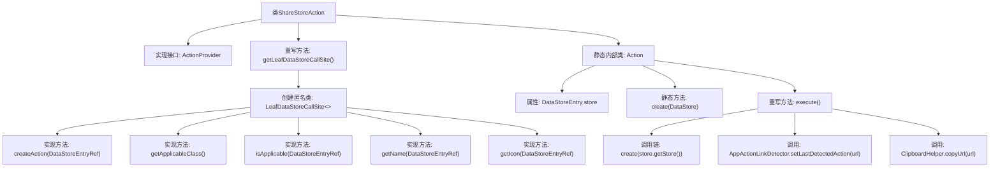

# 基础信息

|      |      |
|------|------|
| 名称 | ShareStoreAction |
| 编码语言 | .java |
| 代码路径 | xpipe/ext/base/src/main/java/io/xpipe/ext/base/action/ShareStoreAction.java |
| 包名 | io.xpipe.ext.base.action |
| 依赖项 | ['io.xpipe.app.core.AppActionLinkDetector', 'io.xpipe.app.core.AppI18n', 'io.xpipe.app.ext.ActionProvider', 'io.xpipe.app.storage.DataStoreEntry', 'io.xpipe.app.storage.DataStoreEntryRef', 'io.xpipe.app.util.ClipboardHelper', 'io.xpipe.app.util.LabelGraphic', 'io.xpipe.core.store.DataStore', 'io.xpipe.core.util.InPlaceSecretValue', 'javafx.beans.value.ObservableValue', 'lombok.Value'] |
| 概述说明 | ShareStoreAction类实现共享存储功能，生成链接并复制到剪贴板。 |

# 说明

这是一个实现共享存储功能的Java类。ShareStoreAction类实现了ActionProvider接口，提供了获取数据存储调用站点的方法。内部定义了LeafDataStoreCallSite类，实现了创建动作、判断适用性、获取名称和图标等功能。静态Action类封装了具体执行逻辑，包括生成加密的存储链接、设置最后检测动作和复制链接到剪贴板。整个类专注于实现数据存储的共享功能，包含链接生成、加密处理和剪贴板操作等关键细节。

# 类列表 Class Summary

| 名称   | 类型  | 说明 |
|-------|------|-------------|
| ShareStoreAction | class | ShareStoreAction类实现共享存储操作，生成链接并复制到剪贴板。 |


## 类 ShareStoreAction

|      |      |
|------|------|
| 访问范围 | public |
| 类型 | class |
| 名称 | ShareStoreAction |
| 说明 | ShareStoreAction类实现共享存储操作，生成链接并复制到剪贴板。 |


### UML类图

```mermaid
classDiagram
    class ShareStoreAction {
        +LeafDataStoreCallSite~?~ getLeafDataStoreCallSite()
    }
    <<interface>> ShareStoreAction {
        <<Interface>>
    }

    class LeafDataStoreCallSite~T~ {
        <<interface>>
        +Action createAction(DataStoreEntryRef~DataStore~ store)
        +Class~DataStore~ getApplicableClass()
        +boolean isApplicable(DataStoreEntryRef~DataStore~ o)
        +ObservableValue~String~ getName(DataStoreEntryRef~DataStore~ store)
        +LabelGraphic getIcon(DataStoreEntryRef~DataStore~ store)
    }
    <<interface>> LeafDataStoreCallSite~T~ {
        <<Interface>>
    }

    class Action {
        -DataStoreEntry store
        +Action(DataStoreEntry store)
        +static String create(DataStore store)
        +void execute()
    }

    class DataStoreEntryRef~T~ {
        <<interface>>
        +T get()
    }
    <<interface>> DataStoreEntryRef~T~ {
        <<Interface>>
    }

    class DataStore {
        <<interface>>
        +Provider getProvider()
    }
    <<interface>> DataStore {
        <<Interface>>
    }

    class Provider {
        <<interface>>
        +boolean isShareable(DataStore store)
    }
    <<interface>> Provider {
        <<Interface>>
    }

    ShareStoreAction --> LeafDataStoreCallSite~?~ : 实现
    LeafDataStoreCallSite~?~ --> Action : 创建
    Action --> DataStoreEntry : 使用
    DataStoreEntryRef~T~ --> DataStore : 引用
    DataStore --> Provider : 依赖
```

这段类图展示了ShareStoreAction及其相关组件的结构关系。ShareStoreAction实现了ActionProvider接口，通过getLeafDataStoreCallSite()方法返回一个LeafDataStoreCallSite匿名实现类。该实现类负责创建Action对象，并定义了数据存储相关的操作逻辑。Action类包含核心业务逻辑，通过DataStoreEntryRef间接操作DataStore，而DataStore又依赖于Provider接口来判断是否可共享。整个设计采用了多层次的接口抽象，体现了良好的解耦和扩展性。


### 内部方法调用关系图



这段代码流程图展示了ShareStoreAction类的结构及其与内部组件的关系。该类实现了ActionProvider接口，核心是通过getLeafDataStoreCallSite方法返回一个匿名LeafDataStoreCallSite实现类，该匿名类重写了5个关键方法用于处理数据存储操作。静态内部类Action包含核心业务逻辑，其中execute方法通过生成加密URL、记录操作和复制到剪贴板三个步骤实现共享功能。整体设计采用策略模式，将数据存储操作与具体实现解耦。

### 字段列表 Field List

| 名称  | 类型  | 说明 |
|-------|-------|------|

### 方法列表 Method List

| 名称  | 类型  | 说明 |
|-------|-------|------|
| getLeafDataStoreCallSite | LeafDataStoreCallSite<?> | 重写方法返回自定义LeafDataStoreCallSite，实现创建动作、类匹配、适用性检查、名称和图标功能。 |


