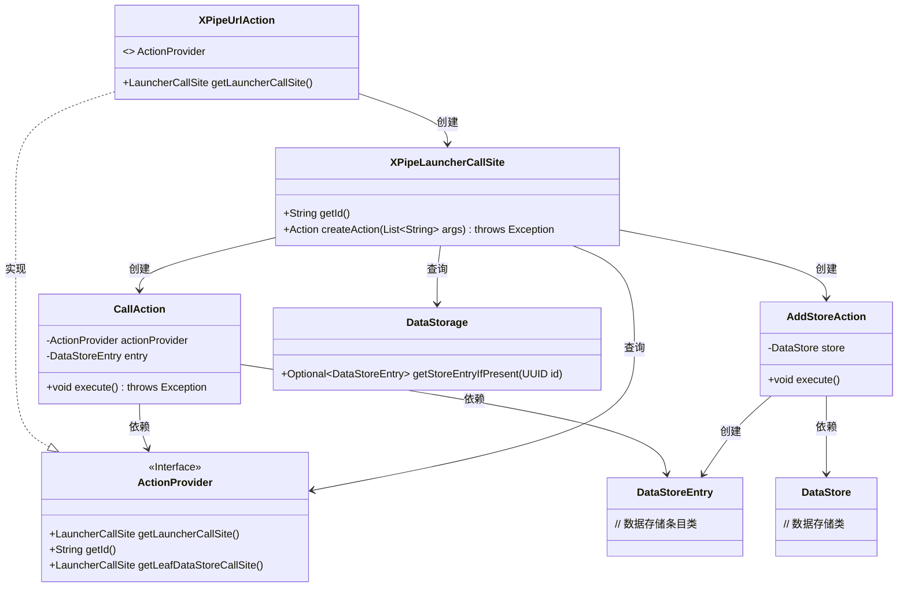
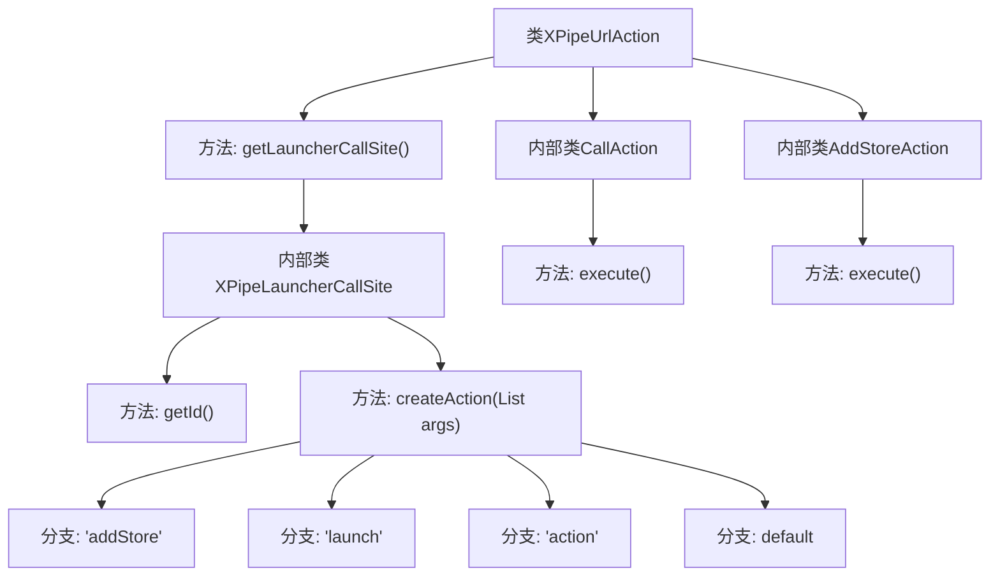
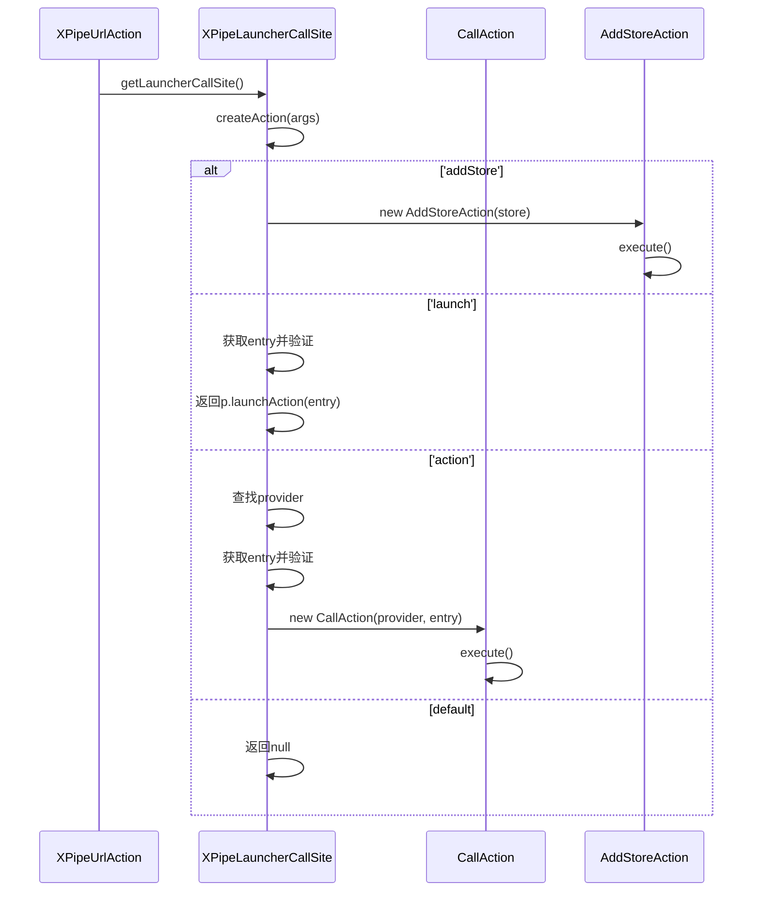

# 基础信息

|      |      |
|------|------|
| 名称 | XPipeUrlAction |
| 编码语言 | .java |
| 代码路径 | xpipe/ext/base/src/main/java/io/xpipe/ext/base/action/XPipeUrlAction.java |
| 包名 | io.xpipe.ext.base.action |
| 依赖项 | ['io.xpipe.app.comp.store.StoreCreationDialog', 'io.xpipe.app.comp.store.StoreViewState', 'io.xpipe.app.ext.ActionProvider', 'io.xpipe.app.issue.TrackEvent', 'io.xpipe.app.storage.DataStorage', 'io.xpipe.app.storage.DataStoreEntry', 'io.xpipe.core.store.DataStore', 'io.xpipe.core.util.InPlaceSecretValue', 'io.xpipe.core.util.JacksonMapper', 'lombok.Value', 'java.util.List', 'java.util.UUID'] |
| 概述说明 | XPipeUrlAction类实现ActionProvider接口，提供三种操作：添加存储、启动存储和执行特定动作。 |

# 说明

该代码定义了一个名为XPipeUrlAction的类，实现了ActionProvider接口。它提供了三种操作：addStore用于添加加密存储数据，launch用于启动指定存储条目，action用于执行特定提供者的操作。类中包含两个静态内部类：CallAction用于执行提供者的操作，AddStoreAction用于创建并显示新的存储条目对话框。所有操作都通过参数列表进行控制，并包含数据验证和跟踪功能。

# 类列表 Class Summary

| 名称   | 类型  | 说明 |
|-------|------|-------------|
| XPipeUrlAction | class | XPipeUrlAction实现ActionProvider，提供addStore、launch和action三种操作，分别处理存储添加、启动和自定义动作执行。 |

## 类 XPipeUrlAction

|      |      |
|------|------|
| 访问范围 | public |
| 类型 | class |
| 名称 | XPipeUrlAction |
| 说明 | XPipeUrlAction实现ActionProvider，提供addStore、launch和action三种操作，分别处理存储添加、启动和自定义动作执行。 |

### UML类图

这段代码展示了一个URL动作处理系统，核心是`XPipeUrlAction`类实现了`ActionProvider`接口。系统通过`XPipeLauncherCallSite`处理三种动作类型："addStore"创建存储、"launch"启动条目、"action"执行特定操作。代码使用工厂模式动态创建`CallAction`和`AddStoreAction`，涉及数据存储管理、UUID查询和动作执行等复杂交互。类图中清晰地展示了各组件间的创建、依赖和实现关系，体现了良好的分层设计和职责分离。

### 内部方法调用关系图

这段代码实现了一个URL动作处理器，主要包含三个核心功能：添加存储(addStore)、启动资源(launch)和执行特定动作(action)。流程图展示了类结构关系，其中XPipeUrlAction通过内部类XPipeLauncherCallSite处理不同动作类型，并分别调用CallAction和AddStoreAction来执行具体操作。时序图则详细描述了根据输入参数选择不同执行路径的过程，包括参数解析、条件判断和动作执行等关键步骤。整个设计采用策略模式，通过参数动态选择不同的处理逻辑。

### 字段列表 Field List

| 名称  | 类型  | 说明 |
|-------|-------|------|

### 方法列表 Method List

| 名称  | 类型  | 说明 |
|-------|-------|------|
| getLauncherCallSite | LauncherCallSite | 重写getLauncherCallSite方法，根据参数执行添加存储、启动或调用操作。 |

