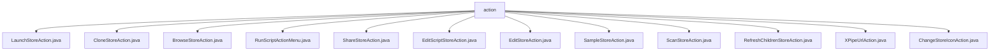

# 基础信息

|      |      |
|------|------|
| 名称 | action |
| 编码语言 | .java |
| 代码路径 | xpipe/ext/base/src/main/java/io/xpipe/ext/base/action |
| 包名 | xpipe.ext.base.src.main.java.io.xpipe.ext.base.action |
| 概述说明 | 多个Java类实现ActionProvider接口，提供数据存储操作如启动、克隆、浏览、脚本执行、共享、编辑、扫描、刷新等，包含名称图标显示和执行逻辑。 |

# 说明

```markdown
## 概述
该代码模块是一个基于Java实现的数据存储操作框架，主要围绕`ActionProvider`接口构建了一系列针对数据存储（DataStore）的操作功能。模块包含多个功能类，每个类专注于不同的存储操作场景，如启动、克隆、浏览、脚本执行、共享、编辑、扫描、刷新等。这些操作通过统一的接口设计，提供了标准化的调用方式、适用性检查、名称/图标显示以及具体业务逻辑实现。

## 主要业务场景
1. **存储启动与连接管理**  
   - `LaunchStoreAction`：检查并执行存储的启动操作
   - `SampleStoreAction`：提供Shell连接操作（命令执行、权限管理等）
   - `ScanStoreAction`：支持单/批量扫描Shell连接状态

2. **存储内容操作**  
   - `BrowseStoreAction`：实现存储内容浏览与文件系统同步
   - `RefreshChildrenStoreAction`：刷新存储子项数据
   - `XPipeUrlAction`：通过URL参数控制存储操作（添加/启动/执行）

3. **存储配置管理**  
   - `EditStoreAction`/`EditScriptStoreAction`：提供存储配置编辑功能
   - `ChangeStoreIconAction`：修改存储项的显示图标
   - `CloneStoreAction`：实现存储条目的复制与时间戳管理

4. **脚本与自动化**  
   - `RunScriptActionMenu`：支持多种脚本执行模式（终端/后台/中心执行）
   - 包含异常处理场景（脚本禁用/无可用脚本等）

5. **数据共享**  
   - `ShareStoreAction`：生成加密存储链接并处理剪贴板操作

模块特点：
- 采用统一的`LeafDataStoreCallSite`/`BatchDataStoreCallSite`调用机制
- 支持国际化名称和图标显示
- 包含完善的异常处理和工作状态检查
- 通过对话框（如`StoreCreationDialog`）实现用户交互
- 采用异步操作和资源安全释放机制（try-with-resources）
```


### 包内部结构视图



该流程图展示了xpipe项目中base模块下的action目录结构，根节点为action文件夹，包含12个具体的Java类文件，这些文件都是不同类型的操作类，如LaunchStoreAction、CloneStoreAction等，用于实现各种存储操作功能。所有子节点均直接隶属于action目录，没有更深层级的嵌套关系。

# 文件列表 File List

| 名称   | 类型  | 说明 |
|-------|------|-------------|
| [LaunchStoreAction.java](LaunchStoreAction.md) | file | 实现启动商店操作的ActionProvider类，包含数据存储调用站点和方法。 |
| [CloneStoreAction.java](CloneStoreAction.md) | file | 克隆存储操作类，实现系统动作，检查可克隆性并创建副本。 |
| [SampleStoreAction.java](SampleStoreAction.md) | file | SampleStoreAction实现ActionProvider，提供ShellStore操作按钮，支持命令执行和脚本处理。 |
| [EditStoreAction.java](EditStoreAction.md) | file | 编辑数据存储的ActionProvider实现类。 |
| [EditScriptStoreAction.java](EditScriptStoreAction.md) | file | 编辑脚本存储操作类，实现系统动作，支持编辑SimpleScriptStore。 |
| [ShareStoreAction.java](ShareStoreAction.md) | file | ShareStoreAction类实现共享存储功能，生成链接并复制到剪贴板。 |
| [BrowseStoreAction.java](BrowseStoreAction.md) | file | 实现浏览商店操作的ActionProvider类，包含数据存储调用和文件系统打开功能。 |
| [ChangeStoreIconAction.java](ChangeStoreIconAction.md) | file | Java类实现更改存储图标操作，含系统动作、名称、图标及执行逻辑。 |
| [XPipeUrlAction.java](XPipeUrlAction.md) | file | XPipeUrlAction类实现ActionProvider接口，提供三种操作：添加存储、启动存储和执行特定动作。 |
| [RefreshChildrenStoreAction.java](RefreshChildrenStoreAction.md) | file | 刷新子存储操作类，实现ActionProvider接口，提供Leaf和Default两种调用方式，执行子存储刷新功能。 |
| [ScanStoreAction.java](ScanStoreAction.md) | file | 扫描连接操作类，支持单/批量处理ShellStore，检查状态并显示对话框。 |
| [RunScriptActionMenu.java](RunScriptActionMenu.md) | file | 代码实现脚本运行菜单功能，支持终端、连接中心和后台执行。 |


