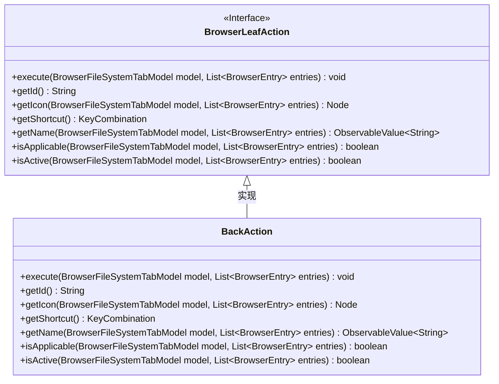
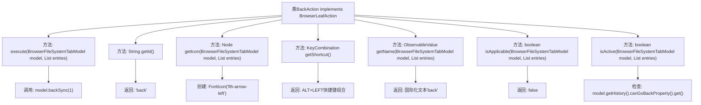

# 基础信息

|      |      |
|------|------|
| 名称 | BackAction |
| 编码语言 | .java |
| 代码路径 | xpipe/ext/base/src/main/java/io/xpipe/ext/base/browser/BackAction.java |
| 包名 | io.xpipe.ext.base.browser |
| 依赖项 | ['io.xpipe.app.browser.action.BrowserLeafAction', 'io.xpipe.app.browser.file.BrowserEntry', 'io.xpipe.app.browser.file.BrowserFileSystemTabModel', 'io.xpipe.app.core.AppI18n', 'javafx.beans.value.ObservableValue', 'javafx.scene.Node', 'javafx.scene.input.KeyCode', 'javafx.scene.input.KeyCodeCombination', 'javafx.scene.input.KeyCombination', 'org.kordamp.ikonli.javafx.FontIcon', 'java.util.List'] |
| 概述说明 | BackAction类实现浏览器后退功能，含快捷键、图标及状态检查。 |

# 说明

BackAction类实现了BrowserLeafAction接口，用于浏览器文件系统标签页的后退操作。执行execute方法时会调用model的backSync方法后退一步。该类定义了唯一标识符"back"，使用左箭头图标作为按钮图标，快捷键设置为Alt+左方向键。名称通过国际化资源获取显示文本"back"。isApplicable方法始终返回false表示该操作不可用，而isActive方法通过检查历史记录判断是否可以执行后退操作。

# 类列表 Class Summary

| 名称   | 类型  | 说明 |
|-------|------|-------------|
| BackAction | class | BackAction类实现浏览器后退功能，含快捷键、图标和状态检查。 |

## 类 BackAction

|      |      |
|------|------|
| 访问范围 | public |
| 类型 | class |
| 名称 | BackAction |
| 说明 | BackAction类实现浏览器后退功能，含快捷键、图标和状态检查。 |

### UML类图

这段类图展示了BackAction类实现了BrowserLeafAction接口的结构关系。BackAction是一个浏览器后退操作的具体实现类，提供了执行后退动作、获取ID、图标、快捷键、名称以及判断操作是否可用和激活状态的方法。接口定义了浏览器叶子节点操作的标准行为规范，而BackAction则实现了这些规范，特别是通过model.backSync(1)实现后退功能，并使用ALT+LEFT快捷键组合。类图清晰地体现了接口与实现类之间的继承关系。

### 内部方法调用关系图

这段代码实现了BrowserLeafAction接口的BackAction类，主要功能是浏览器后退操作。核心方法execute()会调用model.backSync(1)执行后退，getIcon()返回左箭头图标，getShortcut()定义ALT+LEFT快捷键，isActive()通过历史记录检查能否后退。类包含完整的动作定义：执行逻辑、ID、图标、快捷键、名称、可用性和激活状态判断，构成一个完整的浏览器后退功能实现。

### 字段列表 Field List

| 名称  | 类型  | 说明 |
|-------|-------|------|

### 方法列表 Method List

| 名称  | 类型  | 说明 |
|-------|-------|------|
| getIcon | Node | 重写方法返回左箭头图标。 |
| getShortcut | KeyCombination | 重写方法返回ALT+左箭头快捷键组合 |
| execute | void | 重写方法，调用模型回退同步操作。 |
| getName | ObservableValue<String> | 重写方法返回"back"的国际化可观察值。 |
| getId | String | 方法返回字符串"back"。 |
| isApplicable | boolean | 方法重写，始终返回false。 |
| isActive | boolean | 方法检查浏览器文件系统标签模型的历史记录是否可以后退。 |

