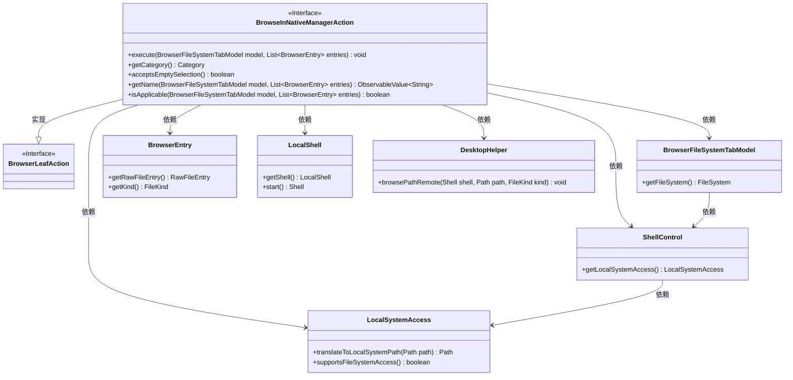
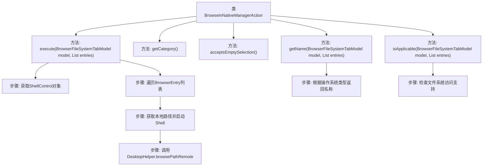

# 基础信息

|      |      |
|------|------|
| 名称 | BrowseInNativeManagerAction |
| 编码语言 | .java |
| 代码路径 | xpipe/ext/base/src/main/java/io/xpipe/ext/base/browser/BrowseInNativeManagerAction.java |
| 包名 | io.xpipe.ext.base.browser |
| 依赖项 | ['io.xpipe.app.browser.action.BrowserLeafAction', 'io.xpipe.app.browser.file.BrowserEntry', 'io.xpipe.app.browser.file.BrowserFileSystemTabModel', 'io.xpipe.app.core.AppI18n', 'io.xpipe.app.util.DesktopHelper', 'io.xpipe.app.util.LocalShell', 'io.xpipe.core.process.OsType', 'io.xpipe.core.process.ShellControl', 'javafx.beans.value.ObservableValue', 'java.util.List'] |
| 概述说明 | 浏览本地文件管理器操作类，支持跨平台打开文件路径，检查系统兼容性。 |

# 说明

该代码定义了一个名为BrowseInNativeManagerAction的类，实现了BrowserLeafAction接口。主要功能是在本地文件管理器中浏览远程文件系统条目。execute方法通过ShellControl获取本地路径，并使用DesktopHelper打开对应路径。getCategory方法返回NATIVE分类，acceptsEmptySelection允许空选择。getName方法根据操作系统类型返回不同的本地化名称。isApplicable方法检查文件系统是否支持文件访问功能。

# 类列表 Class Summary

| 名称   | 类型  | 说明 |
|-------|------|-------------|
| BrowseInNativeManagerAction | class | 浏览本地文件管理器操作类，支持跨平台打开文件路径，检查系统兼容性。 |

## 类 BrowseInNativeManagerAction

|      |      |
|------|------|
| 访问范围 | public |
| 类型 | class |
| 名称 | BrowseInNativeManagerAction |
| 说明 | 浏览本地文件管理器操作类，支持跨平台打开文件路径，检查系统兼容性。 |

### UML类图

这段代码定义了一个`BrowseInNativeManagerAction`类，实现了`BrowserLeafAction`接口，用于在本地文件系统中浏览远程文件。该类通过`ShellControl`和`LocalSystemAccess`将远程路径转换为本地路径，并使用`LocalShell`和`DesktopHelper`在本地文件管理器中打开。代码根据操作系统类型显示不同的名称，并检查文件系统访问支持。类图展示了各个类之间的依赖和实现关系，核心功能是将远程文件路径映射到本地并调用系统文件管理器打开。

### 内部方法调用关系图

这段代码实现了一个浏览器原生管理操作类，主要功能包括：通过ShellControl获取本地系统路径并打开文件/目录（execute方法），根据操作系统类型返回不同的动作名称（getName方法），以及检查文件系统访问支持（isApplicable方法）。流程图展示了类结构和方法调用关系，核心逻辑集中在execute方法中完成路径转换和系统调用，其他方法提供辅助功能如类别判断和空选择处理。

### 字段列表 Field List

| 名称  | 类型  | 说明 |
|-------|-------|------|

### 方法列表 Method List

| 名称  | 类型  | 说明 |
|-------|-------|------|
| acceptsEmptySelection | boolean | 重写方法，允许空选择，返回true。 |
| getName | ObservableValue<String> | 根据操作系统返回不同文件浏览操作的本地化名称。 |
| isApplicable | boolean | 检查文件系统是否支持本地访问。 |
| execute | void | 方法重写，遍历条目，转换路径并远程浏览文件。 |
| getCategory | Category | 重写getCategory方法，返回NATIVE类别。 |

