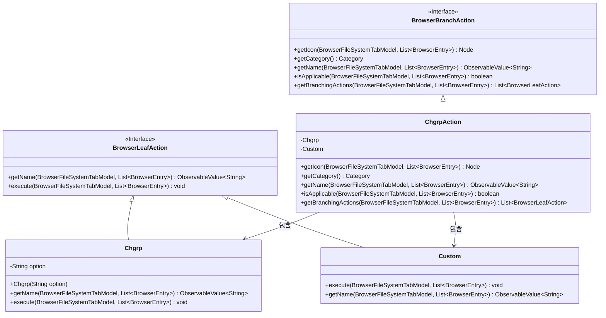
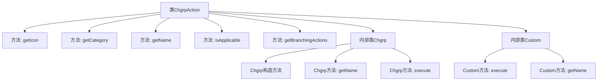
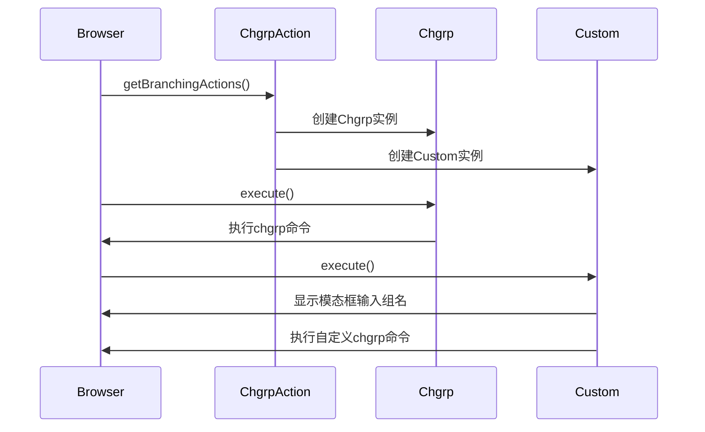

# 基础信息

|      |      |
|------|------|
| 名称 | ChgrpAction |
| 编码语言 | .java |
| 代码路径 | xpipe/ext/base/src/main/java/io/xpipe/ext/base/browser/ChgrpAction.java |
| 包名 | io.xpipe.ext.base.browser |
| 依赖项 | ['io.xpipe.app.browser.action.BrowserBranchAction', 'io.xpipe.app.browser.action.BrowserLeafAction', 'io.xpipe.app.browser.file.BrowserEntry', 'io.xpipe.app.browser.file.BrowserFileSystemTabModel', 'io.xpipe.app.comp.Comp', 'io.xpipe.app.comp.base.ModalOverlay', 'io.xpipe.app.core.AppI18n', 'io.xpipe.core.process.CommandBuilder', 'io.xpipe.core.process.OsType', 'javafx.beans.property.SimpleStringProperty', 'javafx.beans.value.ObservableValue', 'javafx.scene.Node', 'javafx.scene.control.TextField', 'org.kordamp.ikonli.javafx.FontIcon', 'java.util.List', 'java.util.stream.Stream'] |
| 概述说明 | ChgrpAction实现文件组修改功能，支持选择预设组或自定义组名，适用于非Windows/Mac系统。 |

# 说明

ChgrpAction是一个实现BrowserBranchAction接口的类，用于在文件浏览器中执行修改文件组权限的操作。它提供了图标、分类、名称和适用性检查功能。适用性检查确保仅在非Windows和非MacOS系统上可用。getBranchingActions方法返回一组BrowserLeafAction，包括预定义的组选项和自定义组输入功能。预定义组选项过滤掉无效组（如nohome、nogroup、nobody），并显示有效组名。Chgrp类执行具体的chgrp命令，而Custom类允许用户输入自定义组名并通过模态窗口执行命令。整体功能围绕修改文件组权限展开，支持预定义和自定义组操作。

# 类列表 Class Summary

| 名称   | 类型  | 说明 |
|-------|------|-------------|
| ChgrpAction | class | ChgrpAction类实现文件组变更功能，支持预选组或自定义组操作，适用于非Windows/Mac系统。 |

## 类 ChgrpAction

|      |      |
|------|------|
| 访问范围 | public |
| 类型 | class |
| 名称 | ChgrpAction |
| 说明 | ChgrpAction类实现文件组变更功能，支持预选组或自定义组操作，适用于非Windows/Mac系统。 |

### UML类图

这段代码展示了一个文件浏览器中修改文件组(chgrp)功能的实现架构。ChgrpAction作为主入口实现了BrowserBranchAction接口，提供组修改操作的核心逻辑。它包含两个内部类：Chgrp用于执行预定义组修改，Custom处理自定义组名输入。整个设计采用命令模式，通过BrowserLeafAction接口实现具体操作，支持非Windows/MacOS系统下的文件组修改功能，体现了良好的扩展性和平台兼容性。

### 内部方法调用关系图

这段代码实现了一个文件浏览器中的修改文件组(chgrp)功能。ChgrpAction类作为主入口，提供图标、名称、适用性检查等方法，并通过getBranchingActions()生成具体操作列表。内部包含两个实现类：Chgrp用于执行预定义的组修改操作，Custom则提供交互式界面让用户输入自定义组名。流程图展示了类结构关系，时序图描述了主要交互流程。代码特别处理了非Windows/Mac系统下的组修改场景，并过滤了系统保留组(nohome/nogroup/nobody)。

### 字段列表 Field List

| 名称  | 类型  | 说明 |
|-------|-------|------|

### 方法列表 Method List

| 名称  | 类型  | 说明 |
|-------|-------|------|
| getName | ObservableValue<String> | 重写方法返回"chgrp"的可观察值。 |
| getIcon | Node | 重写方法返回账户群组图标 |
| getCategory | Category | 重写getCategory方法，返回MUTATION枚举值。 |
| isApplicable | boolean | 检查操作系统非Windows和MacOS时适用 |
| getBranchingActions | List<BrowserLeafAction> | 重写方法返回合并后的操作列表，过滤特定组并添加自定义操作。 |

