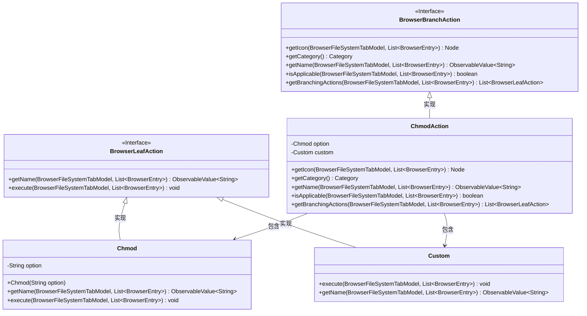
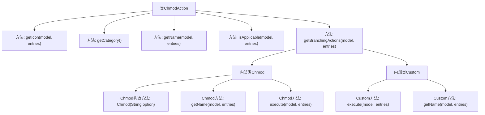

# 基础信息

|      |      |
|------|------|
| 名称 | ChmodAction |
| 编码语言 | .java |
| 代码路径 | xpipe/ext/base/src/main/java/io/xpipe/ext/base/browser/ChmodAction.java |
| 包名 | io.xpipe.ext.base.browser |
| 依赖项 | ['io.xpipe.app.browser.action.BrowserBranchAction', 'io.xpipe.app.browser.action.BrowserLeafAction', 'io.xpipe.app.browser.file.BrowserEntry', 'io.xpipe.app.browser.file.BrowserFileSystemTabModel', 'io.xpipe.app.comp.Comp', 'io.xpipe.app.comp.base.ModalOverlay', 'io.xpipe.app.core.AppI18n', 'io.xpipe.core.process.CommandBuilder', 'io.xpipe.core.process.OsType', 'javafx.beans.property.SimpleStringProperty', 'javafx.beans.value.ObservableValue', 'javafx.scene.Node', 'javafx.scene.control.TextField', 'org.kordamp.ikonli.javafx.FontIcon', 'java.util.List'] |
| 概述说明 | 实现文件权限修改功能，支持预设和自定义权限模式，适用于非Windows系统。 |

# 说明

该代码定义了一个名为ChmodAction的类，实现文件权限修改功能。它提供图标显示、分类标识和名称获取方法，仅适用于非Windows系统。核心功能包括预定义权限选项（如400、755等）和自定义权限输入。执行时通过Shell命令调用chmod，支持批量处理选中的文件条目。自定义权限通过弹窗让用户输入权限值后异步执行命令。整体结构分为分支动作和叶子动作两层，实现权限修改的完整流程。

# 类列表 Class Summary

| 名称   | 类型  | 说明 |
|-------|------|-------------|
| ChmodAction | class | 实现文件权限修改功能，支持多种预设模式和自定义输入。 |

## 类 ChmodAction

|      |      |
|------|------|
| 访问范围 | public |
| 类型 | class |
| 名称 | ChmodAction |
| 说明 | 实现文件权限修改功能，支持多种预设模式和自定义输入。 |

### UML类图

该代码实现了一个文件权限修改功能，核心类ChmodAction实现了BrowserBranchAction接口，提供不同权限选项（如400/755等）和自定义输入功能。通过Chmod和Custom两个内部类实现具体操作，其中Chmod处理预设权限模式，Custom提供交互式权限输入。整个设计符合GUI操作模式，通过命令模式调用底层系统chmod命令，且自动过滤Windows系统不适用场景。

### 内部方法调用关系图

该流程图展示了ChmodAction类的核心结构和调用关系。主类包含5个主要方法，其中getBranchingActions()会生成两个内部类Chmod和Custom的实例。Chmod类实现标准权限设置功能，包含构造方法和两个核心方法；Custom类提供自定义权限输入功能，通过模态窗口获取用户输入后执行命令。所有方法均围绕文件系统权限修改操作展开，形成完整的命令执行链条。

### 字段列表 Field List

| 名称  | 类型  | 说明 |
|-------|-------|------|

### 方法列表 Method List

| 名称  | 类型  | 说明 |
|-------|-------|------|
| getCategory | Category | 重写方法返回变异类型分类。 |
| isApplicable | boolean | 检查非Windows系统适用性 |
| getIcon | Node | 重写方法返回指定图标的FontIcon实例。 |
| getName | ObservableValue<String> | 重写方法返回可观察的"chmod"字符串值。 |
| getBranchingActions | List<BrowserLeafAction> | 重写方法返回包含不同Chmod权限和自定义操作的列表。 |

