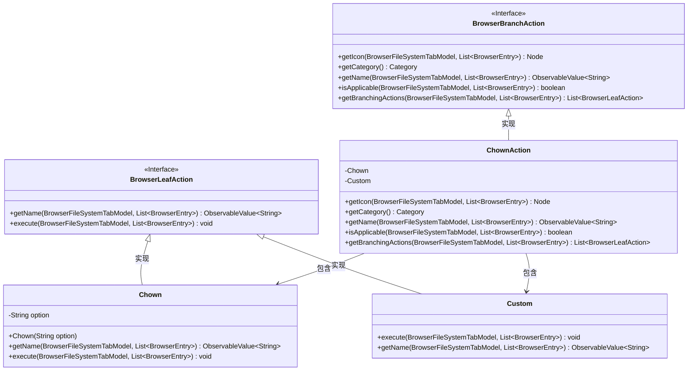
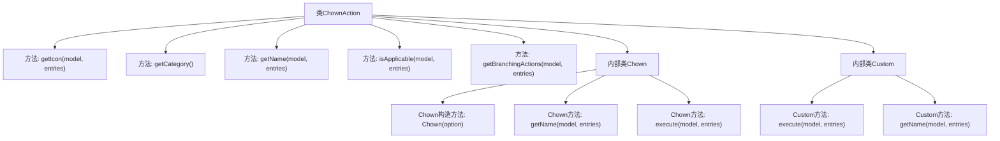

# 基础信息

|      |      |
|------|------|
| 名称 | ChownAction |
| 编码语言 | .java |
| 代码路径 | xpipe/ext/base/src/main/java/io/xpipe/ext/base/browser/ChownAction.java |
| 包名 | io.xpipe.ext.base.browser |
| 依赖项 | ['io.xpipe.app.browser.action.BrowserBranchAction', 'io.xpipe.app.browser.action.BrowserLeafAction', 'io.xpipe.app.browser.file.BrowserEntry', 'io.xpipe.app.browser.file.BrowserFileSystemTabModel', 'io.xpipe.app.comp.Comp', 'io.xpipe.app.comp.base.ModalOverlay', 'io.xpipe.app.core.AppI18n', 'io.xpipe.core.process.CommandBuilder', 'io.xpipe.core.process.OsType', 'javafx.beans.property.SimpleStringProperty', 'javafx.beans.value.ObservableValue', 'javafx.scene.Node', 'javafx.scene.control.TextField', 'org.kordamp.ikonli.javafx.FontIcon', 'java.util.List', 'java.util.stream.Stream'] |
| 概述说明 | ChownAction类实现文件所有权变更功能，支持用户选择和自定义操作，适用于非Windows/Mac系统。 |

# 说明

ChownAction是一个实现文件所有权变更的浏览器分支操作类。它提供图标、名称和分类信息，仅适用于非Windows和MacOS系统。主要功能包括生成用户列表作为子操作，过滤掉无效用户，支持预定义用户和自定义输入两种方式执行chown命令。自定义操作通过模态窗口获取用户名，异步执行命令。所有操作最终都会对选定文件路径执行chown命令变更所有权。

# 类列表 Class Summary

| 名称   | 类型  | 说明 |
|-------|------|-------------|
| ChownAction | class | ChownAction类实现文件所有权变更功能，支持用户选择或自定义所有者，适用于非Windows/Mac系统。 |

## 类 ChownAction

|      |      |
|------|------|
| 访问范围 | public |
| 类型 | class |
| 名称 | ChownAction |
| 说明 | ChownAction类实现文件所有权变更功能，支持用户选择或自定义所有者，适用于非Windows/Mac系统。 |

### UML类图

类图描述：该图展示了一个文件浏览器中修改文件所有者(Chown)功能的实现结构。ChownAction类实现了BrowserBranchAction接口，提供主操作逻辑，包含两个内部类Chown和Custom分别实现BrowserLeafAction接口。Chown用于执行预设用户的所有权修改，Custom允许自定义用户名输入。整体设计采用命令模式，通过BrowserFileSystemTabModel和BrowserEntry与文件系统交互，支持跨平台检测（排除Windows/MacOS）。

### 内部方法调用关系图

这段代码展示了一个实现`BrowserBranchAction`接口的`ChownAction`类，主要用于处理文件所有权变更操作。流程图清晰地展示了类结构，包含5个主要方法和2个内部类（Chown和Custom）。其中getBranchingActions方法生成操作列表，内部类分别处理预设用户和自定义用户两种情况。所有方法都围绕文件系统操作展开，特别是execute方法通过Shell执行chown命令，体现了完整的命令构建和执行流程。

### 字段列表 Field List

| 名称  | 类型  | 说明 |
|-------|-------|------|

### 方法列表 Method List

| 名称  | 类型  | 说明 |
|-------|-------|------|
| getName | ObservableValue<String> | 重写方法，返回可观察的"chown"国际化字符串。 |
| getBranchingActions | List<BrowserLeafAction> | 重写方法返回用户操作列表，过滤无效用户并添加自定义操作。 |
| isApplicable | boolean | 检查操作系统非Windows和MacOS时适用。 |
| getCategory | Category | 重写方法返回Category.MUTATION |
| getIcon | Node | 重写方法返回账户编辑图标。 |

