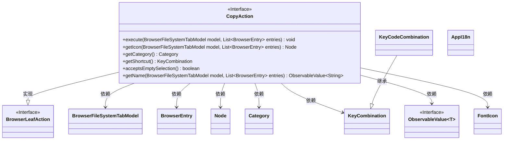
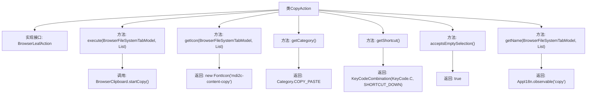

# 基础信息

|      |      |
|------|------|
| 名称 | CopyAction |
| 编码语言 | .java |
| 代码路径 | xpipe/ext/base/src/main/java/io/xpipe/ext/base/browser/CopyAction.java |
| 包名 | io.xpipe.ext.base.browser |
| 依赖项 | ['io.xpipe.app.browser.action.BrowserLeafAction', 'io.xpipe.app.browser.file.BrowserClipboard', 'io.xpipe.app.browser.file.BrowserEntry', 'io.xpipe.app.browser.file.BrowserFileSystemTabModel', 'io.xpipe.app.core.AppI18n', 'javafx.beans.value.ObservableValue', 'javafx.scene.Node', 'javafx.scene.input.KeyCode', 'javafx.scene.input.KeyCodeCombination', 'javafx.scene.input.KeyCombination', 'org.kordamp.ikonli.javafx.FontIcon', 'java.util.List'] |
| 概述说明 | CopyAction类实现浏览器文件复制功能，含执行、图标、类别、快捷键等方法。 |

# 说明

这是一个名为CopyAction的类，实现了BrowserLeafAction接口，用于处理文件复制操作。该类包含多个方法：execute方法启动复制流程，getIcon方法返回复制图标，getCategory方法返回操作类别为复制粘贴，getShortcut方法定义快捷键为Ctrl+C，acceptsEmptySelection方法允许空选择，getName方法返回本地化的"copy"名称。整个类封装了文件复制功能的相关属性和行为。

# 类列表 Class Summary

| 名称   | 类型  | 说明 |
|-------|------|-------------|
| CopyAction | class | CopyAction类实现浏览器文件复制功能，含执行、图标、分类、快捷键等方法。 |

## 类 CopyAction

|      |      |
|------|------|
| 访问范围 | public |
| 类型 | class |
| 名称 | CopyAction |
| 说明 | CopyAction类实现浏览器文件复制功能，含执行、图标、分类、快捷键等方法。 |

### UML类图

这段代码描述了一个实现`BrowserLeafAction`接口的`CopyAction`类，主要用于处理文件系统中的复制操作。类图中展示了`CopyAction`与多个组件的关系，包括文件系统模型、浏览器条目、图标节点、操作类别等。该接口定义了执行复制、获取图标、快捷键绑定等核心功能，并通过泛型`ObservableValue`支持国际化名称显示。整个设计体现了命令模式的特点，将复制操作封装为独立对象。

### 内部方法调用关系图

该流程图展示了CopyAction类的完整结构，该类实现了BrowserLeafAction接口。主要功能包括执行复制操作（通过BrowserClipboard.startCopy()）、提供复制图标（FontIcon）、返回操作类别（COPY_PASTE）、定义快捷键（Ctrl+C）、支持空选择（acceptsEmptySelection）以及提供国际化名称（AppI18n.observable）。每个方法调用和返回值都清晰标注，展现了文件复制操作的核心逻辑和UI交互要素。

### 字段列表 Field List

| 名称  | 类型  | 说明 |
|-------|-------|------|

### 方法列表 Method List

| 名称  | 类型  | 说明 |
|-------|-------|------|
| getCategory | Category | 重写方法返回COPY_PASTE类别 |
| getName | ObservableValue<String> | 重写方法，返回可观察的"copy"字符串值。 |
| acceptsEmptySelection | boolean | 方法重写，接受空选择时返回真。 |
| execute | void | 重写execute方法，调用BrowserClipboard开始复制指定目录下的条目。 |
| getIcon | Node | 重写方法返回复制图标的FontIcon对象。 |
| getShortcut | KeyCombination | 重写快捷键方法，返回Ctrl+C组合键。 |

