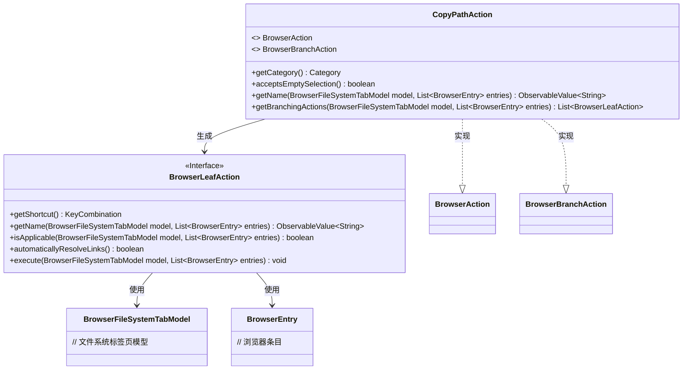
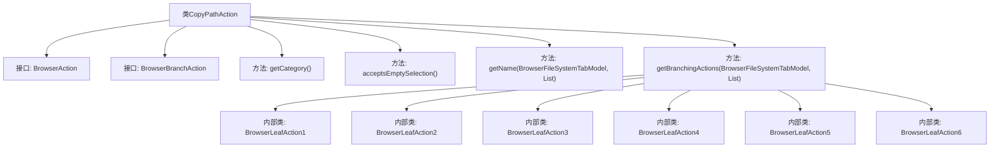

# 基础信息

|      |      |
|------|------|
| 名称 | CopyPathAction |
| 编码语言 | .java |
| 代码路径 | xpipe/ext/base/src/main/java/io/xpipe/ext/base/browser/CopyPathAction.java |
| 包名 | io.xpipe.ext.base.browser |
| 依赖项 | ['io.xpipe.app.browser.action.BrowserAction', 'io.xpipe.app.browser.action.BrowserActionFormatter', 'io.xpipe.app.browser.action.BrowserBranchAction', 'io.xpipe.app.browser.action.BrowserLeafAction', 'io.xpipe.app.browser.file.BrowserEntry', 'io.xpipe.app.browser.file.BrowserFileSystemTabModel', 'io.xpipe.app.core.AppI18n', 'io.xpipe.app.util.ClipboardHelper', 'io.xpipe.core.store.FileKind', 'javafx.beans.property.SimpleObjectProperty', 'javafx.beans.value.ObservableValue', 'javafx.scene.input.KeyCode', 'javafx.scene.input.KeyCodeCombination', 'javafx.scene.input.KeyCombination', 'java.util.List', 'java.util.stream.Collectors'] |
| 概述说明 | 复制路径操作类，支持多种路径和文件名复制方式。 |

# 说明

CopyPathAction类实现了浏览器文件路径复制功能，提供多种复制方式：绝对路径、带引号的路径、文件名、链接路径及带引号的文件名。支持快捷键操作，能处理单个或多个文件选择，自动检测空格路径并添加引号，对链接文件有特殊处理逻辑，所有操作最终将文本复制到剪贴板。

# 类列表 Class Summary

| 名称   | 类型  | 说明 |
|-------|------|-------------|
| CopyPathAction | class | 复制路径操作类，支持多种路径格式和文件名复制到剪贴板。 |

## 类 CopyPathAction

|      |      |
|------|------|
| 访问范围 | public |
| 类型 | class |
| 名称 | CopyPathAction |
| 说明 | 复制路径操作类，支持多种路径格式和文件名复制到剪贴板。 |

### UML类图

这段类图展示了CopyPathAction类实现了BrowserAction和BrowserBranchAction接口，并生成多个BrowserLeafAction实例的结构。CopyPathAction作为核心类，提供了获取分类、名称和分支动作的功能，而BrowserLeafAction则定义了具体操作的接口方法，包括快捷键、名称获取、适用性检查和执行逻辑。整个设计实现了文件路径复制功能的多态扩展，支持不同场景下的路径复制需求（如普通路径、链接路径、带引号路径等）。

### 内部方法调用关系图

这段代码定义了一个名为CopyPathAction的类，实现了BrowserAction和BrowserBranchAction接口，主要用于处理文件路径的复制操作。类中包含6个内部BrowserLeafAction类，每个都实现了不同的路径复制方式：普通路径、链接路径、带引号路径、文件名、链接文件名和带引号文件名。所有操作最终都会调用ClipboardHelper.copyText()方法将结果复制到剪贴板。

### 字段列表 Field List

| 名称  | 类型  | 说明 |
|-------|-------|------|

### 方法列表 Method List

| 名称  | 类型  | 说明 |
|-------|-------|------|
| acceptsEmptySelection | boolean | 重写方法，允许空选择，返回true。 |
| getCategory | Category | 重写方法返回COPY_PASTE类别 |
| getName | ObservableValue<String> | 重写方法返回可观察的"copyLocation"文本。 |
| getBranchingActions | List<BrowserLeafAction> | 代码实现多个文件操作：复制路径、链接路径、带引号路径、文件名、链接文件名及带引号文件名到剪贴板。 |

