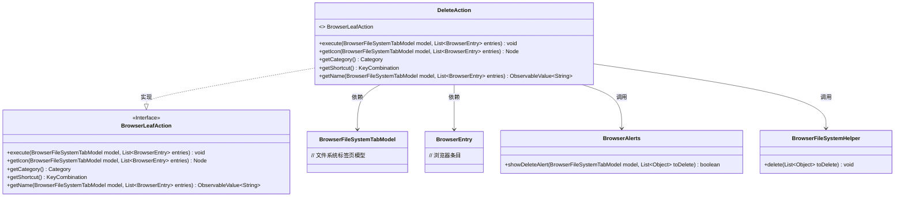
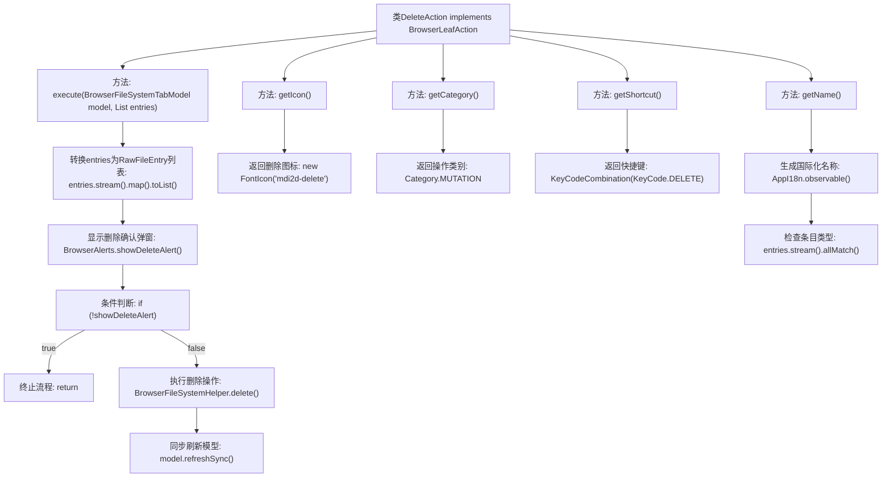

# 基础信息

|      |      |
|------|------|
| 名称 | DeleteAction |
| 编码语言 | .java |
| 代码路径 | xpipe/ext/base/src/main/java/io/xpipe/ext/base/browser/DeleteAction.java |
| 包名 | io.xpipe.ext.base.browser |
| 依赖项 | ['io.xpipe.app.browser.action.BrowserLeafAction', 'io.xpipe.app.browser.file.BrowserAlerts', 'io.xpipe.app.browser.file.BrowserEntry', 'io.xpipe.app.browser.file.BrowserFileSystemHelper', 'io.xpipe.app.browser.file.BrowserFileSystemTabModel', 'io.xpipe.app.core.AppI18n', 'io.xpipe.core.store.FileKind', 'javafx.beans.value.ObservableValue', 'javafx.scene.Node', 'javafx.scene.input.KeyCode', 'javafx.scene.input.KeyCodeCombination', 'javafx.scene.input.KeyCombination', 'org.kordamp.ikonli.javafx.FontIcon', 'java.util.List'] |
| 概述说明 | 删除文件操作类，含执行、图标、分类、快捷键和名称方法。 |

# 说明

这是一个名为DeleteAction的类，实现了BrowserLeafAction接口，用于在浏览器文件系统中执行删除操作。主要功能包括：执行删除前显示确认对话框，通过BrowserFileSystemHelper实际删除文件，并刷新模型。该类还定义了删除操作的图标（使用mdi2d-delete字体图标）、操作分类为MUTATION、快捷键设置为DELETE键，以及根据删除对象类型（文件或链接）动态生成操作名称。

# 类列表 Class Summary

| 名称   | 类型  | 说明 |
|-------|------|-------------|
| DeleteAction | class | 删除文件操作类，含执行删除、图标、分类、快捷键和名称方法。 |

## 类 DeleteAction

|      |      |
|------|------|
| 访问范围 | public |
| 类型 | class |
| 名称 | DeleteAction |
| 说明 | 删除文件操作类，含执行删除、图标、分类、快捷键和名称方法。 |

### UML类图

这段代码展示了一个实现BrowserLeafAction接口的DeleteAction类，主要用于处理文件删除操作。该类提供了删除确认、执行删除、刷新视图等完整功能链，同时包含图标、分类、快捷键和多语言名称支持。通过BrowserAlerts进行删除确认，通过BrowserFileSystemHelper执行实际删除操作，最后刷新BrowserFileSystemTabModel模型。整个设计体现了清晰的职责分离和模块化思想，符合GUI操作命令模式的最佳实践。

### 内部方法调用关系图

流程图描述：该流程图描述了DeleteAction类的完整行为逻辑，核心流程从execute方法开始，先转换文件条目列表，通过弹窗确认删除操作，若用户确认则执行删除并刷新模型视图。其他方法分别处理图标显示、操作分类、快捷键绑定和多语言名称生成，其中getName方法会动态判断条目类型是否为链接。所有方法均围绕文件删除操作展开，形成完整的交互闭环。

### 字段列表 Field List

| 名称  | 类型  | 说明 |
|-------|-------|------|

### 方法列表 Method List

| 名称  | 类型  | 说明 |
|-------|-------|------|
| execute | void | 重写方法：删除文件前确认，成功后刷新模型。 |
| getName | ObservableValue<String> | 重写方法返回删除文件链接的可观察名称，根据条目类型决定是否添加" link"。 |
| getIcon | Node | 重写方法返回删除图标。 |
| getCategory | Category | 重写方法返回突变类型枚举值。 |
| getShortcut | KeyCombination | 重写方法返回删除键快捷键组合。 |

