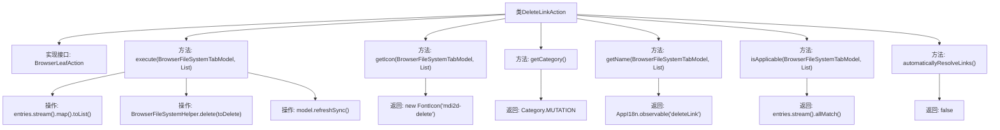

# 基础信息

|      |      |
|------|------|
| 名称 | DeleteLinkAction |
| 编码语言 | .java |
| 代码路径 | xpipe/ext/base/src/main/java/io/xpipe/ext/base/browser/DeleteLinkAction.java |
| 包名 | io.xpipe.ext.base.browser |
| 依赖项 | ['io.xpipe.app.browser.action.BrowserLeafAction', 'io.xpipe.app.browser.file.BrowserEntry', 'io.xpipe.app.browser.file.BrowserFileSystemHelper', 'io.xpipe.app.browser.file.BrowserFileSystemTabModel', 'io.xpipe.app.core.AppI18n', 'io.xpipe.core.store.FileKind', 'javafx.beans.value.ObservableValue', 'javafx.scene.Node', 'org.kordamp.ikonli.javafx.FontIcon', 'java.util.List'] |
| 概述说明 | 删除链接操作类，实现删除功能、图标、名称及适用性检查。 |

# 说明

该代码定义了一个名为DeleteLinkAction的类，实现了BrowserLeafAction接口，用于删除浏览器文件系统中的链接文件。主要功能包括：执行删除操作时获取原始文件条目并调用删除方法，删除后同步刷新模型；使用mdi2d-delete图标；操作类别为MUTATION；名称通过国际化资源获取；仅当所有条目均为链接类型时操作可用；不自动解析链接。

# 类列表 Class Summary

| 名称   | 类型  | 说明 |
|-------|------|-------------|
| DeleteLinkAction | class | 删除链接操作类，实现删除文件链接功能，包含图标、名称、分类及适用性检查。 |


## 类 DeleteLinkAction

|      |      |
|------|------|
| 访问范围 | public |
| 类型 | class |
| 名称 | DeleteLinkAction |
| 说明 | 删除链接操作类，实现删除文件链接功能，包含图标、名称、分类及适用性检查。 |


### UML类图

```mermaid
classDiagram
    class DeleteLinkAction {
        +execute(BrowserFileSystemTabModel model, List~BrowserEntry~ entries) void
        +getIcon(BrowserFileSystemTabModel model, List~BrowserEntry~ entries) Node
        +getCategory() Category
        +getName(BrowserFileSystemTabModel model, List~BrowserEntry~ entries) ObservableValue~String~
        +isApplicable(BrowserFileSystemTabModel model, List~BrowserEntry~ entries) boolean
        +automaticallyResolveLinks() boolean
    }

    <<Interface>> BrowserLeafAction
    BrowserLeafAction : +execute()
    BrowserLeafAction : +getIcon()
    BrowserLeafAction : +getCategory()
    BrowserLeafAction : +getName()
    BrowserLeafAction : +isApplicable()
    BrowserLeafAction : +automaticallyResolveLinks()

    DeleteLinkAction ..|> BrowserLeafAction : 实现
    DeleteLinkAction --> BrowserFileSystemTabModel : 依赖
    DeleteLinkAction --> BrowserEntry : 依赖
    DeleteLinkAction --> BrowserFileSystemHelper : 依赖
    DeleteLinkAction --> FileKind : 依赖
```

这段代码定义了一个名为DeleteLinkAction的类，实现了BrowserLeafAction接口，主要用于删除浏览器文件系统中的链接文件。该类提供了执行删除操作、获取图标、分类、名称、判断是否适用等功能，并依赖于BrowserFileSystemTabModel、BrowserEntry等类来处理文件系统操作。通过实现接口方法，该类能够与文件系统浏览器交互，执行特定的链接删除操作。


### 内部方法调用关系图



这段代码展示了一个实现BrowserLeafAction接口的DeleteLinkAction类，主要用于处理浏览器文件系统中链接删除操作。流程图清晰呈现了类结构，包含6个核心方法：execute执行删除和刷新操作，getIcon返回删除图标，getCategory返回操作类别，getName返回国际化名称，isApplicable验证条目是否可删除，automaticallyResolveLinks返回链接解析策略。关键操作包括流式处理条目列表、调用删除辅助方法、同步刷新模型等，完整展现了删除链接功能的实现逻辑。

### 字段列表 Field List

| 名称  | 类型  | 说明 |
|-------|-------|------|

### 方法列表 Method List

| 名称  | 类型  | 说明 |
|-------|-------|------|
| automaticallyResolveLinks | boolean | 重写方法，禁用自动解析链接功能。 |
| getName | ObservableValue<String> | 重写方法，返回可观察的删除链接文本。 |
| getCategory | Category | 重写方法返回变异类型。 |
| getIcon | Node | 重写方法返回删除图标。 |
| execute | void | 删除指定文件并刷新模型 |
| isApplicable | boolean | 检查所有浏览器条目是否为链接类型。 |


