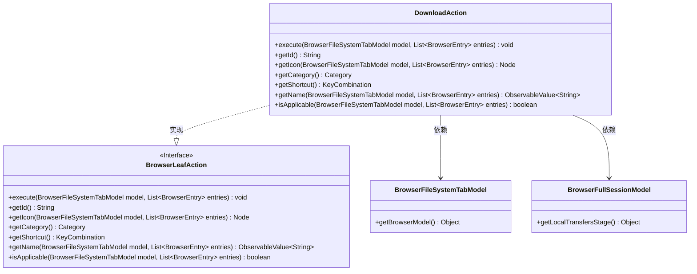
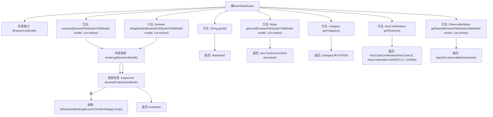

# 基础信息

|      |      |
|------|------|
| 名称 | DownloadAction |
| 编码语言 | .java |
| 代码路径 | xpipe/ext/base/src/main/java/io/xpipe/ext/base/browser/DownloadAction.java |
| 包名 | io.xpipe.ext.base.browser |
| 依赖项 | ['io.xpipe.app.browser.BrowserFullSessionModel', 'io.xpipe.app.browser.action.BrowserLeafAction', 'io.xpipe.app.browser.file.BrowserEntry', 'io.xpipe.app.browser.file.BrowserFileSystemTabModel', 'io.xpipe.app.core.AppI18n', 'javafx.beans.value.ObservableValue', 'javafx.scene.Node', 'javafx.scene.input.KeyCode', 'javafx.scene.input.KeyCodeCombination', 'javafx.scene.input.KeyCombination', 'org.kordamp.ikonli.javafx.FontIcon', 'java.util.List'] |
| 概述说明 | 下载操作类，实现文件下载功能，含快捷键D和图标。 |

# 说明

该代码定义了一个名为DownloadAction的类，实现了BrowserLeafAction接口，用于处理文件下载操作。主要功能包括：执行下载时检查是否为完整会话模型并调用本地传输阶段；提供下载操作的唯一标识符ID；使用Material Design图标作为按钮图标；将操作分类为MUTATION类型；设置快捷键为Ctrl+D；返回本地化的操作名称；检查操作是否适用于当前模型（需为完整会话模型）。

# 类列表 Class Summary

| 名称   | 类型  | 说明 |
|-------|------|-------------|
| DownloadAction | class | 下载操作类，实现文件下载功能，含快捷键D和图标。 |

## 类 DownloadAction

|      |      |
|------|------|
| 访问范围 | public |
| 类型 | class |
| 名称 | DownloadAction |
| 说明 | 下载操作类，实现文件下载功能，含快捷键D和图标。 |

### UML类图

这段类图展示了DownloadAction类实现了BrowserLeafAction接口，并依赖于BrowserFileSystemTabModel和BrowserFullSessionModel两个类。DownloadAction主要处理文件下载操作，包含执行下载、获取ID、图标、类别、快捷键、名称以及检查操作是否适用等方法。BrowserLeafAction接口定义了浏览器叶子节点的基本操作规范，而BrowserFileSystemTabModel和BrowserFullSessionModel则提供了浏览器模型和完整会话模型的相关功能。

### 内部方法调用关系图

这段代码是DownloadAction类的实现，它实现了BrowserLeafAction接口，主要用于处理浏览器文件系统中的下载操作。类中包含多个方法，如execute用于执行下载操作，getId返回操作标识，getIcon提供下载图标，getCategory返回操作类别，getShortcut定义快捷键，getName返回操作名称，isApplicable判断操作是否适用。核心逻辑在execute方法中，通过获取浏览器模型并进行类型检查后，调用本地传输阶段的drop方法完成下载。其他方法主要提供元信息和UI相关的功能。

### 字段列表 Field List

| 名称  | 类型  | 说明 |
|-------|-------|------|

### 方法列表 Method List

| 名称  | 类型  | 说明 |
|-------|-------|------|
| getId | String | 方法getId返回字符串"download"。 |
| getIcon | Node | 重写方法返回下载图标FontIcon。 |
| getCategory | Category | 重写方法返回变异类型分类。 |
| execute | void | 重写execute方法，调用fullSessionModel的drop处理文件传输。 |
| getShortcut | KeyCombination | 重写方法返回快捷键组合Ctrl+D。 |
| getName | ObservableValue<String> | 重写方法，返回下载名称的可观察值。 |
| isApplicable | boolean | 检查模型是否为BrowserFullSessionModel实例。 |

