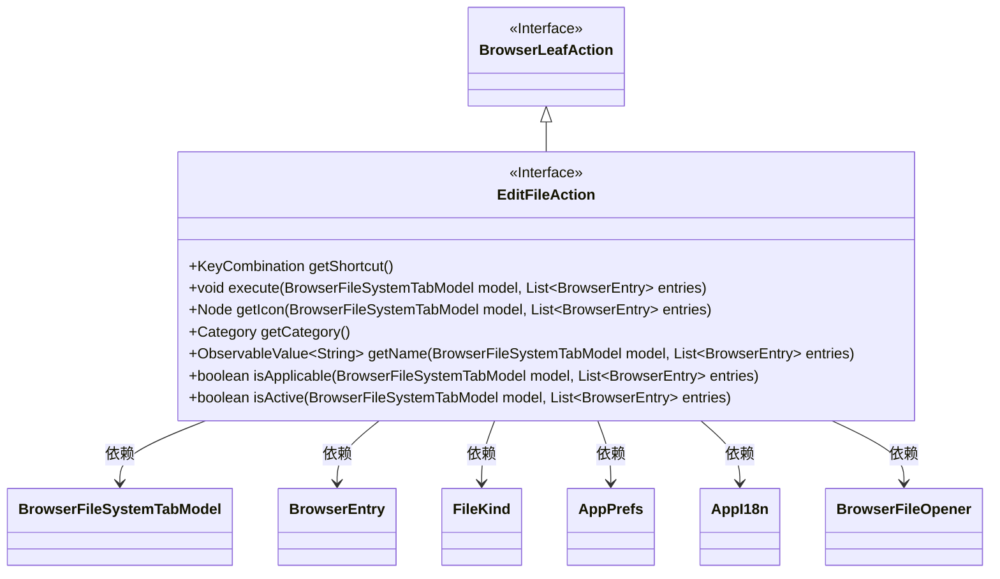
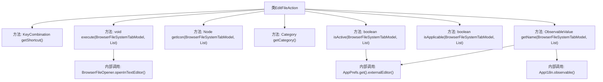

# 基础信息

|      |      |
|------|------|
| 名称 | EditFileAction |
| 编码语言 | .java |
| 代码路径 | xpipe/ext/base/src/main/java/io/xpipe/ext/base/browser/EditFileAction.java |
| 包名 | io.xpipe.ext.base.browser |
| 依赖项 | ['io.xpipe.app.browser.action.BrowserLeafAction', 'io.xpipe.app.browser.file.BrowserEntry', 'io.xpipe.app.browser.file.BrowserFileOpener', 'io.xpipe.app.browser.file.BrowserFileSystemTabModel', 'io.xpipe.app.core.AppI18n', 'io.xpipe.app.prefs.AppPrefs', 'io.xpipe.core.store.FileKind', 'javafx.beans.value.ObservableValue', 'javafx.scene.Node', 'javafx.scene.input.KeyCode', 'javafx.scene.input.KeyCodeCombination', 'javafx.scene.input.KeyCombination', 'org.kordamp.ikonli.javafx.FontIcon', 'java.util.List'] |
| 概述说明 | 编辑文件操作类，快捷键Ctrl+E，适用文件类型，需外部编辑器。 |

# 说明

EditFileAction是一个实现BrowserLeafAction接口的类，用于在文件浏览器中编辑文件。它定义了快捷键Ctrl+E触发操作，执行时通过BrowserFileOpener在文本编辑器中打开选中的文件条目。图标使用mdi2p-pencil字体图标，分类为OPEN。名称显示为当前外部编辑器名称，若未设置则显示问号。仅当所有选中条目为文件类型且外部编辑器已配置时，该操作才可用且激活。

# 类列表 Class Summary

| 名称   | 类型  | 说明 |
|-------|------|-------------|
| EditFileAction | class | 编辑文件操作类，快捷键Ctrl+E，打开文本编辑器，图标为铅笔，适用于文件类型。 |

## 类 EditFileAction

|      |      |
|------|------|
| 访问范围 | public |
| 类型 | class |
| 名称 | EditFileAction |
| 说明 | 编辑文件操作类，快捷键Ctrl+E，打开文本编辑器，图标为铅笔，适用于文件类型。 |

### UML类图

这段代码展示了一个实现了`BrowserLeafAction`接口的`EditFileAction`类，主要用于处理文件编辑操作。该类提供了快捷键绑定、执行编辑操作、获取图标、分类管理、名称显示等功能，并通过`isApplicable`和`isActive`方法控制操作的可用性。代码依赖多个外部类如`BrowserFileSystemTabModel`、`BrowserEntry`等来实现文件系统交互和国际化支持。

### 内部方法调用关系图

该流程图展示了EditFileAction类的完整结构，重点呈现了7个核心方法及其内部调用关系。其中execute()方法通过循环调用BrowserFileOpener打开文本编辑器，getName()和isActive()方法共享对AppPrefs配置的读取逻辑。所有方法共同实现了文件编辑功能，包括快捷键定义、图标渲染、名称国际化显示以及适用性检查等关键操作流程。类设计符合单一职责原则，各方法分工明确且存在合理的逻辑复用。

### 字段列表 Field List

| 名称  | 类型  | 说明 |
|-------|-------|------|

### 方法列表 Method List

| 名称  | 类型  | 说明 |
|-------|-------|------|
| execute | void | 在文本编辑器中打开指定浏览器文件条目。 |
| getCategory | Category | 重写getCategory方法，返回OPEN类型。 |
| getName | ObservableValue<String> | 重写方法，返回用外部编辑器编辑文件时的名称，若无编辑器则显示问号。 |
| getIcon | Node | 重写方法返回铅笔图标。 |
| getShortcut | KeyCombination | 重写方法返回快捷键组合：Ctrl+E。 |
| isApplicable | boolean | 检查所有条目是否为文件类型。 |
| isActive | boolean | 检查外部编辑器是否设置。 |

