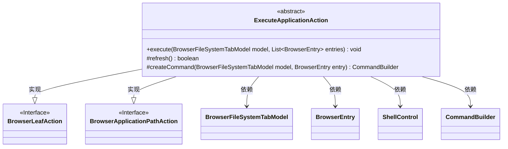
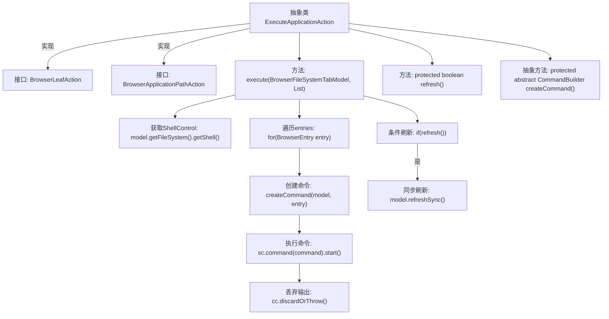

# 基础信息

|      |      |
|------|------|
| 名称 | ExecuteApplicationAction |
| 编码语言 | .java |
| 代码路径 | xpipe/ext/base/src/main/java/io/xpipe/ext/base/browser/ExecuteApplicationAction.java |
| 包名 | io.xpipe.ext.base.browser |
| 依赖项 | ['io.xpipe.app.browser.action.BrowserApplicationPathAction', 'io.xpipe.app.browser.action.BrowserLeafAction', 'io.xpipe.app.browser.file.BrowserEntry', 'io.xpipe.app.browser.file.BrowserFileSystemTabModel', 'io.xpipe.core.process.CommandBuilder', 'io.xpipe.core.process.ShellControl', 'java.util.List'] |
| 概述说明 | 抽象类实现浏览器文件操作，执行命令并可选刷新。 |

# 说明

这是一个抽象类ExecuteApplicationAction，实现了BrowserLeafAction和BrowserApplicationPathAction接口。它定义了execute方法，接收BrowserFileSystemTabModel和BrowserEntry列表参数，通过ShellControl执行命令。方法会遍历每个BrowserEntry，调用createCommand创建命令，在工作目录中执行并丢弃结果。如果refresh方法返回true，则同步刷新模型。refresh方法默认返回false，可由子类覆盖。createCommand是抽象方法，需由子类实现以生成具体命令。整个流程封装了命令执行和可选刷新操作。

# 类列表 Class Summary

| 名称   | 类型  | 说明 |
|-------|------|-------------|
| ExecuteApplicationAction | class | 抽象类实现浏览器文件操作，执行命令并可选刷新。 |

## 类 ExecuteApplicationAction

|      |      |
|------|------|
| 访问范围 | public abstract |
| 类型 | class |
| 名称 | ExecuteApplicationAction |
| 说明 | 抽象类实现浏览器文件操作，执行命令并可选刷新。 |

### UML类图

这段代码展示了一个抽象类ExecuteApplicationAction，它实现了BrowserLeafAction和BrowserApplicationPathAction两个接口。主要功能是通过ShellControl执行由createCommand方法生成的命令，并根据refresh方法的返回值决定是否刷新模型。类图中清晰地展示了类与接口的继承关系，以及与其他关键类的依赖关系，包括BrowserFileSystemTabModel、BrowserEntry、ShellControl和CommandBuilder。该设计允许子类自定义命令创建逻辑，同时提供了可选的刷新控制功能。

### 内部方法调用关系图

这段代码展示了一个抽象类ExecuteApplicationAction，它实现了两个接口并定义了执行应用程序动作的核心逻辑。流程图从类结构开始，展示了execute方法的完整执行流程：获取Shell控制台、遍历文件条目、为每个条目创建并执行命令、处理命令输出，最后根据refresh标志决定是否刷新界面。其中createCommand是留给子类实现的抽象方法，体现了模板方法设计模式。整个流程严格遵循异常处理和资源管理规范（try-with-resources）。

### 字段列表 Field List

| 名称  | 类型  | 说明 |
|-------|-------|------|

### 方法列表 Method List

| 名称  | 类型  | 说明 |
|-------|-------|------|
| refresh | boolean | 保护方法refresh返回false |
| execute | void | 重写execute方法，遍历条目执行命令，成功后刷新模型。 |
| createCommand | CommandBuilder | 创建命令构建器的抽象方法，需传入模型和条目参数。 |

