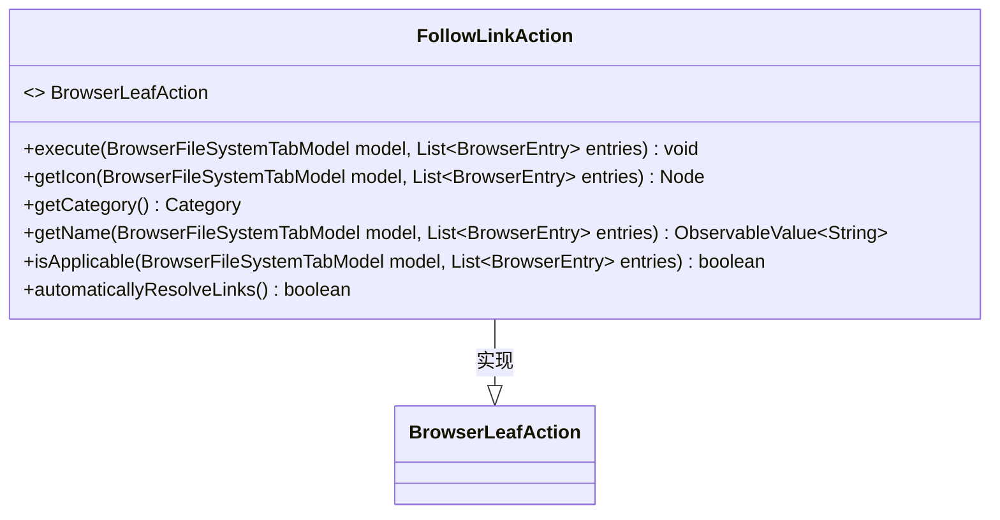
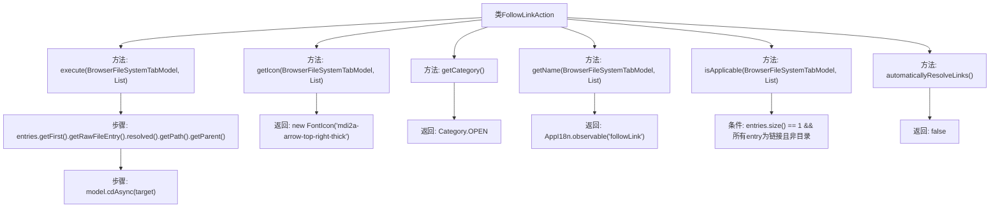

# 基础信息

|      |      |
|------|------|
| 名称 | FollowLinkAction |
| 编码语言 | .java |
| 代码路径 | xpipe/ext/base/src/main/java/io/xpipe/ext/base/browser/FollowLinkAction.java |
| 包名 | io.xpipe.ext.base.browser |
| 依赖项 | ['io.xpipe.app.browser.action.BrowserLeafAction', 'io.xpipe.app.browser.file.BrowserEntry', 'io.xpipe.app.browser.file.BrowserFileSystemTabModel', 'io.xpipe.app.core.AppI18n', 'io.xpipe.core.store.FileKind', 'javafx.beans.value.ObservableValue', 'javafx.scene.Node', 'org.kordamp.ikonli.javafx.FontIcon', 'java.util.List'] |
| 概述说明 | 类实现浏览器链接跳转功能，含执行、图标、名称等方法，适用单链接非目录情况。 |

# 说明

这是一个名为FollowLinkAction的类，实现了BrowserLeafAction接口。主要功能是处理浏览器文件系统中的链接跳转操作。execute方法会获取第一个条目的解析路径并导航到其父目录。getIcon方法返回箭头图标，getCategory返回OPEN分类。getName返回本地化的"followLink"名称。isApplicable方法检查条目是否为单个非目录链接。automaticallyResolveLinks返回false表示不自动解析链接。

# 类列表 Class Summary

| 名称   | 类型  | 说明 |
|-------|------|-------------|
| FollowLinkAction | class | 类实现浏览器链接跳转功能，含执行、图标、名称等方法，检查单链接且非目录时可用。 |

## 类 FollowLinkAction

|      |      |
|------|------|
| 访问范围 | public |
| 类型 | class |
| 名称 | FollowLinkAction |
| 说明 | 类实现浏览器链接跳转功能，含执行、图标、名称等方法，检查单链接且非目录时可用。 |

### UML类图

类图描述：  
FollowLinkAction类实现了BrowserLeafAction接口，主要用于处理浏览器文件系统中的链接跟随操作。它提供了执行动作、获取图标、分类、名称显示、适用性判断等功能，核心逻辑集中在execute()方法中通过解析链接路径实现目录跳转。该类严格校验输入条件（单条目、非目录链接），并通过automaticallyResolveLinks()明确禁用自动链接解析，体现了对文件系统操作的安全控制。

### 内部方法调用关系图

这段代码定义了一个实现BrowserLeafAction接口的FollowLinkAction类，主要用于处理文件浏览器中的链接跟随操作。流程图展示了类中的6个主要方法：execute()执行路径跳转，getIcon()返回箭头图标，getCategory()返回操作类别，getName()返回本地化名称，isApplicable()检查是否适用于当前条目，automaticallyResolveLinks()返回是否自动解析链接。核心逻辑集中在execute()方法中获取链接目标路径并进行异步跳转，以及isApplicable()中对单链接条目的验证。

### 字段列表 Field List

| 名称  | 类型  | 说明 |
|-------|-------|------|

### 方法列表 Method List

| 名称  | 类型  | 说明 |
|-------|-------|------|
| isApplicable | boolean | 检查单个非目录链接文件是否适用。 |
| getIcon | Node | 重写方法，返回箭头图标。 |
| getCategory | Category | 重写getCategory方法，返回OPEN类型。 |
| getName | ObservableValue<String> | 重写方法，返回跟随链接的可观察字符串值。 |
| execute | void | 重写方法，导航至首个条目父目录。 |
| automaticallyResolveLinks | boolean | 重写方法，返回false不自动解析链接。 |

