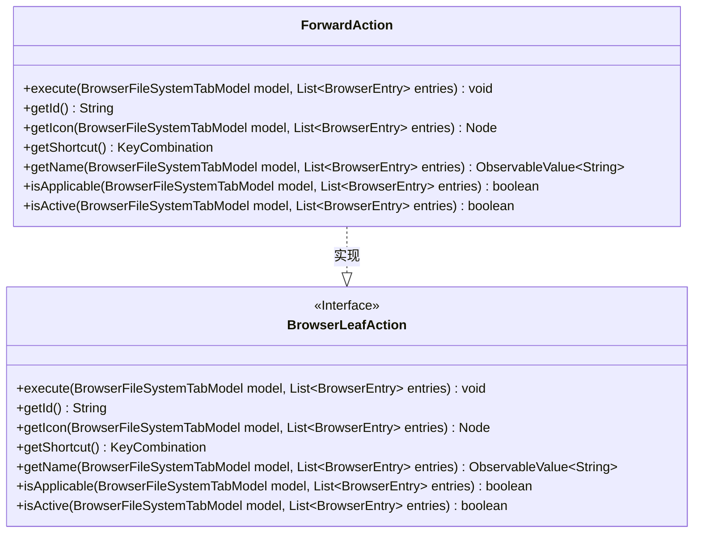
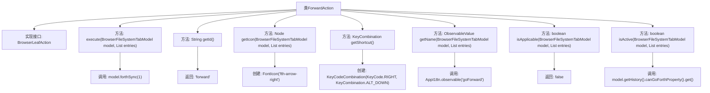

# 基础信息

|      |      |
|------|------|
| 名称 | ForwardAction |
| 编码语言 | .java |
| 代码路径 | xpipe/ext/base/src/main/java/io/xpipe/ext/base/browser/ForwardAction.java |
| 包名 | io.xpipe.ext.base.browser |
| 依赖项 | ['io.xpipe.app.browser.action.BrowserLeafAction', 'io.xpipe.app.browser.file.BrowserEntry', 'io.xpipe.app.browser.file.BrowserFileSystemTabModel', 'io.xpipe.app.core.AppI18n', 'javafx.beans.value.ObservableValue', 'javafx.scene.Node', 'javafx.scene.input.KeyCode', 'javafx.scene.input.KeyCodeCombination', 'javafx.scene.input.KeyCombination', 'org.kordamp.ikonli.javafx.FontIcon', 'java.util.List'] |
| 概述说明 | ForwardAction类实现前进功能，含快捷键、图标、名称及状态检查。 |

# 说明

ForwardAction是一个实现BrowserLeafAction接口的类，用于浏览器文件系统导航的向前操作。其execute方法调用model的forthSync方法前进一个位置。getId返回标识符"forward"。getIcon方法返回右箭头图标。快捷键设置为ALT加右箭头。getName返回国际化文本"goForward"。isApplicable始终返回false表示不可用。isActive检查model历史记录是否可前进。

# 类列表 Class Summary

| 名称   | 类型  | 说明 |
|-------|------|-------------|
| ForwardAction | class | ForwardAction类实现前进功能，含快捷键、图标和状态检查。 |

## 类 ForwardAction

|      |      |
|------|------|
| 访问范围 | public |
| 类型 | class |
| 名称 | ForwardAction |
| 说明 | ForwardAction类实现前进功能，含快捷键、图标和状态检查。 |

### UML类图

这段代码展示了一个实现浏览器前进功能的`ForwardAction`类，它实现了`BrowserLeafAction`接口。该类包含前进操作的核心逻辑，包括执行动作、获取ID、图标、快捷键、名称以及检查是否可用和激活状态的方法。其中`isActive()`方法通过检查历史记录属性决定前进按钮是否可点击，而`getIcon()`使用字体图标表示前进箭头。整个设计体现了命令模式的思想，将浏览器导航操作封装为独立可复用的组件。

### 内部方法调用关系图

这段代码定义了一个名为ForwardAction的类，实现了BrowserLeafAction接口，主要用于浏览器文件系统导航中的前进操作。流程图展示了类结构及其方法调用关系，包括执行前进动作、获取ID、图标、快捷键、名称、可用性检查以及活动状态判断等功能。其中execute方法调用model.forthSync(1)执行前进操作，isActive方法通过检查历史记录属性判断前进按钮是否可激活。

### 字段列表 Field List

| 名称  | 类型  | 说明 |
|-------|-------|------|

### 方法列表 Method List

| 名称  | 类型  | 说明 |
|-------|-------|------|
| isActive | boolean | 方法检查浏览器文件系统标签页模型能否前进。 |
| execute | void | 重写方法，调用模型同步前进1步。 |
| getId | String | 方法返回字符串"forward"。 |
| getIcon | Node | 重写方法返回右箭头图标。 |
| getName | ObservableValue<String> | 重写方法，返回可观察的"goForward"国际化字符串。 |
| getShortcut | KeyCombination | 重写方法返回Alt+右箭头快捷键组合 |
| isApplicable | boolean | 重写方法，始终返回false。 |

