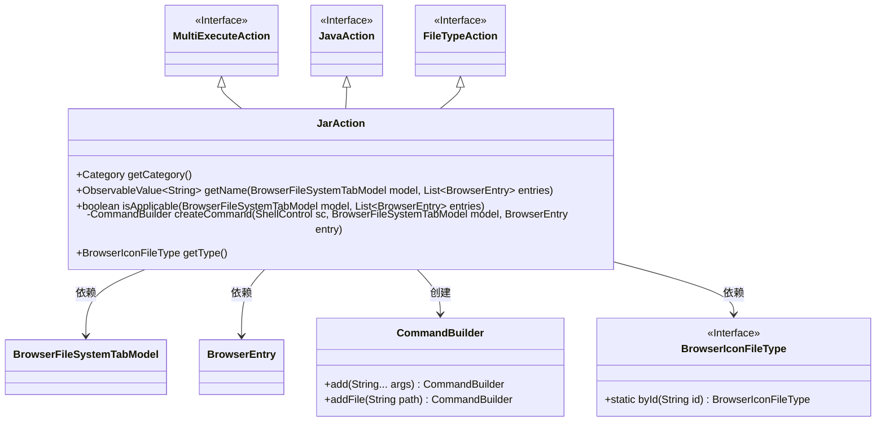
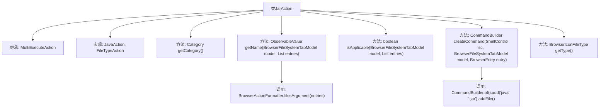

# 基础信息

|      |      |
|------|------|
| 名称 | JarAction |
| 编码语言 | .java |
| 代码路径 | xpipe/ext/base/src/main/java/io/xpipe/ext/base/browser/JarAction.java |
| 包名 | io.xpipe.ext.base.browser |
| 依赖项 | ['io.xpipe.app.browser.action.BrowserActionFormatter', 'io.xpipe.app.browser.file.BrowserEntry', 'io.xpipe.app.browser.file.BrowserFileSystemTabModel', 'io.xpipe.app.browser.icon.BrowserIconFileType', 'io.xpipe.core.process.CommandBuilder', 'io.xpipe.core.process.ShellControl', 'javafx.beans.property.SimpleStringProperty', 'javafx.beans.value.ObservableValue', 'java.util.List'] |
| 概述说明 | JarAction类实现Java和文件操作，支持执行jar文件命令。 |

# 说明

这是一个名为JarAction的Java类，继承自MultiExecuteAction并实现了JavaAction和FileTypeAction接口。该类主要用于处理JAR文件操作，其功能包括：返回自定义类别标识；生成显示"java -jar"加文件参数的名称；检查操作是否适用于当前文件和模型；创建执行JAR文件的命令（使用java -jar命令）；以及返回JAR文件类型标识。该类封装了与JAR文件相关的操作逻辑，包括命令构建和类型判断。

# 类列表 Class Summary

| 名称   | 类型  | 说明 |
|-------|------|-------------|
| JarAction | class | JarAction类实现Java和文件操作，支持执行jar文件命令。 |

## 类 JarAction

|      |      |
|------|------|
| 访问范围 | public |
| 类型 | class |
| 名称 | JarAction |
| 说明 | JarAction类实现Java和文件操作，支持执行jar文件命令。 |

### UML类图

这段代码描述了一个名为`JarAction`的类，它继承自`MultiExecuteAction`并实现了`JavaAction`和`FileTypeAction`接口。该类主要用于处理JAR文件相关的操作，包括获取类别、生成命令名称、检查适用性、创建执行命令以及获取文件类型。`JarAction`依赖于`BrowserFileSystemTabModel`、`BrowserEntry`和`BrowserIconFileType`等类，并通过`CommandBuilder`构建执行命令。整体设计体现了多接口继承和依赖注入的特点，适用于处理JAR文件的操作场景。

### 内部方法调用关系图

这段代码展示了一个名为JarAction的类，它继承了MultiExecuteAction并实现了JavaAction和FileTypeAction接口。该类主要用于处理与JAR文件相关的操作，包括获取类别、生成命令名称、检查适用性、创建执行命令以及获取文件类型。其中，getName方法通过BrowserActionFormatter格式化参数，createCommand方法使用CommandBuilder构建Java命令行指令。整体设计体现了多态性和接口隔离原则，适用于文件浏览器中JAR文件的特定操作场景。

### 字段列表 Field List

| 名称  | 类型  | 说明 |
|-------|-------|------|

### 方法列表 Method List

| 名称  | 类型  | 说明 |
|-------|-------|------|
| getName | ObservableValue<String> | 重写方法，返回包含"java -jar"和文件参数的字符串属性。 |
| getCategory | Category | 重写方法返回自定义类别。 |
| isApplicable | boolean | 检查文件类型操作适用性，需满足父类及接口条件。 |
| createCommand | CommandBuilder | Java命令构建：调用jar文件执行。 |
| getType | BrowserIconFileType | 重写getType方法，返回"jar"类型文件图标。 |

