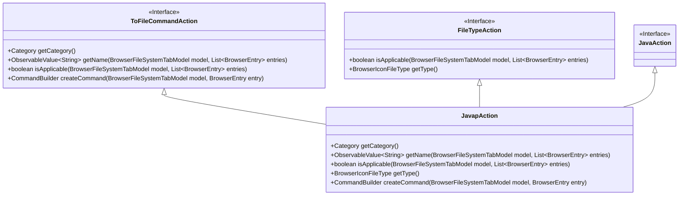
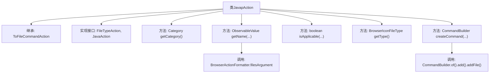

# 基础信息

|      |      |
|------|------|
| 名称 | JavapAction |
| 编码语言 | .java |
| 代码路径 | xpipe/ext/base/src/main/java/io/xpipe/ext/base/browser/JavapAction.java |
| 包名 | io.xpipe.ext.base.browser |
| 依赖项 | ['io.xpipe.app.browser.action.BrowserActionFormatter', 'io.xpipe.app.browser.file.BrowserEntry', 'io.xpipe.app.browser.file.BrowserFileSystemTabModel', 'io.xpipe.app.browser.icon.BrowserIconFileType', 'io.xpipe.core.process.CommandBuilder', 'javafx.beans.property.SimpleStringProperty', 'javafx.beans.value.ObservableValue', 'java.util.List'] |
| 概述说明 | Java类JavapAction实现文件操作命令，支持javap反编译，适用于.class文件。 |

# 说明

这是一个名为JavapAction的Java类，继承自ToFileCommandAction并实现了FileTypeAction和JavaAction接口。该类定义了文件操作相关行为：返回自定义分类，生成包含"javap -c -p"命令和文件参数的名称，检查操作适用性需满足父类和接口的条件，指定文件类型为class图标，创建包含javap反编译命令和文件路径的CommandBuilder对象。

# 类列表 Class Summary

| 名称   | 类型  | 说明 |
|-------|------|-------------|
| JavapAction | class | Java类JavapAction实现文件操作命令，支持javap反编译功能。 |

## 类 JavapAction

|      |      |
|------|------|
| 访问范围 | public |
| 类型 | class |
| 名称 | JavapAction |
| 说明 | Java类JavapAction实现文件操作命令，支持javap反编译功能。 |

### UML类图

该类图展示了JavapAction继承自ToFileCommandAction并实现FileTypeAction和JavaAction接口的层级关系。JavapAction作为具体实现类，重写了获取类别、名称、适用性检查、文件类型及创建命令等核心方法，主要用于处理Java字节码反编译操作。图中清晰体现了接口与实现类的依赖关系，以及方法签名的泛型使用（如ObservableValue~String~和List~BrowserEntry~）。

### 内部方法调用关系图

这段代码定义了一个名为JavapAction的类，继承自ToFileCommandAction并实现了FileTypeAction和JavaAction接口。主要功能包括获取操作类别、生成命令名称、检查适用性、获取文件类型以及创建反编译命令。其中getName方法会生成包含"javap -c -p"和文件参数的字符串，createCommand方法会构建具体的反编译命令行。流程图清晰展示了类继承关系、接口实现和核心方法调用链。

### 字段列表 Field List

| 名称  | 类型  | 说明 |
|-------|-------|------|

### 方法列表 Method List

| 名称  | 类型  | 说明 |
|-------|-------|------|
| getCategory | Category | 重写getCategory方法，返回CUSTOM类别。 |
| createCommand | CommandBuilder | 重写方法，生成包含javap命令的构建器，输出文件反编译代码。 |
| getName | ObservableValue<String> | 方法返回文件反编译命令字符串，格式为"javap -c -p 文件名"。 |
| getType | BrowserIconFileType | 重写getType方法，返回"class"类型的BrowserIconFileType。 |
| isApplicable | boolean | 检查文件类型操作适用性，调用父类及接口方法。 |

