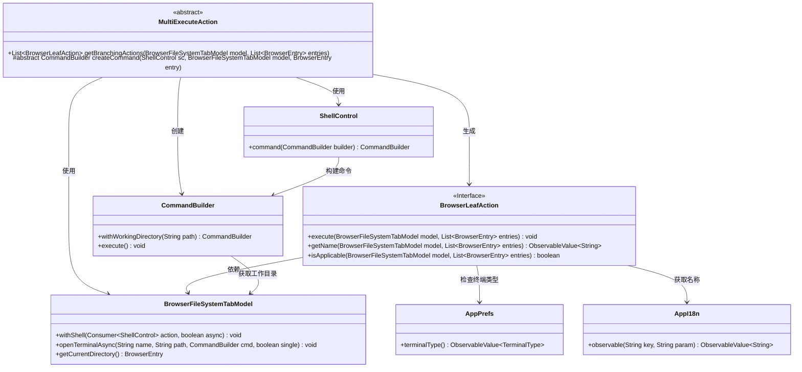
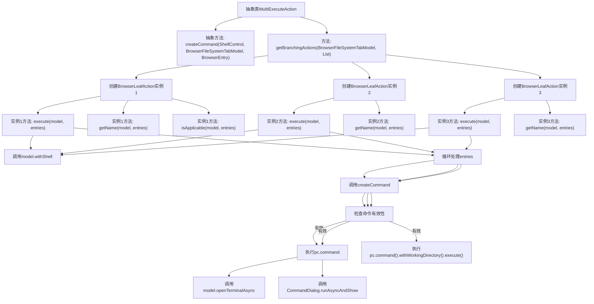

# 基础信息

|      |      |
|------|------|
| 名称 | MultiExecuteAction |
| 编码语言 | .java |
| 代码路径 | xpipe/ext/base/src/main/java/io/xpipe/ext/base/browser/MultiExecuteAction.java |
| 包名 | io.xpipe.ext.base.browser |
| 依赖项 | ['io.xpipe.app.browser.action.BrowserBranchAction', 'io.xpipe.app.browser.action.BrowserLeafAction', 'io.xpipe.app.browser.file.BrowserEntry', 'io.xpipe.app.browser.file.BrowserFileSystemTabModel', 'io.xpipe.app.core.AppI18n', 'io.xpipe.app.prefs.AppPrefs', 'io.xpipe.app.util.CommandDialog', 'io.xpipe.core.process.CommandBuilder', 'io.xpipe.core.process.ShellControl', 'javafx.beans.value.ObservableValue', 'java.util.List'] |
| 概述说明 | 多执行动作类，含终端执行、文件浏览器运行和静默执行三种分支操作。 |

# 说明

MultiExecuteAction是一个抽象类，实现了BrowserBranchAction接口，用于处理多个浏览器文件条目的执行操作。它提供了三个具体的BrowserLeafAction实现：第一个在终端中异步执行命令并显示终端窗口；第二个在文件浏览器中异步运行命令并显示对话框；第三个静默执行命令不显示任何界面。所有操作都通过createCommand抽象方法获取命令，并根据条件处理多个条目。名称和可用性通过动态观察值确定，支持国际化。

# 类列表 Class Summary

| 名称   | 类型  | 说明 |
|-------|------|-------------|
| MultiExecuteAction | class | 多执行动作类，含终端、文件浏览器和静默三种执行方式。 |

## 类 MultiExecuteAction

|      |      |
|------|------|
| 访问范围 | public abstract |
| 类型 | class |
| 名称 | MultiExecuteAction |
| 说明 | 多执行动作类，含终端、文件浏览器和静默三种执行方式。 |

### UML类图

这段代码展示了一个抽象类MultiExecuteAction，它实现了BrowserBranchAction接口，并提供了三个不同的BrowserLeafAction实现。这些动作分别用于在终端中执行命令、在文件浏览器中运行命令以及静默执行命令。类图清晰地展示了各个类之间的关系，包括MultiExecuteAction如何生成BrowserLeafAction实例，以及这些实例如何依赖其他类如BrowserFileSystemTabModel、ShellControl和CommandBuilder来完成命令的执行。整体设计体现了策略模式的思想，通过不同的BrowserLeafAction实现来提供不同的命令执行方式。

### 内部方法调用关系图

这段代码定义了一个抽象类MultiExecuteAction，它实现了BrowserBranchAction接口。主要功能是通过getBranchingActions方法返回三个不同的BrowserLeafAction实例，每个实例代表不同的命令执行方式：在终端中执行、在文件浏览器中运行以及静默执行。每个BrowserLeafAction都实现了execute、getName和isApplicable方法，通过调用createCommand抽象方法创建具体命令，并根据不同场景选择执行方式。流程图清晰地展示了类的结构和方法调用关系。

### 字段列表 Field List

| 名称  | 类型  | 说明 |
|-------|-------|------|

### 方法列表 Method List

| 名称  | 类型  | 说明 |
|-------|-------|------|
| getBranchingActions | List<BrowserLeafAction> | 代码实现三个浏览器文件操作：终端执行、文件浏览器运行和静默执行。 |
| createCommand | CommandBuilder | 创建命令构建器方法，需Shell控制、文件系统模型和浏览器条目参数。 |

