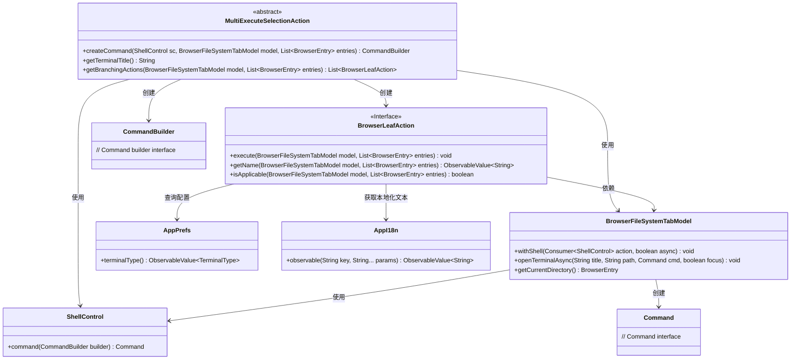

# 基础信息

|      |      |
|------|------|
| 名称 | MultiExecuteSelectionAction |
| 编码语言 | .java |
| 代码路径 | xpipe/ext/base/src/main/java/io/xpipe/ext/base/browser/MultiExecuteSelectionAction.java |
| 包名 | io.xpipe.ext.base.browser |
| 依赖项 | ['io.xpipe.app.browser.action.BrowserBranchAction', 'io.xpipe.app.browser.action.BrowserLeafAction', 'io.xpipe.app.browser.file.BrowserEntry', 'io.xpipe.app.browser.file.BrowserFileSystemTabModel', 'io.xpipe.app.core.AppI18n', 'io.xpipe.app.issue.ErrorEvent', 'io.xpipe.app.prefs.AppPrefs', 'io.xpipe.app.util.CommandDialog', 'io.xpipe.core.process.CommandBuilder', 'io.xpipe.core.process.ProcessOutputException', 'io.xpipe.core.process.ShellControl', 'javafx.beans.value.ObservableValue', 'java.util.List', 'java.util.concurrent.atomic.AtomicReference'] |
| 概述说明 | 抽象类MultiExecuteSelectionAction实现多执行方式，含终端、文件浏览器和静默运行三种操作。 |

# 说明

MultiExecuteSelectionAction是一个抽象类，实现了BrowserBranchAction接口，用于处理文件浏览器中的多选操作。它提供了三个分支动作：在终端执行、在文件浏览器中运行和静默运行。每个动作通过createCommand方法生成命令，并根据不同需求执行。终端执行会打开新终端窗口显示结果，文件浏览器运行会直接显示命令对话框，静默运行则隐藏输出仅返回结果。类还包含获取动作名称和检查适用性的方法。

# 类列表 Class Summary

| 名称   | 类型  | 说明 |
|-------|------|-------------|
| MultiExecuteSelectionAction | class | 抽象类MultiExecuteSelectionAction实现多选操作，提供终端执行、文件浏览器运行和静默执行三种方式。 |

## 类 MultiExecuteSelectionAction

|      |      |
|------|------|
| 访问范围 | public abstract |
| 类型 | class |
| 名称 | MultiExecuteSelectionAction |
| 说明 | 抽象类MultiExecuteSelectionAction实现多选操作，提供终端执行、文件浏览器运行和静默执行三种方式。 |

### UML类图

这段代码展示了一个抽象类`MultiExecuteSelectionAction`，它实现了`BrowserBranchAction`接口（未完整展示），主要功能是为浏览器文件系统选项卡提供多种执行选择操作的方式。该类通过`getBranchingActions`方法返回三个匿名实现的`BrowserLeafAction`，分别对应在终端执行、在文件浏览器运行和静默运行三种模式。每个动作都通过`ShellControl`和`CommandBuilder`构建命令，并处理不同的执行场景。类图中清晰地展示了这些类之间的依赖关系和接口实现。

### 内部方法调用关系图

这段代码流程图展示了MultiExecuteSelectionAction抽象类的结构及其三个内部BrowserLeafAction实现。核心流程是通过getBranchingActions方法返回三个不同的命令执行策略：在终端执行、在文件浏览器执行和静默执行。每个策略都实现了execute方法，通过createCommand创建命令后分别采用不同的执行方式，包括终端异步执行、对话框执行和静默处理输出。整个设计提供了灵活的命令执行扩展点，同时保持了统一的命令创建接口。

### 字段列表 Field List

| 名称  | 类型  | 说明 |
|-------|-------|------|

### 方法列表 Method List

| 名称  | 类型  | 说明 |
|-------|-------|------|
| getTerminalTitle | String | 抽象方法：获取终端标题。 |
| createCommand | CommandBuilder | 创建命令构建器方法，需Shell控制、文件系统模型和条目列表参数。 |
| getBranchingActions | List<BrowserLeafAction> | 代码实现三个浏览器操作：终端执行、文件浏览器运行和静默运行。 |

