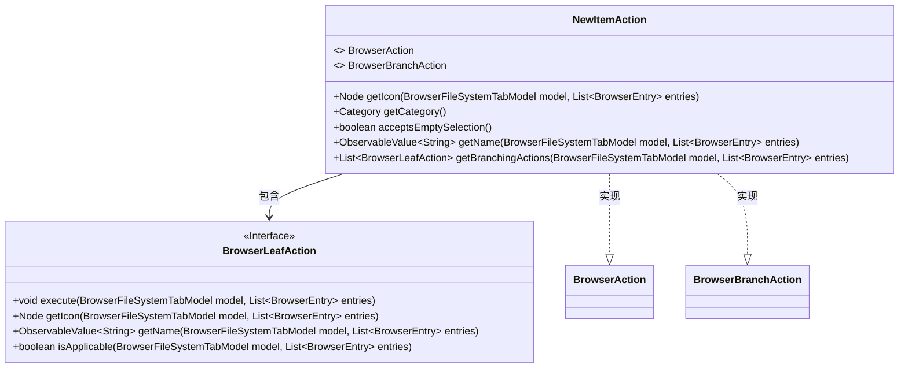
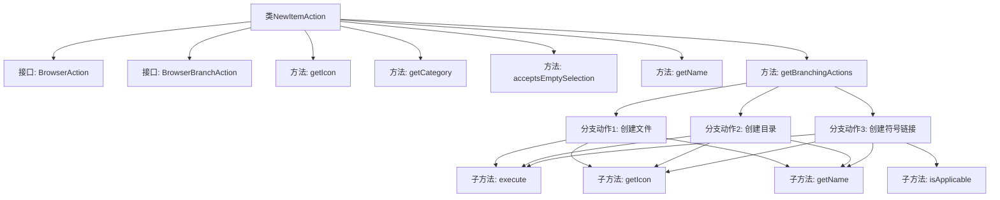

# 基础信息

|      |      |
|------|------|
| 名称 | NewItemAction |
| 编码语言 | .java |
| 代码路径 | xpipe/ext/base/src/main/java/io/xpipe/ext/base/browser/NewItemAction.java |
| 包名 | io.xpipe.ext.base.browser |
| 依赖项 | ['io.xpipe.app.browser.action.BrowserAction', 'io.xpipe.app.browser.action.BrowserBranchAction', 'io.xpipe.app.browser.action.BrowserLeafAction', 'io.xpipe.app.browser.file.BrowserEntry', 'io.xpipe.app.browser.file.BrowserFileSystemTabModel', 'io.xpipe.app.browser.icon.BrowserIcons', 'io.xpipe.app.comp.Comp', 'io.xpipe.app.comp.base.ModalOverlay', 'io.xpipe.app.core.AppI18n', 'io.xpipe.app.util.OptionsBuilder', 'io.xpipe.core.process.OsType', 'io.xpipe.core.store.FilePath', 'javafx.beans.property.SimpleStringProperty', 'javafx.beans.value.ObservableValue', 'javafx.scene.Node', 'javafx.scene.control.TextField', 'org.kordamp.ikonli.javafx.FontIcon', 'java.util.List'] |
| 概述说明 | 实现浏览器新建文件、目录和符号链接的功能类。 |

# 说明

该代码定义了一个名为NewItemAction的类，实现了BrowserAction和BrowserBranchAction接口，用于在文件浏览器中创建新项目。主要功能包括：提供一个加号图标按钮，分类为MUTATION操作，支持空选。它包含三个分支操作：创建文件（显示文本框和文件图标）、创建目录（显示文本框和文件夹图标）、创建符号链接（显示两个输入框和文件图标，仅限非Windows系统）。每个操作都会弹出模态窗口收集名称，并异步执行创建操作。

# 类列表 Class Summary

| 名称   | 类型  | 说明 |
|-------|------|-------------|
| NewItemAction | class | 实现新建文件、目录和符号链接的浏览器操作类。 |

## 类 NewItemAction

|      |      |
|------|------|
| 访问范围 | public |
| 类型 | class |
| 名称 | NewItemAction |
| 说明 | 实现新建文件、目录和符号链接的浏览器操作类。 |

### UML类图

这段代码描述了一个实现浏览器操作的`NewItemAction`类，它同时实现了`BrowserAction`和`BrowserBranchAction`接口。该类提供了创建新文件、目录和符号链接的功能，通过`getBranchingActions`方法返回一组`BrowserLeafAction`实例。每个`BrowserLeafAction`代表一种具体的创建操作，包含执行逻辑、图标获取、名称显示和适用性检查等功能。类图清晰地展示了这些类与接口之间的实现和包含关系。

### 内部方法调用关系图

该流程图展示了NewItemAction类的核心结构和功能。作为实现BrowserAction和BrowserBranchAction接口的类，它主要提供获取图标、分类、名称等基础功能，并通过getBranchingActions方法返回三个分支动作：创建文件、创建目录和创建符号链接。每个分支动作都包含执行(execute)、获取图标(getIcon)和获取名称(getName)方法，其中符号链接动作还包含适用性检查(isApplicable)方法。整体结构清晰地反映了该类作为浏览器操作的核心功能实现。

### 字段列表 Field List

| 名称  | 类型  | 说明 |
|-------|-------|------|

### 方法列表 Method List

| 名称  | 类型  | 说明 |
|-------|-------|------|
| getCategory | Category | 重写getCategory方法，返回MUTATION枚举值。 |
| getBranchingActions | List<BrowserLeafAction> | 代码实现文件、目录和符号链接的创建功能，包含图标和名称显示。 |
| acceptsEmptySelection | boolean | 方法重写，允许空选择，返回true。 |
| getName | ObservableValue<String> | 重写方法，返回"new"的可观察值。 |
| getIcon | Node | 重写方法返回新增文件图标。 |

