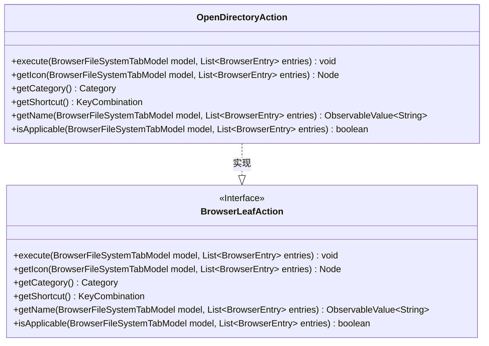
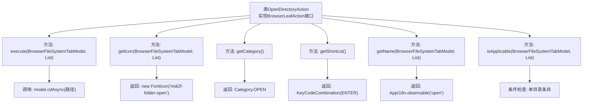

# 基础信息

|      |      |
|------|------|
| 名称 | OpenDirectoryAction |
| 编码语言 | .java |
| 代码路径 | xpipe/ext/base/src/main/java/io/xpipe/ext/base/browser/OpenDirectoryAction.java |
| 包名 | io.xpipe.ext.base.browser |
| 依赖项 | ['io.xpipe.app.browser.action.BrowserLeafAction', 'io.xpipe.app.browser.file.BrowserEntry', 'io.xpipe.app.browser.file.BrowserFileSystemTabModel', 'io.xpipe.app.core.AppI18n', 'io.xpipe.core.store.FileKind', 'javafx.beans.value.ObservableValue', 'javafx.scene.Node', 'javafx.scene.input.KeyCode', 'javafx.scene.input.KeyCodeCombination', 'javafx.scene.input.KeyCombination', 'org.kordamp.ikonli.javafx.FontIcon', 'java.util.List'] |
| 概述说明 | OpenDirectoryAction类实现打开目录功能，含执行、图标、分类、快捷键、名称和适用条件方法。 |

# 说明

这是一个名为OpenDirectoryAction的Java类，实现了BrowserLeafAction接口，用于在文件浏览器中打开目录。主要功能包括：异步切换当前目录到所选条目路径，使用mdi2f-folder-open图标，归类为OPEN操作，快捷键设置为回车键，显示名称为"open"。该操作仅在选中单个目录条目时可用。

# 类列表 Class Summary

| 名称   | 类型  | 说明 |
|-------|------|-------------|
| OpenDirectoryAction | class | OpenDirectoryAction类实现打开目录功能，含执行、图标、分类、快捷键、名称和适用条件方法。 |

## 类 OpenDirectoryAction

|      |      |
|------|------|
| 访问范围 | public |
| 类型 | class |
| 名称 | OpenDirectoryAction |
| 说明 | OpenDirectoryAction类实现打开目录功能，含执行、图标、分类、快捷键、名称和适用条件方法。 |

### UML类图

这段代码展示了一个实现了BrowserLeafAction接口的OpenDirectoryAction类，主要用于处理目录打开操作。类图清晰地显示了接口与实现类的关系，OpenDirectoryAction完整实现了BrowserLeafAction定义的6个方法，包括执行操作、获取图标、分类、快捷键、名称和适用性检查等功能。该实现专门针对单个目录条目操作，通过getRawFileEntry()检查文件类型并执行异步目录切换。

### 内部方法调用关系图

该流程图展示了OpenDirectoryAction类的完整结构，这是一个实现BrowserLeafAction接口的GUI操作类。核心功能包括异步打开目录(execute)、获取文件夹图标(getIcon)、定义操作分类为OPEN(getCategory)、绑定回车快捷键(getShortcut)、国际化名称获取(getName)以及单目录有效性校验(isApplicable)。所有方法均围绕文件浏览器中目录打开场景设计，通过严格的条件检查确保仅对单个目录条目生效。

### 字段列表 Field List

| 名称  | 类型  | 说明 |
|-------|-------|------|

### 方法列表 Method List

| 名称  | 类型  | 说明 |
|-------|-------|------|
| getShortcut | KeyCombination | 重写方法返回回车键快捷键组合。 |
| execute | void | 重写方法，异步切换目录至首个条目的路径。 |
| getIcon | Node | 重写方法返回文件夹打开图标。 |
| getName | ObservableValue<String> | 重写方法返回可观察的"open"字符串值。 |
| getCategory | Category | 重写getCategory方法，返回OPEN类型。 |
| isApplicable | boolean | 检查单个目录条目是否适用。 |

