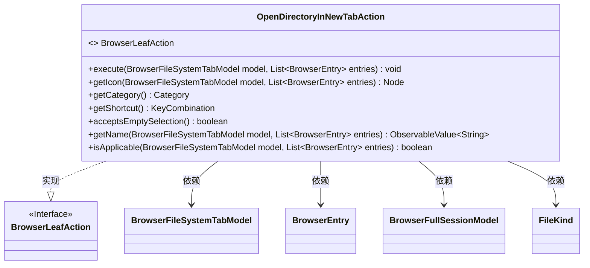
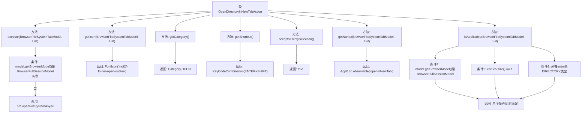

# 基础信息

|      |      |
|------|------|
| 名称 | OpenDirectoryInNewTabAction |
| 编码语言 | .java |
| 代码路径 | xpipe/ext/base/src/main/java/io/xpipe/ext/base/browser/OpenDirectoryInNewTabAction.java |
| 包名 | io.xpipe.ext.base.browser |
| 依赖项 | ['io.xpipe.app.browser.BrowserFullSessionModel', 'io.xpipe.app.browser.action.BrowserLeafAction', 'io.xpipe.app.browser.file.BrowserEntry', 'io.xpipe.app.browser.file.BrowserFileSystemTabModel', 'io.xpipe.app.core.AppI18n', 'io.xpipe.core.store.FileKind', 'javafx.beans.value.ObservableValue', 'javafx.scene.Node', 'javafx.scene.input.KeyCode', 'javafx.scene.input.KeyCodeCombination', 'javafx.scene.input.KeyCombination', 'org.kordamp.ikonli.javafx.FontIcon', 'java.util.List'] |
| 概述说明 | 类实现在新标签页打开目录功能，含图标、快捷键、名称及适用条件检查。 |

# 说明

这是一个名为OpenDirectoryInNewTabAction的浏览器操作类，实现了BrowserLeafAction接口。主要功能是在新标签页中打开目录。执行时检查是否为完整会话模型，异步打开文件系统路径。提供文件夹图标，归类为OPEN操作类别。快捷键设置为Shift+Enter。支持空选择，显示名称为"openInNewTab"。仅当浏览器模型为完整会话、单选且条目为目录时可用。

# 类列表 Class Summary

| 名称   | 类型  | 说明 |
|-------|------|-------------|
| OpenDirectoryInNewTabAction | class | 浏览器操作类：在新标签页打开目录，支持快捷键Shift+Enter，图标为文件夹，仅适用于单个目录。 |

## 类 OpenDirectoryInNewTabAction

|      |      |
|------|------|
| 访问范围 | public |
| 类型 | class |
| 名称 | OpenDirectoryInNewTabAction |
| 说明 | 浏览器操作类：在新标签页打开目录，支持快捷键Shift+Enter，图标为文件夹，仅适用于单个目录。 |

### UML类图

这段代码定义了一个实现了BrowserLeafAction接口的OpenDirectoryInNewTabAction类，主要用于在浏览器文件系统中以新标签页打开目录。该类包含多个方法：execute执行核心操作，getIcon获取图标，getCategory返回操作类别，getShortcut提供快捷键绑定，acceptsEmptySelection判断是否允许空选，getName返回国际化名称，isApplicable验证操作是否适用当前上下文。该类与BrowserFileSystemTabModel、BrowserEntry等多个模型类存在依赖关系，用于处理文件系统操作和状态管理。

### 内部方法调用关系图

该流程图展示了OpenDirectoryInNewTabAction类的完整结构，重点描述了7个核心方法的执行逻辑和相互关系。其中execute()方法包含异步打开目录的核心操作，isApplicable()方法通过三个严格条件验证操作可行性，其他方法分别处理图标显示、快捷键配置等界面交互功能。所有方法共同实现了在浏览器会话中通过Shift+Enter快捷键在新标签页打开目录的功能。

### 字段列表 Field List

| 名称  | 类型  | 说明 |
|-------|-------|------|

### 方法列表 Method List

| 名称  | 类型  | 说明 |
|-------|-------|------|
| getIcon | Node | 重写方法返回文件夹打开图标。 |
| getName | ObservableValue<String> | 重写方法，返回国际化字符串"openInNewTab"的可观察值。 |
| getCategory | Category | 重写getCategory方法，返回OPEN枚举值。 |
| isApplicable | boolean | 检查模型是否为全会话类型且仅含一个目录条目。 |
| execute | void | 重写execute方法，异步打开文件系统，使用首个条目的路径。 |
| acceptsEmptySelection | boolean | 重写方法，允许空选择，返回真值。 |
| getShortcut | KeyCombination | 重写方法返回Shift+Enter快捷键组合 |

