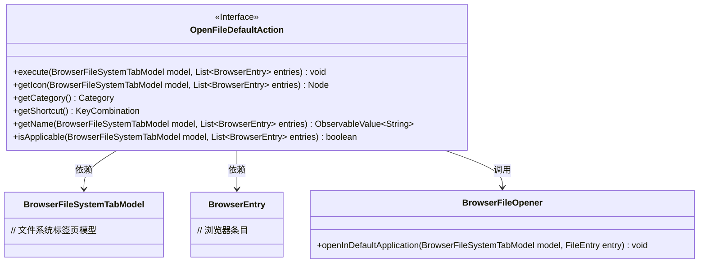
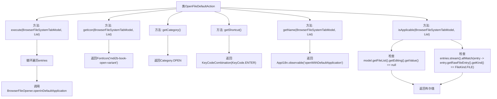

# 基础信息

|      |      |
|------|------|
| 名称 | OpenFileDefaultAction |
| 编码语言 | .java |
| 代码路径 | xpipe/ext/base/src/main/java/io/xpipe/ext/base/browser/OpenFileDefaultAction.java |
| 包名 | io.xpipe.ext.base.browser |
| 依赖项 | ['io.xpipe.app.browser.action.BrowserLeafAction', 'io.xpipe.app.browser.file.BrowserEntry', 'io.xpipe.app.browser.file.BrowserFileOpener', 'io.xpipe.app.browser.file.BrowserFileSystemTabModel', 'io.xpipe.app.core.AppI18n', 'io.xpipe.core.store.FileKind', 'javafx.beans.value.ObservableValue', 'javafx.scene.Node', 'javafx.scene.input.KeyCode', 'javafx.scene.input.KeyCodeCombination', 'javafx.scene.input.KeyCombination', 'org.kordamp.ikonli.javafx.FontIcon', 'java.util.List'] |
| 概述说明 | 类OpenFileDefaultAction实现浏览器文件默认打开操作，含执行、图标、分类、快捷键、名称及适用性方法。 |

# 说明

该代码定义了一个名为OpenFileDefaultAction的类，实现了BrowserLeafAction接口。主要功能包括：执行时通过BrowserFileOpener在默认应用中打开选中的文件；使用mdi2b-book-open-variant图标；归类为OPEN操作；设置快捷键为Enter键；显示名称为"openWithDefaultApplication"；适用条件为未处于编辑状态且所有选中条目均为文件类型。

# 类列表 Class Summary

| 名称   | 类型  | 说明 |
|-------|------|-------------|
| OpenFileDefaultAction | class | 实现默认打开文件操作，含图标、快捷键及名称多语言支持。 |

## 类 OpenFileDefaultAction

|      |      |
|------|------|
| 访问范围 | public |
| 类型 | class |
| 名称 | OpenFileDefaultAction |
| 说明 | 实现默认打开文件操作，含图标、快捷键及名称多语言支持。 |

### UML类图

该类图展示了OpenFileDefaultAction接口及其相关依赖关系。该接口实现了浏览器文件操作的核心功能，包括执行默认打开操作、获取图标、分类、快捷键、名称以及检查适用性等方法。它依赖于BrowserFileSystemTabModel和BrowserEntry类来处理文件系统操作，并通过BrowserFileOpener类实际执行文件打开操作。接口设计符合单一职责原则，每个方法都有明确的功能定义，整体结构清晰体现了文件操作的行为契约。

### 内部方法调用关系图

这段代码定义了一个名为OpenFileDefaultAction的类，实现了BrowserLeafAction接口，主要用于处理在默认应用程序中打开文件的操作。类中包含多个方法：execute方法遍历文件条目并调用打开操作，getIcon返回特定图标，getCategory返回操作类别，getShortcut定义快捷键，getName返回本地化的操作名称，isApplicable检查操作是否适用于当前选中的文件条目。整个类结构清晰，各方法职责明确，共同实现了文件打开功能的完整逻辑。

### 字段列表 Field List

| 名称  | 类型  | 说明 |
|-------|-------|------|

### 方法列表 Method List

| 名称  | 类型  | 说明 |
|-------|-------|------|
| getIcon | Node | 重写方法返回书籍图标 |
| getShortcut | KeyCombination | 重写方法返回回车键快捷键组合。 |
| getCategory | Category | 重写getCategory方法，返回OPEN类型。 |
| execute | void | Java方法：遍历文件列表并用默认应用打开每个文件。 |
| getName | ObservableValue<String> | 重写方法，返回可观察的国际化字符串"openWithDefaultApplication"。 |
| isApplicable | boolean | 检查文件未编辑且所有条目为文件类型。 |

