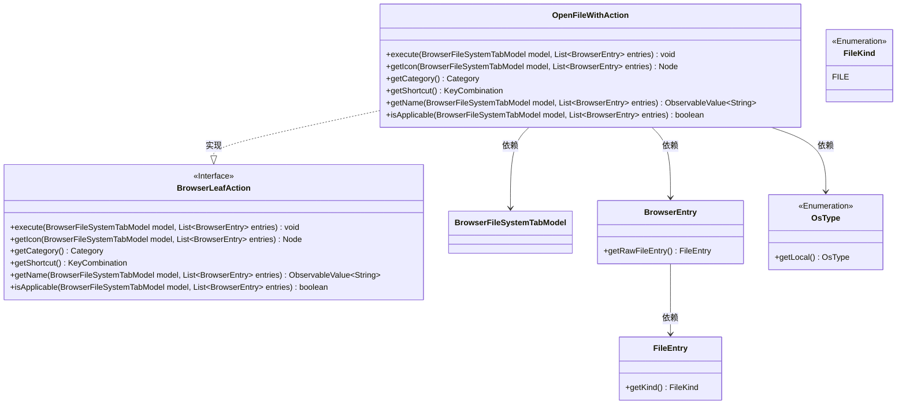
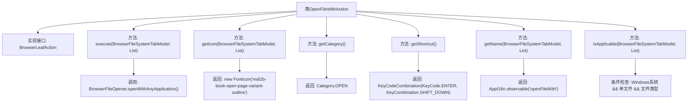

# 基础信息

|      |      |
|------|------|
| 名称 | OpenFileWithAction |
| 编码语言 | .java |
| 代码路径 | xpipe/ext/base/src/main/java/io/xpipe/ext/base/browser/OpenFileWithAction.java |
| 包名 | io.xpipe.ext.base.browser |
| 依赖项 | ['io.xpipe.app.browser.action.BrowserLeafAction', 'io.xpipe.app.browser.file.BrowserEntry', 'io.xpipe.app.browser.file.BrowserFileOpener', 'io.xpipe.app.browser.file.BrowserFileSystemTabModel', 'io.xpipe.app.core.AppI18n', 'io.xpipe.core.process.OsType', 'io.xpipe.core.store.FileKind', 'javafx.beans.value.ObservableValue', 'javafx.scene.Node', 'javafx.scene.input.KeyCode', 'javafx.scene.input.KeyCodeCombination', 'javafx.scene.input.KeyCombination', 'org.kordamp.ikonli.javafx.FontIcon', 'java.util.List'] |
| 概述说明 | OpenFileWithAction类实现浏览器文件操作，支持Windows单文件用任意应用打开，快捷键Shift+Enter。 |

# 说明

该代码定义了一个名为OpenFileWithAction的类，实现了BrowserLeafAction接口。主要功能是在Windows系统中打开单个文件。execute方法通过BrowserFileOpener工具类调用系统应用打开文件。getIcon方法返回一个书本打开图标的字体图标。该操作归类为OPEN类别，快捷键设置为Shift+Enter。操作名称为国际化字符串"openFileWith"。适用条件包括：系统为Windows、仅选中一个条目且该条目为文件类型。

# 类列表 Class Summary

| 名称   | 类型  | 说明 |
|-------|------|-------------|
| OpenFileWithAction | class | OpenFileWithAction类实现用任意应用打开文件，支持Windows单文件操作，快捷键Shift+Enter。 |

## 类 OpenFileWithAction

|      |      |
|------|------|
| 访问范围 | public |
| 类型 | class |
| 名称 | OpenFileWithAction |
| 说明 | OpenFileWithAction类实现用任意应用打开文件，支持Windows单文件操作，快捷键Shift+Enter。 |

### UML类图

该类图展示了OpenFileWithAction类实现BrowserLeafAction接口的结构关系。OpenFileWithAction是一个用于在Windows系统中打开单个文件的操作类，通过BrowserFileOpener工具类执行实际打开操作。它依赖BrowserFileSystemTabModel、BrowserEntry等类获取上下文信息，并检查操作系统类型、文件类型等条件判断操作是否可用。该实现包含图标获取、快捷键定义、名称国际化等标准接口方法，核心逻辑集中在execute()方法中调用静态工具类完成功能。

### 内部方法调用关系图

该流程图展示了OpenFileWithAction类的完整结构，该类实现了BrowserLeafAction接口。核心功能包括通过execute方法调用系统应用打开文件，提供图标、分类、快捷键等UI元数据，并通过isApplicable方法验证操作适用条件（仅Windows系统、单个文件选择）。所有方法均严格遵循接口契约，形成清晰的职责分离，其中execute方法委托BrowserFileOpener实现实际文件操作，条件判断逻辑集中在isApplicable方法。

### 字段列表 Field List

| 名称  | 类型  | 说明 |
|-------|-------|------|

### 方法列表 Method List

| 名称  | 类型  | 说明 |
|-------|-------|------|
| getIcon | Node | 重写方法返回指定图标的FontIcon实例。 |
| execute | void | 重写方法，打开浏览器文件系统中的首个文件。 |
| getShortcut | KeyCombination | 重写方法返回Shift+Enter快捷键组合。 |
| getCategory | Category | 重写getCategory方法，返回OPEN类型。 |
| getName | ObservableValue<String> | 重写方法，返回可观察的"openFileWith"国际化字符串。 |
| isApplicable | boolean | 检查Windows系统下单个文件条目是否适用 |

