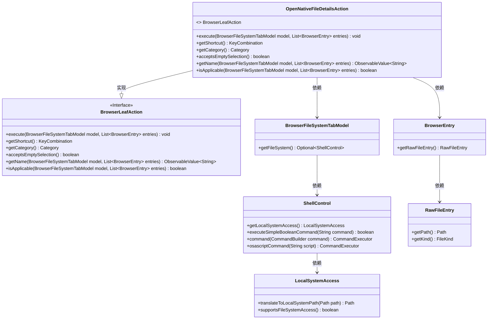

# 基础信息

|      |      |
|------|------|
| 名称 | OpenNativeFileDetailsAction |
| 编码语言 | .java |
| 代码路径 | xpipe/ext/base/src/main/java/io/xpipe/ext/base/browser/OpenNativeFileDetailsAction.java |
| 包名 | io.xpipe.ext.base.browser |
| 依赖项 | ['io.xpipe.app.browser.action.BrowserLeafAction', 'io.xpipe.app.browser.file.BrowserEntry', 'io.xpipe.app.browser.file.BrowserFileSystemTabModel', 'io.xpipe.app.core.AppI18n', 'io.xpipe.app.util.LocalShell', 'io.xpipe.core.process.CommandBuilder', 'io.xpipe.core.process.OsType', 'io.xpipe.core.process.ShellControl', 'io.xpipe.core.store.FileKind', 'javafx.beans.value.ObservableValue', 'javafx.scene.input.KeyCode', 'javafx.scene.input.KeyCodeCombination', 'javafx.scene.input.KeyCombination', 'java.util.List'] |
| 概述说明 | 跨平台文件属性查看类，支持Windows、Linux、MacOS，快捷键Alt+Enter。 |

# 说明

该代码定义了一个名为OpenNativeFileDetailsAction的类，实现了BrowserLeafAction接口，用于在文件浏览器中打开选定文件或目录的属性窗口。主要功能包括：根据操作系统类型执行不同命令，Windows使用PowerShell调用Shell.Application显示属性，Linux通过DBus或xdg-open命令实现，MacOS使用osascript调用Finder显示信息窗口。类方法提供了快捷键设置、动作分类、空选择支持、名称显示和适用性检查等功能。该动作支持跨平台文件属性查看，通过本地Shell交互实现核心功能。

# 类列表 Class Summary

| 名称   | 类型  | 说明 |
|-------|------|-------------|
| OpenNativeFileDetailsAction | class | 跨平台文件属性查看类，支持Windows、Linux、MacOS，快捷键Alt+Enter。 |

## 类 OpenNativeFileDetailsAction

|      |      |
|------|------|
| 访问范围 | public |
| 类型 | class |
| 名称 | OpenNativeFileDetailsAction |
| 说明 | 跨平台文件属性查看类，支持Windows、Linux、MacOS，快捷键Alt+Enter。 |

### UML类图

该类图展示了OpenNativeFileDetailsAction类及其相关依赖关系。OpenNativeFileDetailsAction实现了BrowserLeafAction接口，用于在浏览器文件系统中执行显示文件详细信息的操作。它依赖于BrowserFileSystemTabModel和BrowserEntry来获取文件系统模型和条目信息，通过ShellControl和LocalSystemAccess来执行本地系统命令和路径转换。该类根据不同操作系统类型（Windows、Linux、MacOS）采用不同的方式打开文件属性窗口，体现了跨平台文件操作的处理逻辑。

### 内部方法调用关系图

该流程图展示了OpenNativeFileDetailsAction类的核心结构和执行流程。类实现了BrowserLeafAction接口，主要功能是通过execute方法在不同操作系统(Windows/Linux/MacOS)下调用原生文件属性窗口。流程从获取ShellControl开始，遍历文件条目后根据操作系统类型分支处理，分别构造并执行对应的系统命令(PowerShell/DBus/AppleScript)。其他方法提供快捷键定义、分类标识、空选支持和名称国际化等功能，isApplicable方法验证文件系统访问支持情况。整个设计体现了跨平台文件操作的核心逻辑。

### 字段列表 Field List

| 名称  | 类型  | 说明 |
|-------|-------|------|

### 方法列表 Method List

| 名称  | 类型  | 说明 |
|-------|-------|------|
| getShortcut | KeyCombination | 重写方法返回Alt+Enter快捷键组合 |
| getName | ObservableValue<String> | 重写方法返回显示详情的可观察字符串值。 |
| execute | void | 跨平台文件属性操作：Windows用PowerShell调用Shell属性窗口，Linux用DBus或xdg-open，MacOS用AppleScript打开Finder信息窗口。 |
| getCategory | Category | 重写getCategory方法，返回NATIVE类型。 |
| acceptsEmptySelection | boolean | 方法重写，允许空选择，返回true。 |
| isApplicable | boolean | 检查文件系统是否支持本地访问。 |

