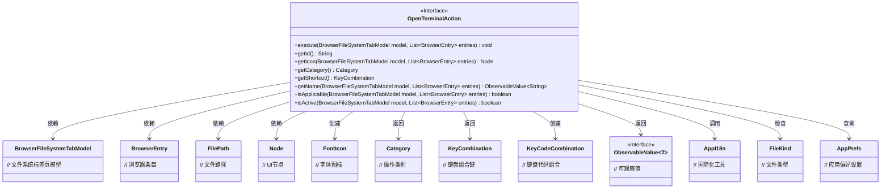
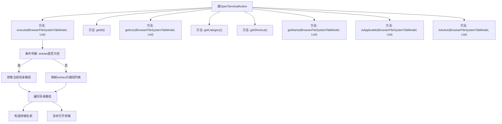

# 基础信息

|      |      |
|------|------|
| 名称 | OpenTerminalAction |
| 编码语言 | .java |
| 代码路径 | xpipe/ext/base/src/main/java/io/xpipe/ext/base/browser/OpenTerminalAction.java |
| 包名 | io.xpipe.ext.base.browser |
| 依赖项 | ['io.xpipe.app.browser.action.BrowserLeafAction', 'io.xpipe.app.browser.file.BrowserEntry', 'io.xpipe.app.browser.file.BrowserFileSystemTabModel', 'io.xpipe.app.core.AppI18n', 'io.xpipe.app.prefs.AppPrefs', 'io.xpipe.core.store.FileKind', 'io.xpipe.core.store.FilePath', 'javafx.beans.value.ObservableValue', 'javafx.scene.Node', 'javafx.scene.input.KeyCode', 'javafx.scene.input.KeyCodeCombination', 'javafx.scene.input.KeyCombination', 'org.kordamp.ikonli.javafx.FontIcon', 'java.util.Collections', 'java.util.List'] |
| 概述说明 | 打开终端操作类，含执行、图标、快捷键等功能。 |

# 说明

这是一个名为OpenTerminalAction的类，实现了BrowserLeafAction接口，用于在文件浏览器中打开终端。主要功能包括：根据选定条目或当前目录路径打开终端窗口，支持多目录同时打开；提供快捷键Ctrl+T触发操作；仅对目录类型条目生效；界面显示为控制台图标，归类于OPEN操作类别；名称显示为"openInTerminal"；通过终端类型配置检查是否激活该功能。

# 类列表 Class Summary

| 名称   | 类型  | 说明 |
|-------|------|-------------|
| OpenTerminalAction | class | 打开终端操作类，支持快捷键T，检查目录有效性并异步打开终端。 |

## 类 OpenTerminalAction

|      |      |
|------|------|
| 访问范围 | public |
| 类型 | class |
| 名称 | OpenTerminalAction |
| 说明 | 打开终端操作类，支持快捷键T，检查目录有效性并异步打开终端。 |

### UML类图

该类图展示了OpenTerminalAction接口及其相关依赖关系。OpenTerminalAction是一个实现浏览器叶子节点操作的接口，主要功能是在终端中打开选定的目录。它依赖于BrowserFileSystemTabModel和BrowserEntry来处理文件系统操作，使用FontIcon提供图标，通过KeyCodeCombination定义快捷键，并利用AppI18n实现国际化名称显示。该接口还通过检查FileKind和AppPrefs来验证操作适用性和活跃状态。整体设计体现了模块化思想，各组件职责明确，协作完成终端打开功能。

### 内部方法调用关系图

流程图展示了OpenTerminalAction类的核心结构和执行流程。该类实现了浏览器终端打开功能，包含7个主要方法。execute方法为核心逻辑，首先判断输入条目是否为空，然后获取目标目录路径（当前目录或选中条目），接着遍历路径并构造终端名称，最后异步打开终端。其他方法分别提供ID、图标、类别、快捷键、名称等元信息，以及适用性和激活状态的判断逻辑。整体设计符合GUI操作模式，支持多目录处理和异步执行。

### 字段列表 Field List

| 名称  | 类型  | 说明 |
|-------|-------|------|

### 方法列表 Method List

| 名称  | 类型  | 说明 |
|-------|-------|------|
| getShortcut | KeyCombination | 重写快捷键方法，返回Ctrl+T组合键。 |
| getIcon | Node | 重写方法，返回控制台图标。 |
| getId | String | 方法返回字符串"openTerminal"。 |
| execute | void | 重写execute方法：根据条目或当前目录打开终端，设置名称和路径。 |
| getCategory | Category | 重写getCategory方法，返回OPEN枚举值。 |
| getName | ObservableValue<String> | 重写方法返回可观察的"openInTerminal"国际化字符串。 |
| isApplicable | boolean | 检查所有条目是否为目录类型 |
| isActive | boolean | 检查终端类型是否非空。 |

