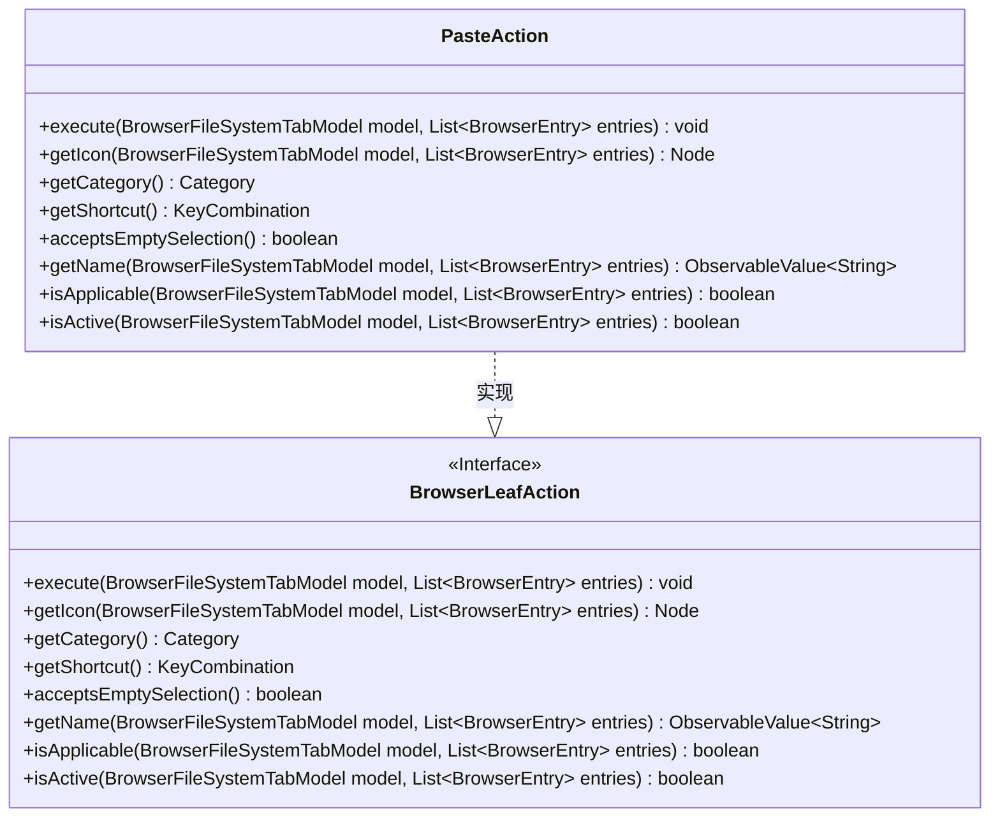
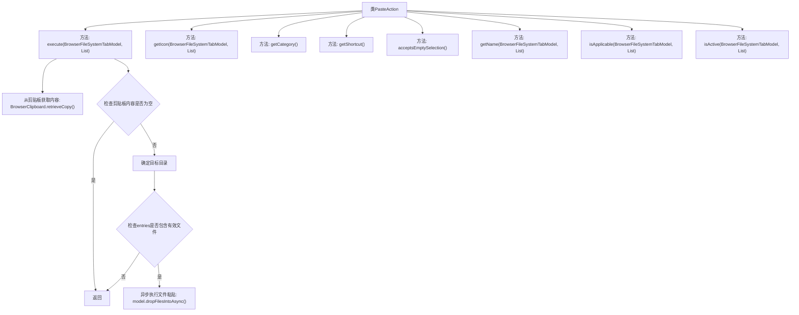

# 基础信息

|      |      |
|------|------|
| 名称 | PasteAction |
| 编码语言 | .java |
| 代码路径 | xpipe/ext/base/src/main/java/io/xpipe/ext/base/browser/PasteAction.java |
| 包名 | io.xpipe.ext.base.browser |
| 依赖项 | ['io.xpipe.app.browser.action.BrowserLeafAction', 'io.xpipe.app.browser.file.BrowserClipboard', 'io.xpipe.app.browser.file.BrowserEntry', 'io.xpipe.app.browser.file.BrowserFileSystemTabModel', 'io.xpipe.app.browser.file.BrowserFileTransferMode', 'io.xpipe.app.core.AppI18n', 'io.xpipe.core.store.FileKind', 'javafx.beans.value.ObservableValue', 'javafx.scene.Node', 'javafx.scene.input.KeyCode', 'javafx.scene.input.KeyCodeCombination', 'javafx.scene.input.KeyCombination', 'org.kordamp.ikonli.javafx.FontIcon', 'java.util.List'] |
| 概述说明 | 粘贴操作类，实现文件粘贴功能，支持快捷键Ctrl+V，图标为粘贴图标。 |

# 说明

这是一个名为PasteAction的类，实现了BrowserLeafAction接口，用于处理文件粘贴操作。该类包含多个方法：execute方法负责从剪贴板获取文件并粘贴到目标目录；getIcon返回粘贴图标；getCategory定义操作为复制粘贴类型；getShortcut设置快捷键为Ctrl+V；acceptsEmptySelection允许空选择；getName返回本地化的"paste"名称；isApplicable检查操作是否适用于当前文件或目录；isActive检查剪贴板是否有内容可粘贴。整体实现了完整的文件粘贴功能逻辑。

# 类列表 Class Summary

| 名称   | 类型  | 说明 |
|-------|------|-------------|
| PasteAction | class | 粘贴操作类，实现文件粘贴功能，支持快捷键Ctrl+V，图标为粘贴符号。 |

## 类 PasteAction

|      |      |
|------|------|
| 访问范围 | public |
| 类型 | class |
| 名称 | PasteAction |
| 说明 | 粘贴操作类，实现文件粘贴功能，支持快捷键Ctrl+V，图标为粘贴符号。 |

### UML类图

这段代码定义了一个实现BrowserLeafAction接口的PasteAction类，主要用于处理文件系统中的粘贴操作。该类包含多个方法，如执行粘贴(execute)、获取图标(getIcon)、判断是否可用(isApplicable)等，通过BrowserClipboard获取剪贴板内容，并根据目标位置和文件类型执行文件复制操作。类图清晰地展示了PasteAction与BrowserLeafAction接口的继承关系及其完整的方法结构。

### 内部方法调用关系图

这段代码定义了一个实现BrowserLeafAction接口的PasteAction类，主要用于处理文件粘贴操作。流程图展示了类的主要方法结构，其中execute方法是核心逻辑，包含从剪贴板获取内容、验证目标目录有效性、执行异步文件粘贴等步骤。其他方法则提供图标、分类、快捷键等辅助功能支持。该类的设计充分考虑了文件操作的各种边界情况，如空选择、目录验证等。

### 字段列表 Field List

| 名称  | 类型  | 说明 |
|-------|-------|------|

### 方法列表 Method List

| 名称  | 类型  | 说明 |
|-------|-------|------|
| execute | void | 重写execute方法：检查剪贴板内容，选择目标目录，若无文件则退出，否则异步复制文件到目标目录。 |
| getIcon | Node | 重写方法返回指定图标的FontIcon实例。 |
| acceptsEmptySelection | boolean | 方法重写，允许空选择，返回true。 |
| getCategory | Category | 重写getCategory方法，返回COPY_PASTE类别。 |
| getName | ObservableValue<String> | 重写方法，返回粘贴操作的国际化名称。 |
| isApplicable | boolean | 检查条目是否为单个目录或全部文件。 |
| isActive | boolean | 检查剪贴板是否有可粘贴内容。 |
| getShortcut | KeyCombination | 重写方法返回Ctrl+V快捷键组合。 |

