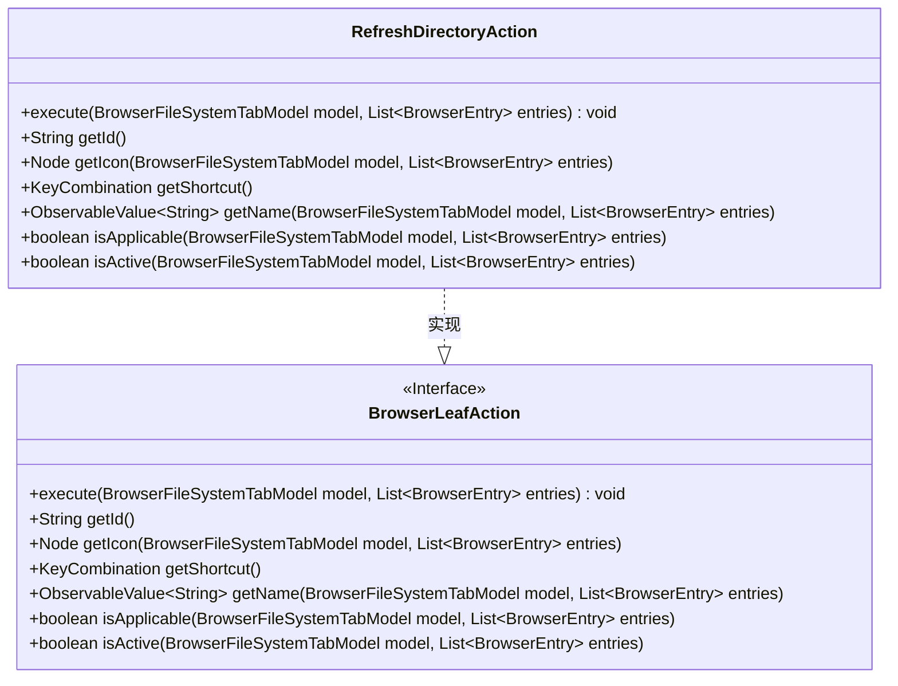
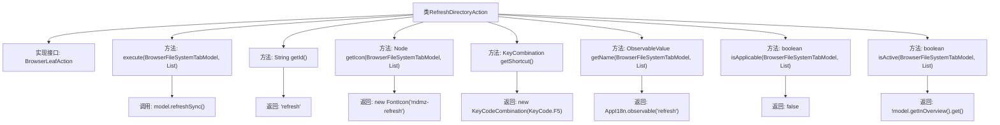

# 基础信息

|      |      |
|------|------|
| 名称 | RefreshDirectoryAction |
| 编码语言 | .java |
| 代码路径 | xpipe/ext/base/src/main/java/io/xpipe/ext/base/browser/RefreshDirectoryAction.java |
| 包名 | io.xpipe.ext.base.browser |
| 依赖项 | ['io.xpipe.app.browser.action.BrowserLeafAction', 'io.xpipe.app.browser.file.BrowserEntry', 'io.xpipe.app.browser.file.BrowserFileSystemTabModel', 'io.xpipe.app.core.AppI18n', 'javafx.beans.value.ObservableValue', 'javafx.scene.Node', 'javafx.scene.input.KeyCode', 'javafx.scene.input.KeyCodeCombination', 'javafx.scene.input.KeyCombination', 'org.kordamp.ikonli.javafx.FontIcon', 'java.util.List'] |
| 概述说明 | 刷新目录操作类，执行同步刷新，快捷键F5，图标为mdmz-refresh。 |

# 说明

这是一个名为RefreshDirectoryAction的类，实现了BrowserLeafAction接口，用于刷新目录。主要功能包括执行刷新操作（refreshSync），提供ID为"refresh"，使用FontIcon作为图标，快捷键设置为F5。名称通过AppI18n国际化获取，当前不可用（isApplicable返回false），且仅在非概览模式下激活（isActive检查model.getInOverview状态）。

# 类列表 Class Summary

| 名称   | 类型  | 说明 |
|-------|------|-------------|
| RefreshDirectoryAction | class | 刷新目录操作类，执行同步刷新，快捷键F5，图标为mdmz-refresh。 |

## 类 RefreshDirectoryAction

|      |      |
|------|------|
| 访问范围 | public |
| 类型 | class |
| 名称 | RefreshDirectoryAction |
| 说明 | 刷新目录操作类，执行同步刷新，快捷键F5，图标为mdmz-refresh。 |

### UML类图

这段类图展示了RefreshDirectoryAction类实现了BrowserLeafAction接口的结构关系。RefreshDirectoryAction是一个具体实现类，提供了刷新目录功能，包含执行操作、获取ID、图标、快捷键、名称以及检查适用性和活跃状态的方法。接口定义了浏览器叶子节点的标准操作规范，而实现类通过具体逻辑（如使用F5快捷键和刷新图标）来完成目录刷新功能。图中明确显示了实现关系及所有接口方法的完整签名。

### 内部方法调用关系图

这段代码定义了一个实现BrowserLeafAction接口的RefreshDirectoryAction类，主要用于处理浏览器文件系统目录的刷新操作。流程图展示了类结构及方法调用关系，包含7个核心方法：execute()触发同步刷新，getId()返回操作标识，getIcon()提供刷新图标，getShortcut()定义F5快捷键，getName()返回国际化名称，isApplicable()始终返回false表示默认不可用，isActive()根据是否在概览视图决定激活状态。各方法通过箭头指向其具体实现或返回值。

### 字段列表 Field List

| 名称  | 类型  | 说明 |
|-------|-------|------|

### 方法列表 Method List

| 名称  | 类型  | 说明 |
|-------|-------|------|
| getId | String | 方法返回字符串"refresh"。 |
| isActive | boolean | 方法检查模型是否不在概览模式。 |
| getName | ObservableValue<String> | 重写方法，返回可观察的"refresh"字符串值。 |
| getShortcut | KeyCombination | 重写getShortcut方法返回F5快捷键组合。 |
| getIcon | Node | 重写方法，返回刷新图标的FontIcon实例。 |
| execute | void | 重写execute方法，调用model的refreshSync刷新数据。 |
| isApplicable | boolean | 方法isApplicable返回false，不适用给定模型和条目。 |

