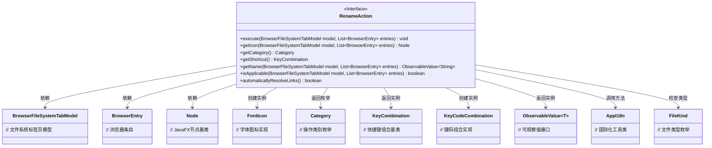
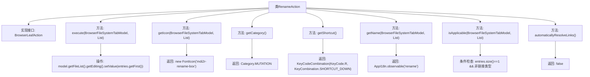

# 基础信息

|      |      |
|------|------|
| 名称 | RenameAction |
| 编码语言 | .java |
| 代码路径 | xpipe/ext/base/src/main/java/io/xpipe/ext/base/browser/RenameAction.java |
| 包名 | io.xpipe.ext.base.browser |
| 依赖项 | ['io.xpipe.app.browser.action.BrowserLeafAction', 'io.xpipe.app.browser.file.BrowserEntry', 'io.xpipe.app.browser.file.BrowserFileSystemTabModel', 'io.xpipe.app.core.AppI18n', 'io.xpipe.core.store.FileKind', 'javafx.beans.value.ObservableValue', 'javafx.scene.Node', 'javafx.scene.input.KeyCode', 'javafx.scene.input.KeyCodeCombination', 'javafx.scene.input.KeyCombination', 'org.kordamp.ikonli.javafx.FontIcon', 'java.util.List'] |
| 概述说明 | 实现文件重命名功能，支持快捷键Ctrl+R，单文件操作且排除链接类型。 |

# 说明

该代码定义了一个名为RenameAction的类，实现了BrowserLeafAction接口，用于文件重命名操作。主要功能包括：执行时将首个选中条目设为编辑状态；使用MDI2图标库中的重命名图标；归类为MUTATION操作类型；设置快捷键为Ctrl+R；返回国际化重命名名称；仅当选中单个非链接文件时可用；不自动解析链接。

# 类列表 Class Summary

| 名称   | 类型  | 说明 |
|-------|------|-------------|
| RenameAction | class | 重命名操作类，设置编辑项、图标、快捷键，仅适用于单个非链接文件。 |

## 类 RenameAction

|      |      |
|------|------|
| 访问范围 | public |
| 类型 | class |
| 名称 | RenameAction |
| 说明 | 重命名操作类，设置编辑项、图标、快捷键，仅适用于单个非链接文件。 |

### UML类图

该类图展示了RenameAction接口的实现细节及其关联类。RenameAction作为浏览器文件重命名操作的接口，定义了7个核心方法，涉及文件模型操作、图标获取、快捷键设置、多语言支持等功能。通过BrowserFileSystemTabModel和BrowserEntry操作文件系统，使用FontIcon显示图标，依赖KeyCodeCombination处理快捷键，并利用AppI18n实现国际化。特别通过isApplicable方法确保仅当选择单个非链接文件时才启用该操作，体现了严谨的边界条件控制。

### 内部方法调用关系图

该流程图展示了RenameAction类的完整结构，该类实现了BrowserLeafAction接口。主要包含7个核心方法：execute()触发文件重命名操作，getIcon()返回重命名图标，getCategory()返回操作类别，getShortcut()定义快捷键组合，getName()提供国际化名称，isApplicable()验证操作适用条件，以及automaticallyResolveLinks()控制链接解析行为。每个方法都有明确的输入输出和内部逻辑，特别是execute()会通过模型设置编辑状态，isApplicable()要求单选且非链接类型文件才允许操作。

### 字段列表 Field List

| 名称  | 类型  | 说明 |
|-------|-------|------|

### 方法列表 Method List

| 名称  | 类型  | 说明 |
|-------|-------|------|
| getCategory | Category | 重写方法返回Category.MUTATION |
| execute | void | 重写方法：设置文件列表的首个条目为编辑状态。 |
| getName | ObservableValue<String> | 重写方法，返回可观察的"rename"国际化字符串。 |
| getIcon | Node | 重写方法返回重命名图标。 |
| getShortcut | KeyCombination | 重写快捷键方法：Ctrl+R组合键。 |
| isApplicable | boolean | 检查单个非链接文件条目是否适用。 |
| automaticallyResolveLinks | boolean | 重写方法，禁用自动解析链接功能。 |

