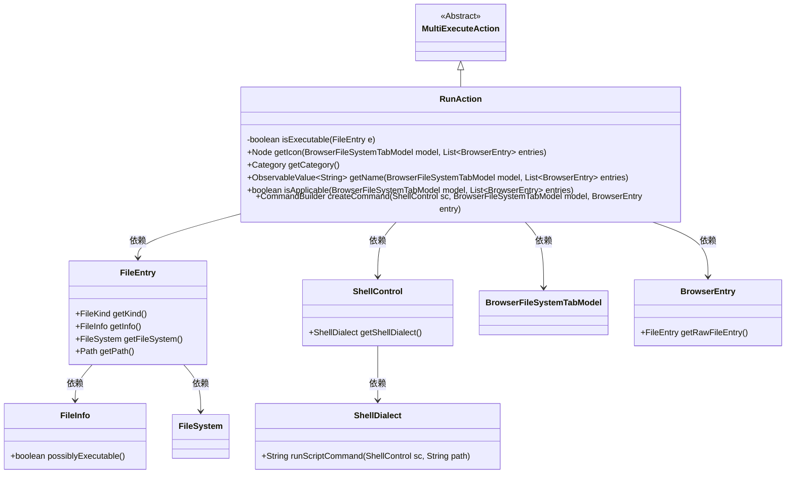

# 基础信息

|      |      |
|------|------|
| 名称 | RunAction |
| 编码语言 | .java |
| 代码路径 | xpipe/ext/base/src/main/java/io/xpipe/ext/base/browser/RunAction.java |
| 包名 | io.xpipe.ext.base.browser |
| 依赖项 | ['io.xpipe.app.browser.file.BrowserEntry', 'io.xpipe.app.browser.file.BrowserFileSystemTabModel', 'io.xpipe.app.core.AppI18n', 'io.xpipe.core.process.CommandBuilder', 'io.xpipe.core.process.OsType', 'io.xpipe.core.process.ShellControl', 'io.xpipe.core.process.ShellDialects', 'io.xpipe.core.store.FileEntry', 'io.xpipe.core.store.FileKind', 'javafx.beans.value.ObservableValue', 'javafx.scene.Node', 'org.kordamp.ikonli.javafx.FontIcon', 'java.util.List', 'java.util.stream.Stream'] |
| 概述说明 | 检查文件可执行性并运行脚本的Java类。 |

# 说明

RunAction类继承MultiExecuteAction，用于判断文件是否可执行并执行脚本。isExecutable方法检查文件类型、系统类型及扩展名（如Windows的exe/bat/ps1/cmd，Unix的sh/command）。类提供图标、分类、名称等基础属性，并通过isApplicable验证所有选中文件是否可执行。执行时通过createCommand构建对应Shell命令。

# 类列表 Class Summary

| 名称   | 类型  | 说明 |
|-------|------|-------------|
| RunAction | class | 检查文件可执行性并运行脚本的类。 |

## 类 RunAction

|      |      |
|------|------|
| 访问范围 | public |
| 类型 | class |
| 名称 | RunAction |
| 说明 | 检查文件可执行性并运行脚本的类。 |

### UML类图

该图展示了RunAction类继承自MultiExecuteAction，并依赖多个核心类实现文件执行功能。RunAction通过检查文件类型、系统类型和扩展名判断可执行性，提供图标、分类、名称等UI元素，并构建执行命令。关键依赖包括文件系统模型(FileEntry/BrowserEntry)、Shell控制(ShellControl/ShellDialect)等组件，形成一个完整的可执行文件操作体系。

### 内部方法调用关系图

```mermaid
graph TD
    A["类RunAction"]
    B["方法: boolean isExecutable(FileEntry e)"]
    C["方法: Node getIcon(BrowserFileSystemTabModel model, List<BrowserEntry> entries)"]
    D["方法: Category getCategory()"]
    E["方法: ObservableValue<String> getName(BrowserFileSystemTabModel model, List<BrowserEntry> entries)"]
    F["方法: boolean isApplicable(BrowserFileSystemTabModel model, List<BrowserEntry> entries)"]
    G["方法: CommandBuilder createCommand(ShellControl sc, BrowserFileSystemTabModel model, BrowserEntry entry)"]
    H["条件检查: e.getKind() != FileKind.FILE"]
    I["条件检查: e.getInfo() != null && e.getInfo().possiblyExecutable()"]
    J["条件检查: shell.isEmpty()"]
    K["条件检查: Windows可执行文件后缀匹配"]
    L["条件检查: Powershell脚本后缀匹配"]
    M["条件检查: Shell脚本后缀匹配"]
    N["返回: new FontIcon('mdi2p-play')"]
    O["返回: Category.CUSTOM"]
    P["返回: AppI18n.observable('run')"]
    Q["返回: entries.stream().allMatch(...)"]
    R["返回: CommandBuilder.of().add(...)"]

    A --> B
    A --> C
    A --> D
    A --> E
    A --> F
    A --> G
    B --> H
    B --> I
    B --> J
    B --> K
    B --> L
    B --> M
    C --> N
    D --> O
    E --> P
    F --> Q
    G --> R
```

该流程图展示了RunAction类的完整结构，包含7个主要方法和内部逻辑分支。isExecutable方法通过5层条件检查判断文件是否可执行，包括文件类型验证、可执行标志检测、操作系统类型匹配和多种脚本后缀验证。其他方法分别处理图标显示、分类标记、名称国际化、适用性判断和命令构建。所有方法最终通过箭头指向明确的返回结果，形成完整的逻辑链路。

### 字段列表 Field List

| 名称  | 类型  | 说明 |
|-------|-------|------|

### 方法列表 Method List

| 名称  | 类型  | 说明 |
|-------|-------|------|
| getCategory | Category | 重写getCategory方法，返回CUSTOM类别。 |
| isExecutable | boolean | 检查文件是否可执行：非文件类型返回假，根据扩展名和系统类型判断可执行性。 |
| isApplicable | boolean | 检查所有浏览器条目是否可执行。 |
| getName | ObservableValue<String> | 重写方法，返回可观察的"run"字符串值。 |
| getIcon | Node | 重写getIcon方法，返回播放图标FontIcon。 |
| createCommand | CommandBuilder | 创建命令构建器，执行指定路径的脚本命令。 |

