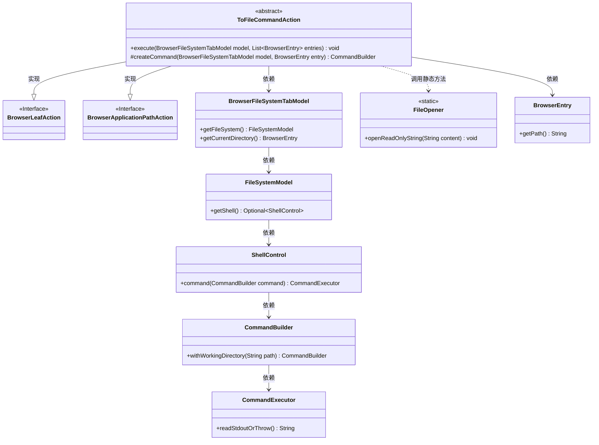
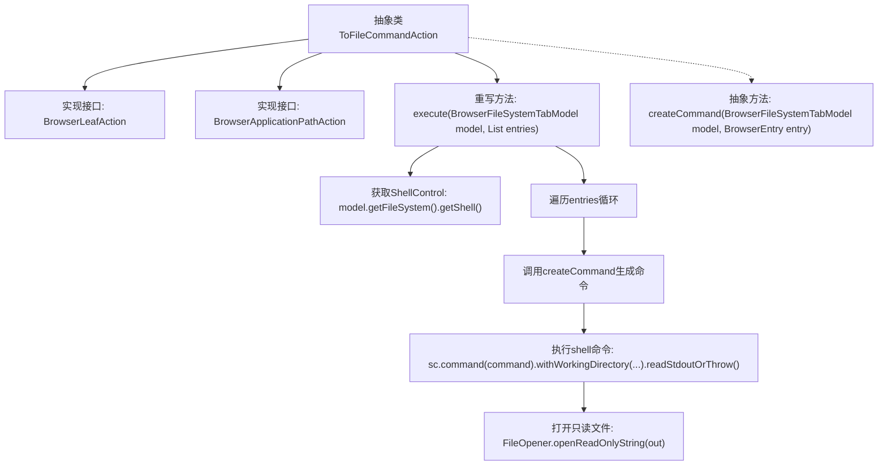

# 基础信息

|      |      |
|------|------|
| 名称 | ToFileCommandAction |
| 编码语言 | .java |
| 代码路径 | xpipe/ext/base/src/main/java/io/xpipe/ext/base/browser/ToFileCommandAction.java |
| 包名 | io.xpipe.ext.base.browser |
| 依赖项 | ['io.xpipe.app.browser.action.BrowserApplicationPathAction', 'io.xpipe.app.browser.action.BrowserLeafAction', 'io.xpipe.app.browser.file.BrowserEntry', 'io.xpipe.app.browser.file.BrowserFileSystemTabModel', 'io.xpipe.app.util.FileOpener', 'io.xpipe.core.process.CommandBuilder', 'io.xpipe.core.process.ShellControl', 'java.util.List'] |
| 概述说明 | 抽象类实现文件操作命令，执行后读取输出并打开。需子类提供具体命令。 |

# 说明

这是一个名为ToFileCommandAction的抽象类，实现了BrowserLeafAction和BrowserApplicationPathAction接口。它定义了一个execute方法，接收BrowserFileSystemTabModel模型和BrowserEntry条目列表作为参数。方法通过模型获取ShellControl实例，遍历每个条目，使用抽象方法createCommand生成命令并执行，将输出结果以只读方式打开。抽象方法createCommand需要子类实现，用于创建特定命令。整个过程涉及文件系统操作、命令执行和结果处理。

# 类列表 Class Summary

| 名称   | 类型  | 说明 |
|-------|------|-------------|
| ToFileCommandAction | class | 抽象类实现文件操作命令，执行后读取输出并打开。需子类提供具体命令构建逻辑。 |

## 类 ToFileCommandAction

|      |      |
|------|------|
| 访问范围 | public abstract |
| 类型 | class |
| 名称 | ToFileCommandAction |
| 说明 | 抽象类实现文件操作命令，执行后读取输出并打开。需子类提供具体命令构建逻辑。 |

### UML类图

该类图展示了抽象类`ToFileCommandAction`实现两个接口的核心结构，及其与文件系统操作相关的依赖关系。`ToFileCommandAction`通过`BrowserFileSystemTabModel`获取Shell环境，使用命令构建器生成命令并执行，最终通过`FileOpener`静态方法展示结果。图中包含9个类/接口，清晰反映了命令执行流程中各组件的协作关系，特别是抽象方法`createCommand`的桥接作用。

### 内部方法调用关系图

该流程图展示了抽象类ToFileCommandAction的核心结构和工作流程。类实现了两个浏览器操作接口，主要逻辑在execute方法中：首先获取Shell控制对象，然后遍历每个浏览器条目，通过抽象方法createCommand生成具体命令，执行后获取标准输出，最后用文件打开器显示结果。抽象方法createCommand需要子类实现，体现了模板方法设计模式。整个流程涉及文件系统操作、命令执行和结果展示三个关键阶段。

### 字段列表 Field List

| 名称  | 类型  | 说明 |
|-------|-------|------|

### 方法列表 Method List

| 名称  | 类型  | 说明 |
|-------|-------|------|
| createCommand | CommandBuilder | 创建命令构建器的抽象方法，需传入模型和条目参数。 |
| execute | void | 重写execute方法，遍历条目执行命令并打开输出。 |

