# 基础信息

|      |      |
|------|------|
| 名称 | browser |
| 编码语言 | .java |
| 代码路径 | xpipe/ext/base/src/main/java/io/xpipe/ext/base/browser |
| 包名 | xpipe.ext.base.src.main.java.io.xpipe.ext.base.browser |
| 概述说明 | 跨平台压缩解压模块，支持ZIP/TAR格式，提供目录文件操作及用户交互功能。 |

# 说明

```markdown
## 概述
该代码模块是一个文件浏览器操作功能集合，提供跨平台的文件系统管理能力。模块采用面向对象设计，通过抽象基类(如MultiExecuteAction、ToFileCommandAction)和接口(如BrowserLeafAction、BrowserBranchAction)封装通用逻辑，并由具体子类实现不同操作类型和平台差异。模块包含50+个具体操作类，覆盖文件浏览、编辑、权限管理、压缩解压等核心功能，支持Windows/Unix/macOS多平台适配，通过异步命令执行和国际化实现统一交互体验。

## 主要业务场景
1. **文件导航操作**：
   - 前进/后退(ForwardAction/BackAction)实现历史记录导航
   - 目录打开(OpenDirectoryAction)支持回车键快速进入
   - 新标签页打开(OpenDirectoryInNewTabAction)实现多标签浏览
   - 链接跳转(FollowLinkAction)处理符号链接追踪

2. **文件基础操作**：
   - 复制粘贴(CopyAction/PasteAction)实现文件传输
   - 重命名(RenameAction)支持单个文件修改
   - 删除(DeleteAction/DeleteLinkAction)区分文件和链接
   - 新建(NewItemAction)支持文件/目录/链接创建

3. **权限管理**：
   - 文件权限(ChmodAction)提供400/755等预设模式
   - 所有权变更(ChownAction/ChgrpAction)支持用户/组修改
   - 仅限Unix系统可用，包含预定义和自定义输入

4. **文件查看与编辑**：
   - 默认打开(OpenFileDefaultAction)调用系统关联程序
   - 文本编辑(EditFileAction)使用外部编辑器
   - 属性查看(OpenNativeFileDetailsAction)跨平台实现
   - 终端打开(OpenTerminalAction)支持多目录同时启动

5. **高级文件操作**：
   - 压缩解压(各CompressAction类)支持ZIP/TAR格式
   - 执行运行(RunAction/JarAction)处理可执行文件
   - 反编译(JavapAction)查看class文件
   - 批量命令(MultiExecuteSelectionAction)支持终端/静默模式

6. **系统集成**：
   - 路径复制(CopyPathAction)支持多种格式
   - 本地管理器(BrowseInNativeManagerAction)打开系统文件管理器
   - 下载传输(DownloadAction)处理远程文件
   - 刷新操作(RefreshDirectoryAction)更新目录状态
```


### 包内部结构视图

```mermaid
graph TD
    browser --> compress
    browser --> FileTypeAction.java
    browser --> ChmodAction.java
    browser --> CopyPathAction.java
    browser --> OpenDirectoryInNewTabAction.java
    browser --> OpenTerminalAction.java
    browser --> NewItemAction.java
    browser --> MultiExecuteSelectionAction.java
    browser --> BrowseInNativeManagerAction.java
    browser --> EditFileAction.java
    browser --> RefreshDirectoryAction.java
    browser --> ChgrpAction.java
    browser --> OpenFileDefaultAction.java
    browser --> DeleteAction.java
    browser --> ExecuteApplicationAction.java
    browser --> ChownAction.java
    browser --> CopyAction.java
    browser --> FollowLinkAction.java
    browser --> DownloadAction.java
    browser --> ForwardAction.java
    browser --> MultiExecuteAction.java
    browser --> JavaAction.java
    browser --> RenameAction.java
    browser --> RunAction.java
    browser --> JavapAction.java
    browser --> PasteAction.java
    browser --> ToFileCommandAction.java
    browser --> OpenFileWithAction.java
    browser --> JarAction.java
    browser --> BackAction.java
    browser --> DeleteLinkAction.java
    browser --> OpenNativeFileDetailsAction.java
    browser --> OpenDirectoryAction.java
    compress --> DirectoryCompressAction.java
    compress --> UnzipDirectoryUnixAction.java
    compress --> UnzipDirectoryWindowsAction.java
    compress --> FileCompressAction.java
    compress --> UntarGzHereAction.java
    compress --> BaseCompressAction.java
    compress --> UntarGzDirectoryAction.java
    compress --> UntarDirectoryAction.java
    compress --> BaseUnzipWindowsAction.java
    compress --> UntarHereAction.java
    compress --> BaseUnzipUnixAction.java
    compress --> BaseUntarAction.java
    compress --> UnzipHereWindowsAction.java
    compress --> UnzipHereUnixAction.java
```



该流程图展示了浏览器模块下的文件结构，包含压缩功能子目录和多个独立操作类文件。compress子目录下细分为多种压缩/解压操作实现类，而browser根目录则包含文件操作、权限管理、导航等各类功能实现类，总计39个节点清晰呈现了模块的功能划分与层级关系。

# 文件列表 File List

| 名称   | 类型  | 说明 |
|-------|------|-------------|
| [FileTypeAction.java](FileTypeAction.md) | file | 输入内容为空，无法生成概要。请提供具体信息以便总结。 |
| [EditFileAction.java](EditFileAction.md) | file | 编辑文件操作类，快捷键Ctrl+E，适用文件类型，需外部编辑器。 |
| [MultiExecuteSelectionAction.java](MultiExecuteSelectionAction.md) | file | 抽象类MultiExecuteSelectionAction实现多执行方式，含终端、文件浏览器和静默运行三种操作。 |
| [NewItemAction.java](NewItemAction.md) | file | 实现浏览器新建文件、目录和符号链接的功能类。 |
| [OpenTerminalAction.java](OpenTerminalAction.md) | file | 打开终端操作类，含执行、图标、快捷键等功能。 |
| [OpenDirectoryInNewTabAction.java](OpenDirectoryInNewTabAction.md) | file | 类实现在新标签页打开目录功能，含图标、快捷键、名称及适用条件检查。 |
| [CopyPathAction.java](CopyPathAction.md) | file | 复制路径操作类，支持多种路径和文件名复制方式。 |
| [ChmodAction.java](ChmodAction.md) | file | 实现文件权限修改功能，支持预设和自定义权限模式，适用于非Windows系统。 |
| [ForwardAction.java](ForwardAction.md) | file | ForwardAction类实现前进功能，含快捷键、图标、名称及状态检查。 |
| [DownloadAction.java](DownloadAction.md) | file | 下载操作类，实现文件下载功能，含快捷键D和图标。 |
| [FollowLinkAction.java](FollowLinkAction.md) | file | 类实现浏览器链接跳转功能，含执行、图标、名称等方法，适用单链接非目录情况。 |
| [CopyAction.java](CopyAction.md) | file | CopyAction类实现浏览器文件复制功能，含执行、图标、类别、快捷键等方法。 |
| [ChownAction.java](ChownAction.md) | file | ChownAction类实现文件所有权变更功能，支持用户选择和自定义操作，适用于非Windows/Mac系统。 |
| [ExecuteApplicationAction.java](ExecuteApplicationAction.md) | file | 抽象类实现浏览器文件操作，执行命令并可选刷新。 |
| [DeleteAction.java](DeleteAction.md) | file | 删除文件操作类，含执行、图标、分类、快捷键和名称方法。 |
| [OpenFileDefaultAction.java](OpenFileDefaultAction.md) | file | 类OpenFileDefaultAction实现浏览器文件默认打开操作，含执行、图标、分类、快捷键、名称及适用性方法。 |
| [ChgrpAction.java](ChgrpAction.md) | file | ChgrpAction实现文件组修改功能，支持选择预设组或自定义组名，适用于非Windows/Mac系统。 |
| [DeleteLinkAction.java](DeleteLinkAction.md) | file | 删除链接操作类，实现删除功能、图标、名称及适用性检查。 |
| [BackAction.java](BackAction.md) | file | BackAction类实现浏览器后退功能，含快捷键、图标及状态检查。 |
| [JarAction.java](JarAction.md) | file | JarAction类实现Java和文件操作，支持执行jar文件命令。 |
| [OpenFileWithAction.java](OpenFileWithAction.md) | file | OpenFileWithAction类实现浏览器文件操作，支持Windows单文件用任意应用打开，快捷键Shift+Enter。 |
| [ToFileCommandAction.java](ToFileCommandAction.md) | file | 抽象类实现文件操作命令，执行后读取输出并打开。需子类提供具体命令。 |
| [PasteAction.java](PasteAction.md) | file | 粘贴操作类，实现文件粘贴功能，支持快捷键Ctrl+V，图标为粘贴图标。 |
| [JavapAction.java](JavapAction.md) | file | Java类JavapAction实现文件操作命令，支持javap反编译，适用于.class文件。 |
| [RunAction.java](RunAction.md) | file | 检查文件可执行性并运行脚本的Java类。 |
| [RenameAction.java](RenameAction.md) | file | 实现文件重命名功能，支持快捷键Ctrl+R，单文件操作且排除链接类型。 |
| [OpenDirectoryAction.java](OpenDirectoryAction.md) | file | OpenDirectoryAction类实现打开目录功能，含执行、图标、分类、快捷键、名称和适用条件方法。 |
| [OpenNativeFileDetailsAction.java](OpenNativeFileDetailsAction.md) | file | 跨平台文件属性查看类，支持Windows、Linux、MacOS，快捷键Alt+Enter。 |
| [JavaAction.java](JavaAction.md) | file | 输入内容为空，无法生成概要。请提供具体信息。 |
| [MultiExecuteAction.java](MultiExecuteAction.md) | file | 多执行动作类，含终端执行、文件浏览器运行和静默执行三种分支操作。 |
| [RefreshDirectoryAction.java](RefreshDirectoryAction.md) | file | 刷新目录操作类，执行同步刷新，快捷键F5，图标为mdmz-refresh。 |
| [BrowseInNativeManagerAction.java](BrowseInNativeManagerAction.md) | file | 浏览本地文件管理器操作类，支持跨平台打开文件路径，检查系统兼容性。 |
| [compress](compress/_module.md) | package | Java类实现跨平台文件目录压缩解压功能，含Windows/Unix系统专用处理类。 |


