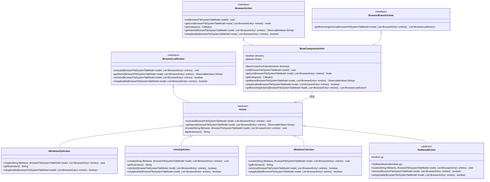
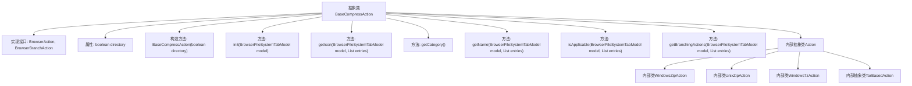
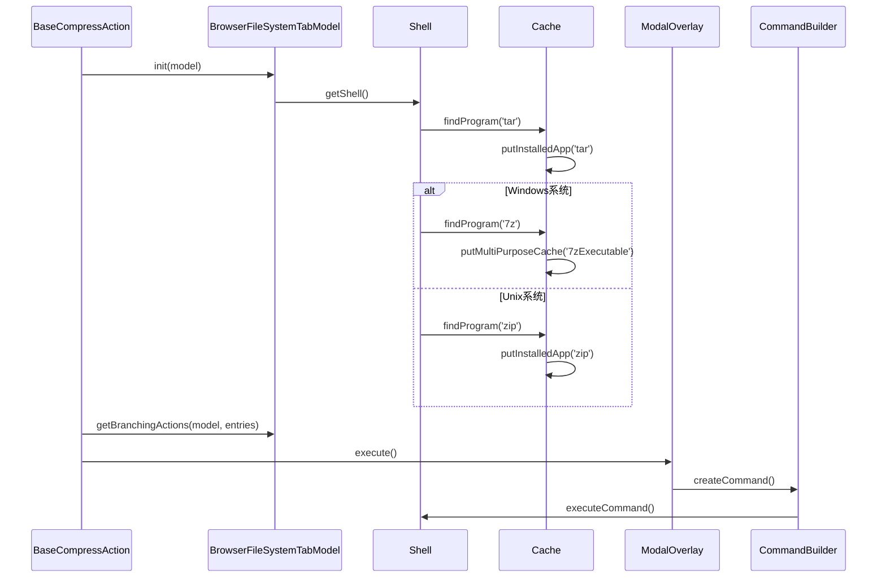

# 基础信息

|      |      |
|------|------|
| 名称 | BaseCompressAction |
| 编码语言 | .java |
| 代码路径 | xpipe/ext/base/src/main/java/io/xpipe/ext/base/browser/compress/BaseCompressAction.java |
| 包名 | io.xpipe.ext.base.browser.compress |
| 依赖项 | ['io.xpipe.app.browser.action.BrowserAction', 'io.xpipe.app.browser.action.BrowserBranchAction', 'io.xpipe.app.browser.action.BrowserLeafAction', 'io.xpipe.app.browser.file.BrowserEntry', 'io.xpipe.app.browser.file.BrowserFileSystemTabModel', 'io.xpipe.app.comp.Comp', 'io.xpipe.app.comp.base.ModalOverlay', 'io.xpipe.app.core.AppI18n', 'io.xpipe.app.util.CommandSupport', 'io.xpipe.core.process.CommandBuilder', 'io.xpipe.core.process.OsType', 'io.xpipe.core.process.ShellDialects', 'io.xpipe.core.store.FileKind', 'io.xpipe.core.store.FilePath', 'javafx.beans.property.SimpleStringProperty', 'javafx.beans.value.ObservableValue', 'javafx.scene.Node', 'javafx.scene.control.TextField', 'org.kordamp.ikonli.javafx.FontIcon', 'java.util.List'] |
| 概述说明 | 抽象类BaseCompressAction实现文件压缩功能，支持不同系统和格式。 |

# 说明

BaseCompressAction是一个抽象类，实现了浏览器文件压缩功能。它根据操作系统类型检测可用压缩工具（如tar、7z、zip），并提供多种压缩格式选项。该类支持目录和文件压缩，通过子类实现不同压缩方式（Windows7zAction、WindowsZipAction、UnixZipAction和TarBasedAction）。压缩时会弹出对话框让用户输入文件名，自动添加相应扩展名。各子类针对不同平台和压缩格式实现了具体的压缩命令构建逻辑，并通过异步方式执行压缩操作。

# 类列表 Class Summary

| 名称   | 类型  | 说明 |
|-------|------|-------------|
| BaseCompressAction | class | 抽象类BaseCompressAction实现文件压缩功能，支持不同系统和格式。 |

## 类 BaseCompressAction

|      |      |
|------|------|
| 访问范围 | public abstract |
| 类型 | class |
| 名称 | BaseCompressAction |
| 说明 | 抽象类BaseCompressAction实现文件压缩功能，支持不同系统和格式。 |

### UML类图

这段代码实现了一个文件压缩功能的核心类结构。BaseCompressAction作为抽象基类实现了BrowserAction和BrowserBranchAction接口，提供了跨平台的文件压缩功能。它包含多个内部类（WindowsZipAction、UnixZipAction、Windows7zAction和TarBasedAction）来处理不同操作系统和压缩格式的具体实现。类图展示了清晰的接口继承关系和内部类结构，其中BaseCompressAction作为主控制器，通过策略模式委托给不同的具体压缩实现类。整个设计支持Windows和Unix系统，并提供了zip、7z和tar等多种压缩格式的选择。

### 内部方法调用关系图

这段代码实现了一个抽象压缩操作基类，主要功能包括初始化压缩环境检查、提供多种压缩格式支持（zip/7z/tar等）以及处理不同操作系统下的压缩操作。流程图展示了类结构和继承关系，时序图则描述了初始化过程和命令执行流程。代码通过策略模式为不同操作系统和压缩格式提供了具体实现，并包含完善的缓存机制和用户交互处理。

### 字段列表 Field List

| 名称  | 类型  | 说明 |
|-------|-------|------|
| directory | boolean | 私有布尔变量directory |

### 方法列表 Method List

| 名称  | 类型  | 说明 |
|-------|-------|------|
| getIcon | Node | 重写方法，返回档案图标。 |
| getCategory | Category | 重写方法返回变异类型分类。 |
| getName | ObservableValue<String> | 重写方法，根据目录状态返回不同压缩操作的名称。 |
| init | void | 检查系统是否安装tar、7z或zip工具并缓存结果。 |
| isApplicable | boolean | 检查文件是否适用：非压缩文件且满足目录或文件数量条件。 |
| getBranchingActions | List<BrowserLeafAction> | Java方法返回多种压缩操作列表 |

